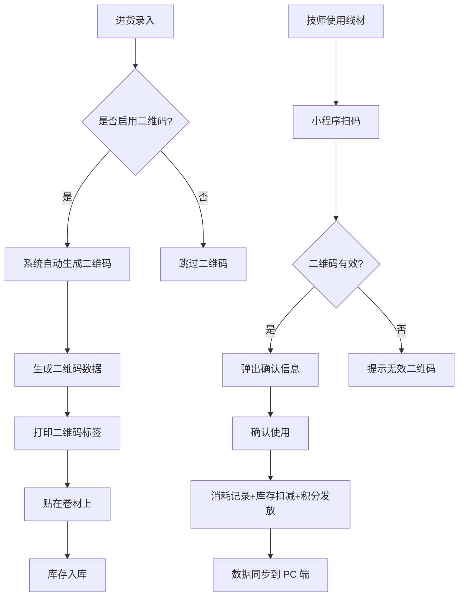
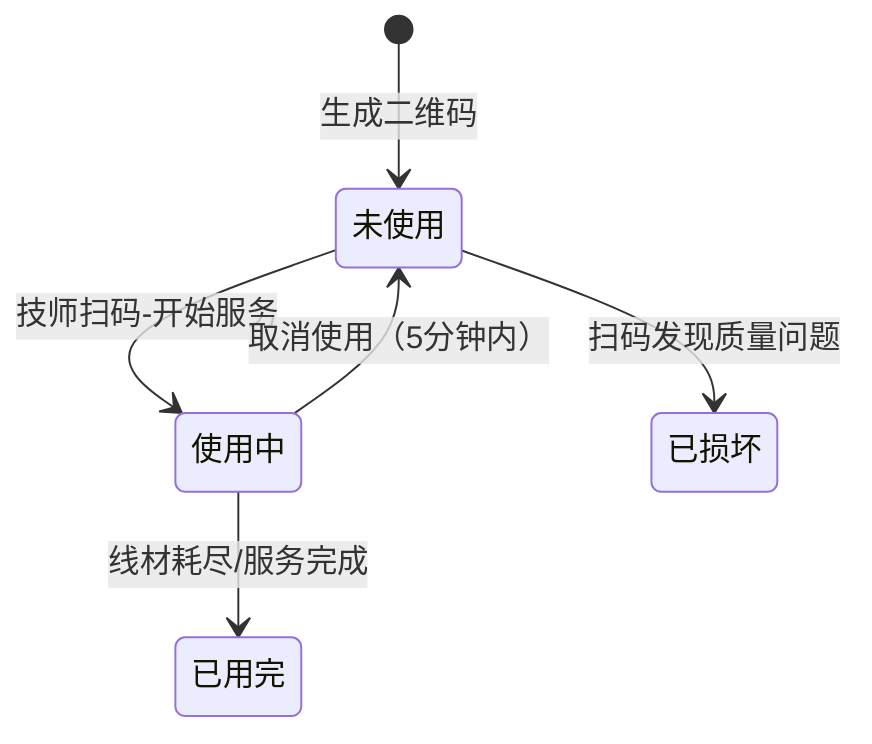

# 线材耗材管理系统 — 详细需求

> **版本**: V2.1.0  
> **适用阶段**: 线材管理系统开发  
> **依赖**: [05-数据库设计.md](05-数据库设计.md)（线材模块表结构）  
> **Token 预算**: 较大（约 800 行，含二维码和财务增强）

---

## 模块概述

线材耗材管理系统面向 Web 管理后台，提供线材字典、供应商管理、批次计价进货、日常消耗记录、报废记录、二维码扫码追踪、库存管理、财务统计分析等功能。

**核心目标**：通过批次计价 + 加权平均成本 + 二维码追踪，实现线材成本的精准核算和追溯。

## 数据表

> 完整字段定义见 [05-数据库设计.md](05-数据库设计.md)的"线材模块"+"二维码模块"章节。

| 表名 | 说明 | 核心字段 |
|------|------|----------|
| `tb_wire` | 线材字典 | brand, model, spec, color, type, min_stock |
| `tb_supplier` | 供应商 | name, contact, phone, payment_method, rating |
| `tb_purchase` | 进货记录 | wire_id, supplier_id, quantity, unit_price, batch_no |
| `tb_usage` | 消耗记录 | wire_id, usage_date, quantity, related_order |
| `tb_waste` | 报废记录 | wire_id, waste_date, quantity, reason |
| `tb_wire_quality` | 线材质量 | purchase_id, production_date, quality_check_result |
| `tb_wire_spool` | 单卷余量 | qr_code_id, initial_length, remaining_length |
| `tb_qr_code` | 二维码表 | qr_code, wire_id, purchase_id, batch_no, spool_no, status |
| `tb_qr_scan_record` | 扫码记录 | qr_code_id, action, service_history_id, technician_id |
| `tb_inventory_suggestion` | 库存建议 | wire_id, avg_daily_usage, safety_stock, suggested_qty |
| `tb_inventory_check` | 库存盘点 | check_no, wire_id, system_qty, actual_qty, diff_qty |
| `tb_profit_analysis` | 利润分析 | analysis_type, dimension_value, revenue, cost, margin |
| `tb_payable` | 应付账款 | supplier_id, total_payable, due_date, status |
| `tb_price_trend` | 价格趋势 | wire_id, supplier_id, price, recorded_at |

## 功能需求

### 3.1 线材字典（P0）

**功能描述**：管理线材的基础信息，是进货、消耗、报废等业务的关联基础。

| 功能 | 说明 |
|------|------|
| 新增线材 | 填写品牌、型号、规格、颜色、类型、最低库存 |
| 编辑线材 | 修改已有线材信息，品牌+型号不可重复 |
| 删除线材 | 软删除，已关联进货记录的线材仍可查看 |
| 搜索筛选 | 支持按品牌、型号、类型筛选 |

**API 接口**

| 方法 | 路径 | 说明 |
|------|------|------|
| GET | `/api/wire/list` | 线材列表（分页） |
| POST | `/api/wire` | 新增线材 |
| PUT | `/api/wire/{id}` | 更新线材 |
| DELETE | `/api/wire/{id}` | 软删除线材 |

### 3.2 供应商管理（P0）

| 功能 | 说明 |
|------|------|
| 新增供应商 | 填写名称、联络人、电话、支付方式、备注 |
| 编辑供应商 | 修改已有供应商信息 |
| 删除供应商 | 软删除 |

**API 接口**

| 方法 | 路径 | 说明 |
|------|------|------|
| GET | `/api/supplier/list` | 供应商列表（分页） |
| POST | `/api/supplier` | 新增供应商 |
| PUT | `/api/supplier/{id}` | 更新供应商 |

### 3.3 进货管理（P0）

**功能描述**：记录线材进货信息，支持批次计价。

| 功能 | 说明 |
|------|------|
| 新增进货 | 选择线材、供应商，填写日期、数量、单价，系统自动生成批次号和计算总价 |
| 编辑进货 | 修改已有进货记录，重新计算总价 |
| 删除进货 | 软删除 |
| 查询筛选 | 支持按线材、供应商、日期范围筛选 |

**API 接口**

| 方法 | 路径 | 说明 |
|------|------|------|
| GET | `/api/purchase/list` | 进货列表（分页） |
| POST | `/api/purchase` | 新增进货 |
| PUT | `/api/purchase/{id}` | 更新进货 |
| DELETE | `/api/purchase/{id}` | 软删除进货 |

### 3.4 消耗记录（P0）

| 功能 | 说明 |
|------|------|
| 新增消耗 | 选择线材、填写日期、消耗数量、关联订单号、操作人 |
| 删除消耗 | 软删除 |
| 查询筛选 | 支持按线材、日期范围筛选 |

**API 接口**

| 方法 | 路径 | 说明 |
|------|------|------|
| GET | `/api/usage/list` | 消耗列表（分页） |
| POST | `/api/usage` | 新增消耗记录 |
| DELETE | `/api/usage/{id}` | 软删除消耗 |

### 3.5 报废记录（P0）

| 功能 | 说明 |
|------|------|
| 新增报废 | 选择线材、填写日期、数量、原因、操作人 |
| 删除报废 | 软删除 |
| 查询筛选 | 支持按线材、日期范围、报废原因筛选 |

**API 接口**

| 方法 | 路径 | 说明 |
|------|------|------|
| GET | `/api/waste/list` | 报废列表（分页） |
| POST | `/api/waste` | 新增报废记录 |
| DELETE | `/api/waste/{id}` | 软删除报废 |

**数据字典**

| reason | 说明 |
|--------|------|
| break | 断裂 |
| knot | 打结 |
| human | 人为损坏 |
| other | 其他 |

### 3.6 库存管理（P1）

**核心公式**

```
实时库存 = Σ进货数量 − Σ消耗数量 − Σ报废数量
加权均价 = Σ(进货数量 × 进货单价) / Σ进货数量
库存价值 = 实时库存 × 加权均价
损耗率   = 报废量 / 消耗量 × 100%
```

| 功能 | 说明 |
|------|------|
| 库存总览 | 顶部统计卡片：线材种类、库存总量、库存总值、低库存预警 |
| 库存明细 | 列表展示每款线材的进货/消耗/报废/当前库存/均价/库存价值 |
| 低库存预警 | 库存 ≤ 预警线时红色高亮 |
| 库存盘点 | 扫码核对实际库存，生成盘盈盘亏报告 |

**API 接口**

| 方法 | 路径 | 说明 |
|------|------|------|
| GET | `/api/inventory/list` | 库存列表 |
| GET | `/api/inventory/low-stock` | 低库存预警 |
| POST | `/api/inventory/check/start` | 开始盘点 |
| PUT | `/api/inventory/check/{id}/scan` | 扫码盘点 |
| POST | `/api/inventory/check/{id}/complete` | 完成盘点 |

### 3.7 智能采购建议（P1）

**智能采购算法**

```
建议采购量 = (日均消耗量 × 到货周期天数) + 安全库存 - 当前库存
安全库存 = 日均消耗量 × (到货周期 + 安全天数) × 波动系数
波动系数 = 1 + (标准差 / 日均消耗量)  [范围: 1.0-2.0]
```

| 功能 | 说明 |
|------|------|
| 计算建议 | 基于近30天消耗速率+当前库存+到货周期 |
| 安全库存动态调整 | 根据消耗波动系数自动调整 |
| 线材替代推荐 | 缺货时基于相似规格推荐替代品 |

**API 接口**

| 方法 | 路径 | 说明 |
|------|------|------|
| GET | `/api/inventory/suggestion` | 获取采购建议 |
| POST | `/api/inventory/suggestion/calculate` | 计算建议 |

### 3.8 二维码管理（P0）

**核心流程**



**二维码编码规则**

| 字段 | 长度 | 说明 | 示例 |
|------|------|------|------|
| 前缀 | 3 | 固定 `WIR` | WIR |
| 线材ID | 8 | 补零 | 00000001 |
| 进货记录ID | 8 | 补零 | 00000001 |
| 卷号 | 4 | 当日第N卷 | 0001 |
| 校验码 | 4 | CRC16 | A3F2 |

**状态流转**



**二维码生成时机**：
- **自动生成**：进货提交时，系统自动为每卷线材生成唯一二维码（数量=进货数量），状态为 `unused`
- **手动生成**：商家也可在"二维码管理"页面手动触发生成
- **标签打印**：生成后可在"二维码管理"页面批量打印标签（支持小标签 50×30mm / 大标签 100×60mm）

**离线扫码冲突处理**：
- 同一二维码在离线期间被多人扫码时，以 **PC 端最先同步的记录** 为准
- 后续冲突记录标记为 `conflict` 状态，需管理员人工裁决
- 冲突裁决方式：以时间戳最早者 / 以实际使用者 / 标记为异常

**API 接口**

| 方法 | 路径 | 说明 |
|------|------|------|
| POST | `/api/qr/generate` | 生成二维码 |
| GET | `/api/qr/list` | 二维码列表 |
| GET | `/api/qr/{qrCode}` | 二维码详情 |
| GET | `/api/qr/{qrCode}/trace` | 线材追溯 |
| PUT | `/api/qr/{qrCode}/print` | 标记已打印 |
| POST | `/api/qr/scan` | 扫码操作 |
| POST | `/api/qr/scan/offline-sync` | 离线扫码同步 |
| GET | `/api/qr/print-template` | 打印标签 |
| DELETE | `/api/qr/{qrCode}` | 作废二维码 |

### 3.9 线材追溯（P1）

| 功能 | 说明 |
|------|------|
| 单卷追溯 | 扫描/输入二维码 → 进货→使用→消耗→报废 完整链路 |
| 批次追溯 | 输入批次号 → 该批次所有线材的使用情况 |
| 供应商追溯 | 选择供应商 → 该供应商所有线材的质量统计 |
| 客户追溯 | 输入会员ID → 该客户使用的所有线材记录 |

### 3.10 财务统计增强（P1）

| 功能 | 说明 |
|------|------|
| 服务毛利分析 | 按服务类型/技师/时段分析毛利率 |
| 客户RFM分析 | 按最近消费/频次/金额对客户分层 |
| 技师绩效看板 | 统计每位技师的日均量/损耗率/评分/毛利 |
| 客单价趋势 | 追踪平均客单价变化 |
| 应付账款管理 | 记录供应商赊账金额/账期/到期提醒 |
| 现金流日历 | 展示未来30天预计收支 |
| 价格趋势分析 | 追踪同一品牌线材的进货价格曲线 |
| 盈亏平衡分析 | 计算每日/月需完成的缠线量 |
| 损耗归因分析 | 按原因/技师/时段交叉分析损耗 |
| 库存周转率 | 计算各线材周转天数，识别滞销品 |

**API 接口**

| 方法 | 路径 | 说明 |
|------|------|------|
| GET | `/api/finance/profit` | 利润分析 |
| GET | `/api/finance/rfm` | RFM 客户分层 |
| GET | `/api/finance/technician-performance` | 技师绩效 |
| GET | `/api/finance/payable` | 应付账款 |
| POST | `/api/finance/payable` | 新增应付 |
| PUT | `/api/finance/payable/{id}/pay` | 记录付款 |
| GET | `/api/finance/cashflow` | 现金流日历 |
| GET | `/api/finance/price-trend` | 价格趋势 |
| GET | `/api/finance/break-even` | 盈亏平衡 |
| GET | `/api/finance/wastage-attribution` | 损耗归因 |
| GET | `/api/finance/inventory-turnover` | 库存周转率 |

**RFM 客户分层规则**

| 层级 | R(最近消费) | F(消费频次) | M(消费金额) | 运营策略 |
|------|------------|------------|------------|---------|
| vip | ≤30天 | ≥4次/月 | ≥500元 | VIP专属优惠 |
| develop | ≤30天 | 2-3次/月 | 300-500元 | 升级引导 |
| keep | 31-90天 | ≥4次/月 | ≥300元 | 唤醒活动 |
| normal | >90天 | <2次/月 | <300元 | 常规营销 |

## 页面清单

### 商家端（Web 管理后台）

| 页面 | 路由 | 图标 | 功能 |
|------|------|------|------|
| 线材管理 | `/wire` | BuildOutlined | 线材字典 CRUD |
| 供应商管理 | `/supplier` | TruckOutlined | 供应商 CRUD |
| 进货管理 | `/purchase` | ShoppingCartOutlined | 进货记录 |
| 消耗记录 | `/usage` | ScissorOutlined | 消耗记录 |
| 报废记录 | `/waste` | WarningOutlined | 报废记录 |
| 库存查询 | `/inventory` | AppstoreOutlined | 库存状态 |
| 库存盘点 | `/inventory/check` | ScanOutlined | 扫码盘点 |
| 采购建议 | `/inventory/suggestion` | BulbOutlined | 智能采购建议 |
| 二维码管理 | `/qr/manage` | QrcodeOutlined | 二维码生成/打印 |
| 线材追溯 | `/qr/trace` | SearchOutlined | 线材使用追溯 |
| 财务报表 | `/report` | BarChartOutlined | 财务分析 |
| 利润分析 | `/finance/profit` | PieChartOutlined | 多维度利润分析 |
| 应付账款 | `/finance/payable` | CreditCardOutlined | 供应商账期管理 |
| 现金流 | `/finance/cashflow` | FundOutlined | 现金流日历 |

## 验收标准

| 功能 | 验收条件 | 优先级 |
|------|---------|--------|
| 线材 CRUD | 新增/编辑/删除线材，品牌+型号唯一性校验 | P0 |
| 供应商 CRUD | 新增/编辑/删除供应商，名称唯一性校验 | P0 |
| 进货记录 | 进货后库存增加，批次号自动生成 | P0 |
| 消耗记录 | 消耗后库存减少，不能超过当前库存 | P0 |
| 报废记录 | 报废后库存减少，原因必选 | P0 |
| 二维码生成 | 进货时自动生成，编码规则正确 | P0 |
| 扫码使用 | 小程序扫码后自动记录消耗 | P0 |
| 库存预警 | 库存 ≤ 预警线时红色高亮 | P1 |
| 智能采购 | 建议采购量计算正确 | P1 |
| 库存盘点 | 扫码核对，生成盘盈盘亏报告 | P1 |
| 服务毛利 | 按维度分析毛利率正确 | P1 |
| 应付账款 | 到期提醒推送 | P1 |
