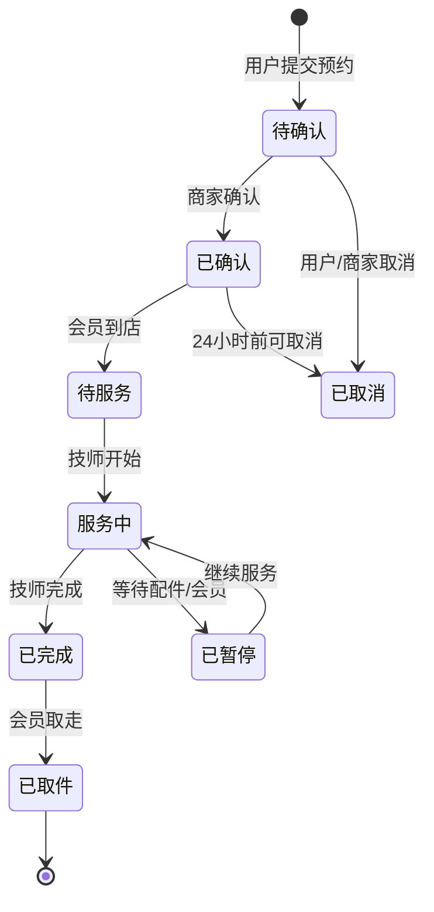

# 服务预约与追踪系统 — 详细需求

> **版本**: V2.1.0  
> **适用阶段**: 预约系统开发  
> **依赖**: [05-数据库设计.md](05-数据库设计.md)（预约模块表结构）  
> **Token 预算**: 中等（约 400 行）

---

## 模块概述

服务预约与追踪系统面向微信小程序用户端和 Web 管理后台，提供缠线服务预约、进度追踪、服务历史记录、个性化推荐等功能。

**核心目标**：通过预约系统减少客户等待时间，通过进度追踪提升服务透明度，通过个性化推荐提升客单价。

## 数据表

> 完整字段定义见 [05-数据库设计.md](05-数据库设计.md)的"预约模块"章节。

| 表名 | 说明 | 核心字段 |
|------|------|----------|
| `tb_appointment` | 预约表 | member_id, service_type, date, time_slot, status |
| `tb_service_progress` | 服务进度 | appointment_id, status, technician_id, wire_id, start_time |
| `tb_service_history` | 服务历史 | member_id, wire_id, tension, cost, rating |
| `tb_recommendation` | 推荐记录 | member_id, rec_type, item_id, score, status |
| `tb_technician` | 技师表 | name, phone, skill_type, work_schedule |
| `tb_training_task` | 培训任务 | technician_id, training_type, trigger_reason, status |

## 功能需求

### 3.1 服务预约（P0）

**用户故事**
```
作为 会员，我希望 提前预约缠线服务，以便 到店后无需等待。
作为 店铺管理员，我希望 管理预约排班，以便 合理安排技师工作。
```

**界面及交互**

| 元素 | 类型 | 必填 | 校验规则 |
|------|------|------|---------|
| 服务类型 | 下拉选择 | 是 | 羽毛球拍/网球拍/重穿线 |
| 预约日期 | 日期选择 | 是 | 不能选择过去日期 |
| 预约时段 | 下拉选择 | 是 | 必须选择可用时段 |
| 技师选择 | 下拉选择 | 否 | 自动分配/指定技师 |
| 球拍数量 | 数字输入 | 是 | 1-10 |
| 当前磅数 | 数字输入 | 否 | 15-35（网球）/18-32（羽毛球）|
| 期望磅数 | 数字输入 | 否 | 15-35（网球）/18-32（羽毛球）|
| 特殊要求 | 文本域 | 否 | 1-500 字符 |

**业务规则**

- 预约时段按 30 分钟粒度划分（9:00-21:00）
- 同一技师同一时段只能有一个预约
- 预约需提前 2 小时，取消需提前 4 小时

**API 接口**

| 方法 | 路径 | 说明 |
|------|------|------|
| GET | `/api/appointment/list` | 预约列表（分页） |
| POST | `/api/appointment` | 新增预约 |
| PUT | `/api/appointment/{id}/confirm` | 确认预约 |
| PUT | `/api/appointment/{id}/cancel` | 取消预约 |
| PUT | `/api/appointment/{id}/complete` | 完成服务 |

### 3.2 服务进度追踪（P0）

**服务状态流转**



**状态说明**

| 状态 | 说明 | C端展示 | B端展示 |
|------|------|---------|---------|
| 待确认 | 预约提交，等待商家确认 | 显示"待确认" | 显示待确认列表 |
| 已确认 | 商家确认预约 | 显示"已确认"+预约详情 | — |
| 待服务 | 会员到店，等待技师 | 显示"请前往店面" | — |
| 服务中 | 技师正在缠线 | 显示"服务中"+预计完成时间 | 显示技师当前任务 |
| 已暂停 | 等待配件或会员确认 | 显示"已暂停"+原因 | 显示暂停原因 |
| 已完成 | 服务完成，等待取拍 | 显示"已完成"+取件码 | — |
| 已取件 | 会员已取走球拍 | 显示"已取件"+评价入口 | — |
| 已取消 | 预约已取消 | 显示"已取消" | — |

**API 接口**

| 方法 | 路径 | 说明 |
|------|------|------|
| GET | `/api/service/progress/{appointmentId}` | 查询进度 |
| POST | `/api/service/progress` | 创建/更新进度 |
| PUT | `/api/service/progress/{id}/pause` | 暂停服务 |
| PUT | `/api/service/progress/{id}/resume` | 恢复服务 |

### 3.3 服务历史记录（P1）

| 功能 | 说明 |
|------|------|
| 历史查询 | 会员可查看历史服务记录 |
| 服务详情 | 展示每次服务的完整信息 |
| 评价服务 | 会员可对服务进行评分和评价 |

**API 接口**

| 方法 | 路径 | 说明 |
|------|------|------|
| GET | `/api/service/history` | 服务历史列表 |
| GET | `/api/service/history/{id}` | 服务详情 |
| POST | `/api/service/history/{id}/review` | 评价服务 |

### 3.4 个性化推荐（P1）

**推荐场景**

| 场景 | 触发条件 | 推荐内容 |
|------|---------|---------|
| 重复预约 | 会员再次预约同类型服务 | 推荐上次使用的线材和磅数 |
| 线材搭配 | 会员选择特定球拍 | 推荐适配的线材型号 |
| 磅数建议 | 会员历史有磅数变化 | 推荐当前主流磅数 |
| 配件推荐 | 消费满一定金额 | 推荐手胶、护腕等配件 |
| 会员升级 | 积分接近升级阈值 | 推荐积分翻倍活动或兑换方案 |

**推荐算法逻辑**

```
1. 基于历史记录：
   - 最近 3 次使用的线材品牌/型号 → 推荐同品牌
   - 平均磅数 → 推荐相近磅数（±1磅）

2. 基于消费能力：
   - 客单价 < 100 → 推荐经济型线材
   - 客单价 100-200 → 推荐中端线材
   - 客单价 > 200 → 推荐高端线材

3. 基于运动偏好：
   - 羽毛球 → 推荐 0.65-0.70mm 线径
   - 网球 → 推荐 1.20-1.30mm 线径
```

**API 接口**

| 方法 | 路径 | 说明 |
|------|------|------|
| GET | `/api/recommendation/{memberId}` | 获取推荐 |
| POST | `/api/recommendation` | 创建推荐 |
| PUT | `/api/recommendation/{id}/click` | 记录点击 |
| PUT | `/api/recommendation/{id}/dismiss` | 忽略推荐 |

### 3.5 技师管理（P1）

| 功能 | 说明 |
|------|------|
| 技师 CRUD | 增删改查技师信息 |
| 排班管理 | 设置技师工作日程 |
| 绩效统计 | 统计日均量/损耗率/评分 |
| 培训任务 | 损耗率异常时触发培训 |

**API 接口**

| 方法 | 路径 | 说明 |
|------|------|------|
| GET | `/api/technician/list` | 技师列表 |
| POST | `/api/technician` | 新增技师 |
| PUT | `/api/technician/{id}` | 更新技师 |
| GET | `/api/technician/{id}/schedule` | 查询排班 |
| GET | `/api/training/list` | 培训列表 |
| POST | `/api/training` | 创建培训 |
| PUT | `/api/training/{id}/complete` | 完成培训 |

## 页面清单

### 用户端（微信小程序）

| 页面 | 路由 | 功能 |
|------|------|------|
| 服务预约 | `/appointment/book` | 预约缠线服务 |
| 预约列表 | `/appointment/list` | 我的预约 |
| 服务进度 | `/appointment/progress/:id` | 实时进度追踪 |
| 服务历史 | `/appointment/history` | 历史服务记录 |
| 扫码使用 | `/qr/scan` | 扫码标记线材使用 |
| 我的扫码 | `/qr/my-scans` | 我的扫码记录 |

### 商家端（Web 管理后台）

| 页面 | 路由 | 图标 | 功能 |
|------|------|------|------|
| 预约管理 | `/appointment` | CalendarOutlined | 预约排班、确认 |
| 服务进度 | `/service/progress` | LoadingOutlined | 进行中服务 |
| 服务历史 | `/service/history` | HistoryOutlined | 历史服务记录 |
| 技师管理 | `/technician` | TeamOutlined | 技师排班 |
| 个性化推荐 | `/recommendation` | BulbOutlined | 推荐配置 |
| 培训管理 | `/training` | ReadOutlined | 技师培训任务 |

## 验收标准

| 功能 | 验收条件 | 优先级 |
|------|---------|--------|
| 预约提交 | 选择服务类型/日期/时段后提交成功 | P0 |
| 预约确认 | 管理员确认后会员收到通知 | P0 |
| 进度追踪 | 会员可实时查看服务状态 | P0 |
| 服务完成 | 技师完成后自动扣库存+发放积分（原子操作，使用数据库事务保证一致性）| P0 |
| 预约取消 | 24小时前可取消，释放时段 | P0 |
| 历史记录 | 会员可查看历史服务记录 | P1 |
| 个性化推荐 | 基于历史记录推荐线材和磅数 | P1 |
| 技师排班 | 管理员可配置技师排班 | P1 |
