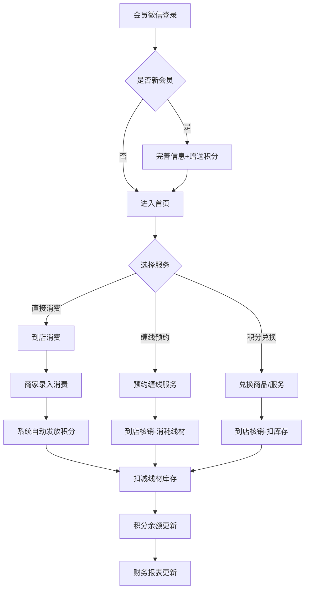
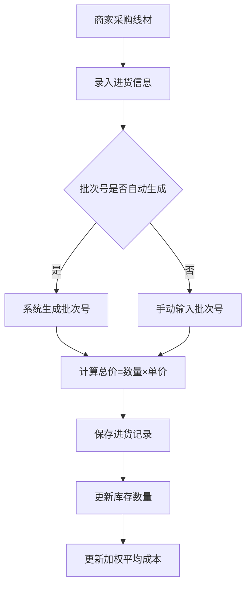
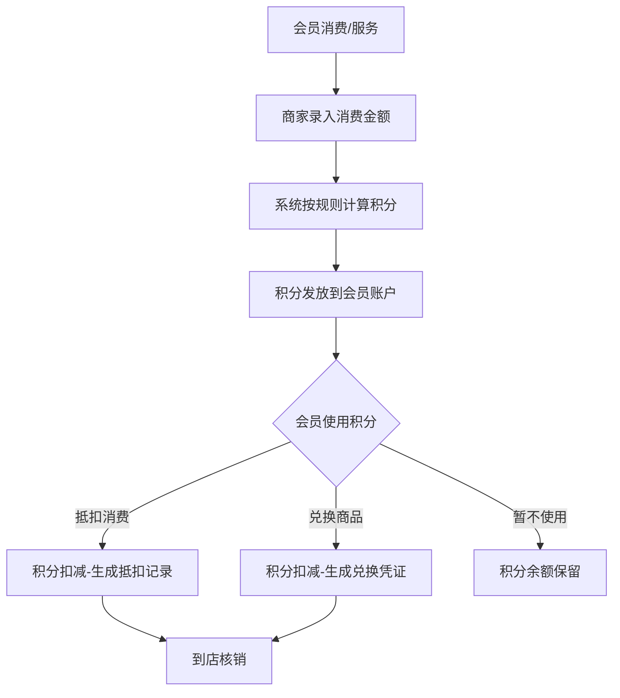
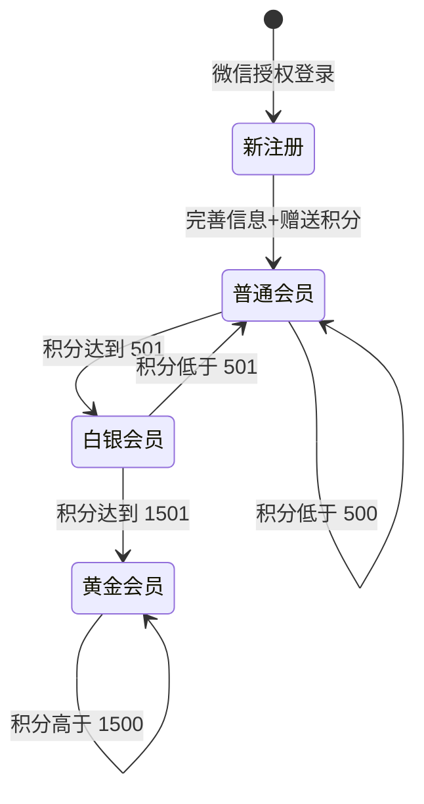
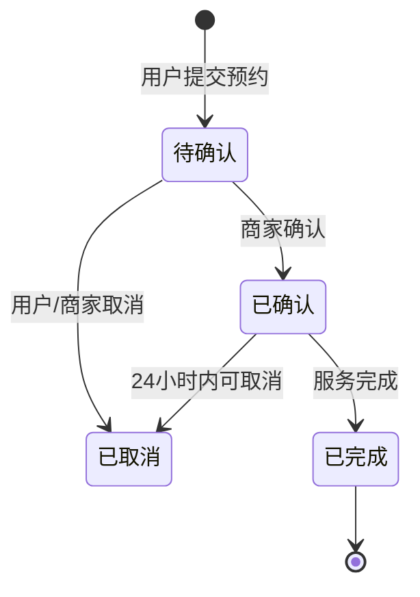
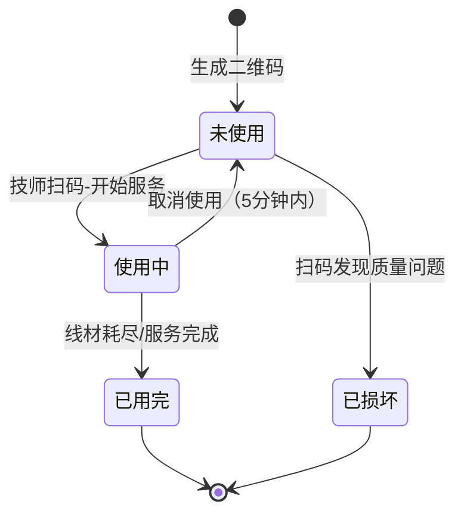
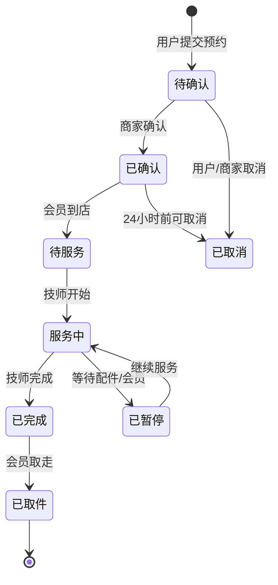

# 体育器材服务店铺管理系统 — 产品需求文档（PRD）

版本号：V2.1.0

| 版本 | 时间 | 修订人 | 备注 |
|------|------|--------|------|
| V1.0.0 | 2026/03/01 | — | 会员积分系统初版 |
| V2.0.0 | 2026/06/12 | — | 新增线材耗材管理系统，合并两大模块 |
| V2.1.0 | 2026/06/12 | — | 新增二维码扫码追踪功能 |

---

## 一、概述（为什么做）

### 1.1 产品概述及目标

#### 1.1.1 背景介绍

体育器材服务店铺的核心业务包含两大板块：一是羽毛球拍、网球拍缠线专项服务（高频刚需，核心老客群体）；二是球拍、缠线材料、运动配件等产品售卖（低频高客单）。

目前店铺面临以下经营痛点：

1. **老客户留存难** — 缺乏有效的会员体系，客户消费后无复购激励，无法形成"消费-留存-复购"闭环
2. **线材成本核算难** — 同一品牌型号线材从不同供应商、不同时间进货，单价不同，无法准确核算每次缠线的成本
3. **消耗追踪难** — 每日缠线消耗量靠估算，报废损耗未记录，导致成本偏差、利润不清
4. **库存管理难** — 不知道何时补货、向谁进货最划算，影响资金周转
5. **线材溯源难** — 无法追踪每卷线材的来源、批次、使用情况，出现质量问题难以定位
6. **扫码标记缺失** — 技师使用线材时无法快速记录，依赖手工录入，效率低、易出错

#### 1.1.2 市场现状

根据体育器材服务行业调研，当前缠线店线上化呈现以下趋势：

**行业共性需求：**

| 需求类型 | 市场现状 | 用户痛点 |
|---------|---------|---------|
| 预约服务 | 大部分店铺仍依赖微信/电话预约 | 技师排班混乱、客户等待时间长 |
| 服务追踪 | 客户无法实时了解缠线进度 | 到店才发现还没完成，体验差 |
| 会员体系 | 多数店铺无会员系统 | 老客户流失率高，复购率低 |
| 线材选择 | 客户对线材品牌/型号认知不足 | 选择困难，依赖技师推荐 |
| 价格透明 | 各店铺定价不统一 | 客户比价困难，信任度低 |
| 历史记录 | 客户无法查看历史缠线记录 | 无法追踪磅数偏好、使用习惯 |

**竞品分析：**

| 竞品类型 | 代表产品 | 优势 | 不足 |
|---------|---------|------|------|
| 综合体育平台 | 咕咚、Keep | 用户基数大、社区活跃 | 不聚焦缠线服务、无库存管理 |
| 垂直体育服务 | 动域、趣运动 | 专业赛事服务 | 不覆盖器材服务、无会员体系 |
| 传统店铺 | 各地独立店铺 | 本地化服务 | 无线上能力、客户管理落后 |

**市场机会：**

当前市场缺乏专注于"缠线服务 + 器材管理"的垂直SaaS系统。本系统填补以下空白：
1. 面向C端：一站式缠线服务预约、追踪、会员权益
2. 面向B端：线材进销存管理、成本核算、财务分析
3. 数据驱动：客户偏好分析、库存预警、经营决策支持

#### 1.1.3 产品概述

本系统为体育器材服务店铺提供一套综合管理系统，包含三大核心模块：

- **会员积分管理系统**：面向微信小程序用户端 + Web 管理后台，提供会员注册、积分获取/使用、商品兑换、服务预约、积分规则配置等功能
- **线材耗材管理系统**：面向 Web 管理后台，提供线材字典、供应商管理、批次计价进货、日常消耗记录、报废记录、库存管理、财务统计分析等功能
- **服务预约与追踪系统**：面向微信小程序用户端 + Web 管理后台，提供缠线服务预约、进度追踪、服务历史记录、个性化推荐等功能

三大模块深度集成：会员预约缠线 → 技师接单 → 消耗线材扣库存 → 消费金额累计积分 → 财务报表更新，形成完整的业务闭环。

#### 1.1.3 产品目标

**业务目标**

| 目标 | 指标 | 目标值 | 达成时间 |
|------|------|--------|---------|
| 提升老客户复购率 | 核心客户月消费频次 | 提升 30% | 上线后 3 个月 |
| 降低线材成本核算误差 | 成本核算准确率 | ≥ 95% | 上线后 1 个月 |
| 减少库存缺货情况 | 低库存预警响应率 | ≥ 80% | 上线后 2 个月 |
| 提升缠线服务毛利 | 服务毛利率 | 提升 15% | 上线后 3 个月 |

**用户目标**

| 目标用户 | 用户目标 | 衡量指标 |
|---------|---------|---------|
| 店铺会员 | 便捷查询和使用积分，享受会员权益 | 积分使用率 ≥ 60% |
| 缠线技师 | 快速记录线材消耗和报废 | 记录完整率 ≥ 90% |
| 店铺老板 | 实时掌握库存和成本，优化经营决策 | 库存准确率 ≥ 95% |

#### 1.1.4 目标用户

| 角色 | 描述 | 核心诉求 |
|------|------|---------|
| 店铺会员 | 到店消费缠线服务或购买商品的顾客 | 便捷查询积分、享受会员权益、兑换商品/服务 |
| 缠线技师 | 负责缠线服务的技术人员 | 快速记录每日线材消耗和报废情况 |
| 店铺管理员 | 负责店铺日常运营的管理人员 | 管理会员、配置积分规则、查看财务报表 |
| 系统管理员 | 负责系统配置和权限管理的超级管理员 | 全功能权限，系统配置和用户管理 |

### 1.2 名词说明

| 名词 | 说明 |
|------|------|
| 积分 | 会员消费后获得的虚拟积分，可抵扣消费或兑换商品/服务 |
| 缠线服务 | 将羽毛球拍或网球拍穿线、拉线的专业服务 |
| 线材/拍线 | 用于缠线服务的消耗性材料，如 Yonex BG-80、李宁 N90-III |
| 批次计价 | 同一线材每次进货独立记录单价，支持不同时间不同价格 |
| 加权平均成本 | 线材平均单价 = Σ(进货数量 × 进货单价) / Σ进货数量 |
| 实时库存 | 当前库存 = Σ进货数量 − Σ消耗数量 − Σ报废数量 |
| 损耗率 | 报废量 / 消耗量 × 100% |
| JWT | JSON Web Token，用于系统认证 |
| Mock 数据 | 前端开发阶段使用的模拟数据，不依赖后端 API |

### 1.3 角色及权限

| 角色 | 权限范围 | 数据范围 |
|------|---------|---------|
| 系统管理员 | 全功能权限 | 全部数据 |
| 店铺管理员 | 会员管理、积分管理、线材管理、报表查看 | 全部业务数据 |
| 缠线技师 | 消耗记录、报废记录 | 本人创建的记录 |
| 微信会员 | 积分查询、积分使用、商品兑换、预约、个人信息 | 仅本人数据 |

### 1.4 文档阅读对象

| 对象 | 关注内容 |
|------|---------|
| 前端开发 | 页面交互、API 对接、Mock 数据、组件规范 |
| Java 后端开发 | 数据库设计、API 接口、Service 层业务逻辑 |
| UI/UX 设计 | 界面交互、全局规则、视觉规范 |
| 测试 | 异常流程、验收标准、数据字典 |
| 运营/产品经理 | 产品目标、埋点方案、功能清单、优先级 |

---

## 二、产品描述（做什么）

### 2.1 产品需求描述

本系统为体育器材服务店铺提供会员积分管理与线材耗材管理两大核心功能，覆盖微信小程序用户端、Web 管理后台两个入口，支持会员注册登录、积分获取使用、商品兑换、服务预约、线材进销存管理、成本核算、财务分析等场景。

**系统边界：**
- 不开发线上交易功能（商品购买、服务付款仅支持线下）
- 不开发物流配送功能（兑换商品仅到店自提）
- 不开发多级仓库管理（仅支持单店铺库存）

### 2.2 产品整体流程

#### 2.2.1 主流程



#### 2.2.2 子流程

**子流程 A：线材采购与库存更新**



**子流程 B：会员积分流转**



#### 2.2.3 数据流图（DFD）

```
                    ┌─────────────┐
                    │  微信会员    │
                    └──────┬──────┘
                           │ 登录/查询/预约/兑换
                           ▼
┌─────────────┐    ┌─────────────┐    ┌─────────────┐
│  商家管理员  │───▶│  系统后台   │◀───│  缠线技师   │
└─────────────┘    └──────┬──────┘    └─────────────┘
                          │
          ┌───────────────┼───────────────┐
          ▼               ▼               ▼
   ┌─────────────┐ ┌─────────────┐ ┌─────────────┐
   │  会员数据   │ │  线材数据   │ │  财务数据   │
   │  (tb_member)│ │ (tb_wire等) │ │ (报表统计)  │
   └─────────────┘ └─────────────┘ └─────────────┘
```

#### 2.2.4 状态转换图（STD）

**会员等级状态流转：**



**预约状态流转：**



### 2.3 全局说明

#### 2.3.1 全局异常处理

| 异常场景 | 处理方式 | 提示文案 |
|---------|---------|---------|
| 网络异常 | 显示提示，支持重试 | "请检查网络连接" |
| 服务超时 | 显示提示，支持重试 | "系统响应超时，请稍后重试" |
| 权限异常 | 显示提示，不允许操作 | "无操作权限" |
| 积分不足 | 显示提示，不允许兑换 | "积分不足，当前余额：xxx" |
| 库存不足 | 显示提示，不允许消耗 | "线材库存不足，当前库存：xxx" |
| 重复提交 | 首次点击后按钮置灰 | — |
| 数据不存在 | 返回空状态页 | "内容不存在或已删除" |
| 系统异常 | 显示提示，记录日志 | "系统开小差啦，请联系管理员" |

#### 2.3.2 普通列表规则

| 规则项 | 说明 |
|--------|------|
| 分页 | 默认 10 条/页，可调整为 20/50/100 |
| 排序 | 默认按创建时间倒序，支持点击表头排序 |
| 搜索 | 支持模糊搜索、多条件筛选 |
| 空数据 | 显示插画 + "暂无数据" |
| 统计 | 列表顶部展示统计信息（如有） |
| 导出 | 支持 Excel 导出（财务报表） |
| 批量操作 | 需二次确认（如有） |

#### 2.3.3 全局交互

| 场景 | 交互方式 |
|------|---------|
| 操作成功 | Toast 提示"操作成功"，自动消失 |
| 操作失败 | 弹窗/Toast 提示错误详情 |
| 加载中 | 显示全局 loading 动画 |
| 表单保存 | 自动返回上一页并提示 |
| 删除操作 | 二次确认弹窗 |
| 异步操作 | 按钮置灰防止重复提交 |
| 空状态 | 显示插画 + 文字提示 |

### 2.4 产品版本规划（里程碑）

| 版本 | 范围 | 计划时间 | 状态 |
|------|------|---------|------|
| V1.0 | 会员积分系统 MVP（登录、积分查询、积分规则、兑换、预约） | 2026/03 | ✅ 已完成 |
| V1.1 | 积分到期提醒、兑换记录查询、商品展示、数据统计 | 2026/04 | ⏳ 规划中 |
| V2.0 | 线材耗材管理系统 P0（线材字典、供应商、进货、消耗、报废） | 2026/06 | ✅ 已完成 |
| V2.1 | 库存管理、财务分析报表 | 2026/07 | 🔨 已实现 |
| V2.2 | 会员等级权益、积分翻倍活动、数据导出 | 2026/08 | ⏳ 规划中 |
| V3.0 | 积分-线材系统打通（缠线消费→扣库存+积分）、毛利分析 | 2026/09 | ⏳ 规划中 |

### 2.5 产品框架

```
体育器材服务店铺管理系统
├── 微信小程序（用户端）
│   ├── 首页（积分余额、快捷入口）
│   ├── 积分模块（明细、规则、兑换）
│   ├── 用户中心（资料、等级、记录）
│   ├── 预约模块（缠线服务预约）
│   └── 商品展示
├── Web 管理后台（商家端）
│   ├── 数据概览（核心指标看板）
│   ├── 会员管理
│   ├── 积分管理（调整/核销）
│   ├── 兑换管理（商品/记录）
│   ├── 预约管理
│   ├── 积分规则设置
│   ├── 线材管理
│   ├── 供应商管理
│   ├── 进货管理
│   ├── 消耗记录
│   ├── 报废记录
│   ├── 库存查询
│   └── 财务报表
├── 服务预约与追踪系统 ← 新增
│   ├── 服务预约
│   ├── 进度追踪
│   ├── 服务历史
│   └── 个性化推荐
└── Java 后端
    ├── 会员积分模块
    ├── 线材耗材模块
    ├── 服务预约模块 ← 新增
    └── 公共模块（认证、权限、工具）
```

### 2.6 功能清单

| 模块 | 功能 | 优先级 | 版本 | 说明 |
|------|------|--------|------|------|
| 用户端 | 微信登录/注册 | P0 | V1.0 | 已完成 |
| 用户端 | 积分查询（余额+明细） | P0 | V1.0 | 已完成 |
| 用户端 | 积分规则查看 | P0 | V1.0 | 已完成 |
| 用户端 | 店铺信息查看 | P0 | V1.0 | 已完成 |
| 用户端 | 积分抵扣消费 | P0 | V1.0 | 已完成 |
| 用户端 | 积分兑换商品/服务 | P0 | V1.0 | 已完成 |
| 用户端 | 缠线服务预约 | P1 | V1.1 | 规划中 |
| 用户端 | 商品展示 | P1 | V1.1 | 规划中 |
| 用户端 | 积分到期提醒 | P1 | V1.1 | 规划中 |
| 用户端 | 会员等级权益 | P2 | V2.2 | 规划中 |
| 用户端 | 每日签到赚积分 | P2 | V2.2 | 规划中 |
| 商家端 | 数据概览 | P0 | V1.0 | 已完成 |
| 商家端 | 商家登录 | P0 | V1.0 | 已完成 |
| 商家端 | 会员管理 | P0 | V1.0 | 已完成 |
| 商家端 | 积分管理（调整/核销） | P0 | V1.0 | 已完成 |
| 商家端 | 兑换管理 | P0 | V1.0 | 已完成 |
| 商家端 | 预约管理 | P0 | V1.0 | 已完成 |
| 商家端 | 积分规则设置 | P0 | V1.0 | 已完成 |
| 商家端 | 线材管理 | P0 | V2.0 | ✅ 已完成 |
| 商家端 | 供应商管理 | P0 | V2.0 | ✅ 已完成 |
| 商家端 | 进货管理 | P0 | V2.0 | ✅ 已完成 |
| 商家端 | 消耗记录 | P0 | V2.0 | ✅ 已完成 |
| 商家端 | 报废记录 | P0 | V2.0 | ✅ 已完成 |
| 商家端 | 库存查询 | P1 | V2.1 | 🔨 已实现 |
| 商家端 | 财务报表 | P1 | V2.1 | 🔨 已实现 |
| 商家端 | 积分-线材系统打通 | P2 | V3.0 | 规划中 |
| 商家端 | 服务预约管理 | P0 | V2.2 | 🔨 新增 |
| 商家端 | 服务进度追踪 | P0 | V2.2 | 🔨 新增 |
| 商家端 | 客户偏好分析 | P1 | V2.2 | 🔨 新增 |
| 商家端 | 个性化推荐 | P1 | V2.3 | 规划中 |
| 商家端 | 在线收款 | P1 | V2.3 | 规划中 |
| 商家端 | 经营数据分析 | P1 | V2.3 | 规划中 |
| 商家端 | 二维码管理 | P0 | V2.1 | 🔨 新增 |
| 商家端 | 线材追溯 | P1 | V2.1 | 🔨 新增 |
| 用户端 | 扫码使用 | P0 | V2.1 | 🔨 新增 |

---

## 三、功能需求（怎么做）

### 3.1 会员积分系统

#### 3.1.1 微信快捷登录/会员注册

**描述**

用户通过微信一键授权登录，自动生成会员账号，降低使用门槛。

**用户故事**

```
作为 店铺顾客，我希望 通过微信一键登录，以便 无需注册账号密码即可使用会员功能。
作为 新会员，我希望 完善个人信息后获得赠送积分，以便 激励我完善资料。
```

**前置条件**

| 类型 | 条件 |
|------|------|
| 功能依赖 | 已安装微信客户端 |
| 权限依赖 | 用户授权微信登录 |

**后置条件**

- 系统创建/更新会员记录
- 新会员获得 10 积分赠送
- 登录后跳转小程序首页

**界面及交互**

| 元素 | 类型 | 必填 | 默认值 | 校验规则 | 操作反馈 |
|------|------|------|--------|---------|---------|
| 微信授权按钮 | 按钮 | — | — | — | 点击后调起微信授权 |
| 姓名 | 文本输入 | 否 | — | 1-20 字符 | — |
| 手机号 | 文本输入 | 是 | — | 11 位手机号格式 | 格式错误提示"请输入正确的手机号" |
| 运动偏好 | 单选 | 否 | 全部 | 全部/羽毛球/网球 | — |

**业务流程**

```mermaid
flowchart TD
    A[用户点击微信登录] --> B[调起微信授权]
    B -->{授权成功?}
    B -->|否| C[提示授权失败]
    B -->|是| D{是否新会员?}
    D -->|是| E[创建会员记录]
    E --> F[跳转完善信息页]
    D -->|否| G[更新登录时间]
    G --> H[跳转首页]
    F --> I[用户填写信息]
    I --> J[保存+赠送10积分]
    J --> H
```

**异常/分支流程**

| 场景 | 触发条件 | 处理方式 | 提示文案 |
|------|---------|---------|---------|
| 授权取消 | 用户取消微信授权 | 返回登录页 | — |
| 授权失败 | 微信授权失败 | 显示重试按钮 | "授权失败，请重试" |
| 手机号已注册 | 输入的手机号已存在 | 提示已有账号 | "该手机号已注册，请直接登录" |

**数据字典**

| 字段名 | 类型 | 必填 | 说明 | 示例值 |
|--------|------|------|------|--------|
| id | Long | 是 | 主键 | 1001 |
| member_id | String | 是 | 会员编号 | M202401010001 |
| name | String(50) | 否 | 姓名 | "张三" |
| phone | String(20) | 是 | 手机号 | "138****8888" |
| avatar | String(255) | 否 | 头像 URL | "https://..." |
| level | Integer | 是 | 会员等级：1-普通 2-白银 3-黄金 | 1 |
| points | Integer | 是 | 积分余额 | 2580 |
| register_time | DateTime | 是 | 注册时间 | 2024-01-01 10:00:00 |
| last_consume_time | DateTime | 否 | 最后消费时间 | 2025-01-28 15:30:00 |

#### 3.1.2 积分管理

**描述**

管理积分的获取、使用、调整和核销，是会员积分系统的核心功能。

**用户故事**

```
作为 店铺管理员，我希望 手动调整会员积分（补赠/扣除），以便 处理特殊情况。
作为 店铺管理员，我希望 查看积分明细，以便 核对积分变动情况。
作为 会员，我希望 使用积分抵扣消费，以便 享受会员优惠。
```

**前置条件**

| 类型 | 条件 |
|------|------|
| 权限依赖 | 店铺管理员角色 |
| 功能依赖 | 会员已注册 |

**后置条件**

- 积分余额实时更新
- 积分变动记录写入明细表
- 会员收到积分变动通知

**界面及交互**

| 元素 | 类型 | 必填 | 默认值 | 校验规则 | 操作反馈 |
|------|------|------|--------|---------|---------|
| 会员搜索 | 文本输入 | 是 | — | 手机号或会员ID | 实时搜索 |
| 操作类型 | 下拉选择 | 是 | — | 补赠/扣除 | — |
| 积分数量 | 数字输入 | 是 | — | 1-99999 | — |
| 调整原因 | 文本域 | 是 | — | 1-200 字符 | — |

**数据字典**

| 字段名 | 类型 | 必填 | 说明 | 示例值 |
|--------|------|------|------|--------|
| id | Long | 是 | 主键 | 1 |
| member_id | String | 是 | 会员ID | M202401010001 |
| points | Integer | 是 | 积分数量（正数=获得，负数=扣除）| 100 |
| type | Enum | 是 | earn-获得 / deduct-扣除 | earn |
| reason | String(200) | 是 | 原因 | "缠线服务消费" |
| create_time | DateTime | 是 | 记录时间 | 2025-01-31 09:00:00 |

#### 3.1.3 积分兑换管理

**描述**

管理可兑换的商品/服务以及会员的兑换记录。

**用户故事**

```
作为 会员，我希望 用积分兑换商品或服务，以便 享受会员权益。
作为 店铺管理员，我希望 管理可兑换的商品/服务，以便 灵活配置兑换内容。
```

**界面及交互**

| 元素 | 类型 | 必填 | 默认值 | 校验规则 | 操作反馈 |
|------|------|------|--------|---------|---------|
| 商品名称 | 文本输入 | 是 | — | 1-100 字符 | — |
| 商品描述 | 文本域 | 是 | — | 1-500 字符 | — |
| 所需积分 | 数字输入 | 是 | — | ≥ 1 | — |
| 库存 | 数字输入 | 是 | — | ≥ 0 | — |
| 商品类型 | 下拉选择 | 是 | — | product/service | — |
| 状态 | 下拉选择 | 是 | active | active/inactive | — |

**数据字典**

| 字段名 | 类型 | 必填 | 说明 | 示例值 |
|--------|------|------|------|--------|
| id | Long | 是 | 主键 | 1 |
| name | String(100) | 是 | 商品名称 | "专业羽毛球拍手胶" |
| description | Text | 否 | 商品描述 | "高品质PU材质" |
| points | Integer | 是 | 所需积分 | 200 |
| stock | Integer | 是 | 库存 | 50 |
| image | String(255) | 否 | 商品图片 | "https://..." |
| type | Enum | 是 | product/service | product |
| status | Enum | 是 | active/inactive | active |

---

### 3.2 线材耗材管理系统

#### 3.2.1 线材字典

**描述**

管理线材的基础信息，是进货、消耗、报废等业务的关联基础。

**用户故事**

```
作为 店铺管理员，我希望 管理线材的品牌、型号、规格等信息，以便 统一管理线材基础数据。
作为 店铺管理员，我希望 设置最低库存预警线，以便 库存不足时及时提醒。
```

**前置条件**

| 类型 | 条件 |
|------|------|
| 权限依赖 | 店铺管理员角色 |

**后置条件**

- 线材基础数据创建/更新
- 品牌+型号组合唯一性校验

**界面及交互**

| 元素 | 类型 | 必填 | 默认值 | 校验规则 | 操作反馈 |
|------|------|------|--------|---------|---------|
| 品牌 | 文本输入 | 是 | — | 1-50 字符 | — |
| 型号 | 文本输入 | 是 | — | 1-50 字符 | — |
| 规格 | 文本输入 | 否 | — | 1-30 字符 | — |
| 颜色 | 文本输入 | 否 | — | 1-30 字符 | — |
| 类型 | 下拉选择 | 是 | — | tennis/badminton | — |
| 最低库存 | 数字输入 | 否 | 0 | ≥ 0 | — |

**业务规则**

- 品牌 + 型号组合必须唯一
- 删除线材不影响已关联的进货/消耗/报废记录

**数据字典**

| 字段名 | 类型 | 必填 | 说明 | 示例值 |
|--------|------|------|------|--------|
| id | Long | 是 | 主键 | 1 |
| brand | String(50) | 是 | 品牌 | "Yonex" |
| model | String(50) | 是 | 型号 | "BG-80" |
| spec | String(30) | 否 | 规格 | "0.68mm" |
| color | String(30) | 否 | 颜色 | "白色" |
| type | Enum | 是 | tennis/badminton | badminton |
| min_stock | Integer | 否 | 最低库存预警线 | 5 |
| deleted | Integer | 是 | 0=正常 1=已删 | 0 |
| create_time | DateTime | 是 | 创建时间 | 2026-06-01 00:00:00 |
| update_time | DateTime | 是 | 更新时间 | 2026-06-01 00:00:00 |

#### 3.2.2 供应商管理

**描述**

管理线材供应商信息，是进货业务的关联基础。

**用户故事**

```
作为 店铺管理员，我希望 管理供应商的联络人和支付方式，以便 进货时快速选择。
```

**界面及交互**

| 元素 | 类型 | 必填 | 默认值 | 校验规则 | 操作反馈 |
|------|------|------|--------|---------|---------|
| 供应商名称 | 文本输入 | 是 | — | 1-100 字符，唯一 | — |
| 联络人 | 文本输入 | 否 | — | 1-50 字符 | — |
| 电话 | 文本输入 | 否 | — | 1-20 字符 | — |
| 支付方式 | 下拉选择 | 否 | cash | cash/transfer/monthly | — |
| 备注 | 文本域 | 否 | — | 1-500 字符 | — |

**数据字典**

| 字段名 | 类型 | 必填 | 说明 | 示例值 |
|--------|------|------|------|--------|
| id | Long | 是 | 主键 | 1 |
| name | String(100) | 是 | 供应商名称（唯一）| "上海羽毛球用品批发" |
| contact | String(50) | 否 | 联络人 | "张经理" |
| phone | String(20) | 否 | 电话 | "138-0000-1111" |
| payment_method | Enum | 否 | 支付方式 | transfer |
| remark | String(500) | 否 | 备注 | "Yonex 总代理" |
| deleted | Integer | 是 | 0=正常 1=已删 | 0 |

#### 3.2.3 进货管理

**描述**

记录线材进货信息，支持批次计价——同一线材不同供应商、不同时间允许不同单价。

**用户故事**

```
作为 店铺管理员，我希望 记录每次进货的详细信息，以便 追踪线材来源和成本。
作为 店铺管理员，我希望 系统自动生成批次号和计算总价，以便 减少人工错误。
```

**界面及交互**

| 元素 | 类型 | 必填 | 默认值 | 校验规则 | 操作反馈 |
|------|------|------|--------|---------|---------|
| 线材 | 下拉选择 | 是 | — | 必须选择有效线材 | 选择后显示当前库存 |
| 供应商 | 下拉选择 | 是 | — | 必须选择有效供应商 | — |
| 进货日期 | 日期选择 | 是 | 今天 | 不能选择未来日期 | — |
| 数量 | 数字输入 | 是 | — | ≥ 1 | — |
| 单价 | 数字输入 | 是 | — | ≥ 0.01，精确到分 | — |
| 总价 | 只读 | — | — | 后端自动计算 | 数量×单价 |
| 付款方式 | 下拉选择 | 否 | cash | cash/transfer/monthly | — |
| 备注 | 文本域 | 否 | — | 1-500 字符 | — |

**业务规则**

- 批次号生成规则：取品牌名前 3 位大写 + 进货日期 + 当日序号（如 `YNX-20260612-001`）
- 总价由后端自动计算，前端不可手动修改
- 新增进货后自动更新库存数量和加权平均成本

**数据字典**

| 字段名 | 类型 | 必填 | 说明 | 示例值 |
|--------|------|------|------|--------|
| id | Long | 是 | 主键 | 1 |
| wire_id | Long | 是 | 线材ID | 1 |
| supplier_id | Long | 是 | 供应商ID | 1 |
| purchase_date | Date | 是 | 进货日期 | 2026-06-01 |
| quantity | Integer | 是 | 数量（条）| 20 |
| unit_price | Decimal(10,2) | 是 | 单价（元）| 15.00 |
| total_price | Decimal(12,2) | 是 | 总价（元）| 300.00 |
| payment_method | Enum | 否 | 付款方式 | transfer |
| batch_no | String(30) | 是 | 批次号（唯一）| YNX-20260601-001 |
| remark | String(500) | 否 | 备注 | — |
| deleted | Integer | 是 | 0=正常 1=已删 | 0 |

#### 3.2.4 消耗记录

**描述**

记录每日缠线服务消耗的线材数量，是成本核算的核心数据来源。

**用户故事**

```
作为 缠线技师，我希望 快速记录每日消耗的线材，以便 准确核算服务成本。
作为 店铺管理员，我希望 查看所有消耗记录，以便 分析线材使用情况。
```

**界面及交互**

| 元素 | 类型 | 必填 | 默认值 | 校验规则 | 操作反馈 |
|------|------|------|--------|---------|---------|
| 线材 | 下拉选择 | 是 | — | 必须选择有效线材 | 选择后显示当前库存 |
| 消耗日期 | 日期选择 | 是 | 今天 | 不能选择未来日期 | — |
| 消耗数量 | 数字输入 | 是 | — | ≥ 1，≤ 当前库存 | 超出时提示"库存不足" |
| 关联订单号 | 文本输入 | 否 | — | 1-64 字符 | — |
| 操作人 | 文本输入 | 否 | — | 1-50 字符 | — |
| 备注 | 文本域 | 否 | — | 1-500 字符 | — |

**业务规则**

- 消耗数量不能超过当前库存（前端校验 + 后端校验）
- 新增消耗后自动更新库存数量

**数据字典**

| 字段名 | 类型 | 必填 | 说明 | 示例值 |
|--------|------|------|------|--------|
| id | Long | 是 | 主键 | 1 |
| wire_id | Long | 是 | 线材ID | 1 |
| usage_date | Date | 是 | 消耗日期 | 2026-06-10 |
| quantity | Integer | 是 | 消耗数量（条）| 2 |
| usage_type | Enum | 否 | 默认 service | service |
| related_order | String(64) | 否 | 关联订单号 | ORD-20260610-001 |
| operator | String(50) | 否 | 操作人 | "张师傅" |
| remark | String(500) | 否 | 备注 | — |
| deleted | Integer | 是 | 0=正常 1=已删 | 0 |

#### 3.2.5 报废记录

**描述**

记录缠线过程中产生的线材损耗（断线、打结、人为损坏等），确保成本核算完整。

**用户故事**

```
作为 缠线技师，我希望 快速记录线材报废情况，以便 成本核算完整。
作为 店铺管理员，我希望 查看报废统计，以便 分析损耗原因并改进工艺。
```

**界面及交互**

| 元素 | 类型 | 必填 | 默认值 | 校验规则 | 操作反馈 |
|------|------|------|--------|---------|---------|
| 线材 | 下拉选择 | 是 | — | 必须选择有效线材 | 选择后显示当前库存 |
| 报废日期 | 日期选择 | 是 | 今天 | 不能选择未来日期 | — |
| 报废数量 | 数字输入 | 是 | — | ≥ 1，≤ 当前库存 | 超出时提示"库存不足" |
| 报废原因 | 下拉选择 | 是 | — | break/knot/human/other | 标签颜色区分 |
| 操作人 | 文本输入 | 否 | — | 1-50 字符 | — |
| 备注 | 文本域 | 否 | — | 1-500 字符 | — |

**业务规则**

- 报废数量不能超过当前库存
- 报废原因标签颜色：断裂=红色，打结=橙色，人为=火山红，其他=灰色

**数据字典**

| 字段名 | 类型 | 必填 | 说明 | 示例值 |
|--------|------|------|------|--------|
| id | Long | 是 | 主键 | 1 |
| wire_id | Long | 是 | 线材ID | 1 |
| waste_date | Date | 是 | 报废日期 | 2026-06-10 |
| quantity | Integer | 是 | 报废数量（条）| 1 |
| reason | Enum | 是 | break/knot/human/other | knot |
| operator | String(50) | 否 | 操作人 | "张师傅" |
| remark | String(500) | 否 | 备注 | "穿线时打结" |
| deleted | Integer | 是 | 0=正常 1=已删 | 0 |

#### 3.2.6 库存管理

**描述**

实时展示库存状态，支持加权平均成本计算与低库存预警。

**用户故事**

```
作为 店铺管理员，我希望 实时查看库存数量和价值，以便 掌握资金占用情况。
作为 店铺管理员，我希望 收到低库存预警，以便 及时补货避免断货。
```

**核心公式**

```
实时库存 = Σ进货数量 − Σ消耗数量 − Σ报废数量
加权均价 = Σ(进货数量 × 进货单价) / Σ进货数量
库存价值 = 实时库存 × 加权均价
损耗率   = 报废量 / 消耗量 × 100%
```

**库存总览（顶部统计卡片）**

| 指标 | 说明 |
|---|---|
| 线材种类 | 线材字典中未删除的线材总数 |
| 库存总量 | 所有线材的实时库存之和 |
| 库存总值 | 所有线材的库存价值之和 |
| 低库存预警 | 实时库存 ≤ 最低库存预警线的线材种类数 |

**库存明细（列表展示）**

| 字段 | 说明 |
|---|---|
| 品牌 | 线材品牌 |
| 型号 | 线材型号 |
| 总进货(条) | 该线材的累计进货数量 |
| 总消耗(条) | 该线材的累计消耗数量 |
| 总报废(条) | 该线材的累计报废数量 |
| 实时库存(条) | 当前库存，低库存时红色高亮 |
| 加权均价(元) | 加权平均成本 |
| 库存价值(元) | 实时库存 × 加权均价 |

**操作需求**

- 库存数据实时计算，不依赖手动刷新
- 低库存线材在列表中红色高亮，并显示"低库存"标签
- 支持按品牌、型号搜索

#### 3.2.7 财务分析

**描述**

提供多维度的财务数据分析，支持经营决策。

**用户故事**

```
作为 店铺老板，我希望 查看每日消耗成本，以便 控制运营支出。
作为 店铺老板，我希望 比较不同供应商的价格，以便 选择最优供应商。
作为 店铺老板，我希望 查看损耗率统计，以便 改进工艺降低损耗。
作为 店铺老板，我希望 查看月度成本汇总，以便 制定经营计划。
```

**3.2.7.1 日消耗统计**

| 字段 | 说明 |
|---|---|
| 日期 | 消耗日期 |
| 线材 | 线材名称 |
| 消耗量(条) | 当日消耗数量 |
| 报废量(条) | 当日报废数量 |
| 成本(元) | 消耗数量 × 加权均价 |

- 支持按日期筛选（默认当天）

**3.2.7.2 供应商价格比较**

| 字段 | 说明 |
|---|---|
| 线材 | 线材名称 |
| 供应商 | 供应商名称 |
| 平均单价(元) | 该供应商的平均进货价格 |
| 累计采购(条) | 该供应商的累计进货数量 |
| 最近进货 | 最近一次进货日期 |

**3.2.7.3 损耗率统计**

| 字段 | 说明 |
|---|---|
| 线材 | 线材名称 |
| 总消耗(条) | 累计消耗数量 |
| 总报废(条) | 累计报废数量 |
| 损耗率 | 报废量 / 消耗量 × 100% |

- 支持日期范围筛选（默认近 30 天）
- 损耗率 > 10% 标红，> 5% 标橙

**3.2.7.4 月度汇总**

| 指标 | 说明 |
|---|---|
| 本月进货成本 | Σ进货总价 |
| 本月消耗成本 | Σ(消耗数量 × 加权均价) |
| 本月报废成本 | Σ(报废数量 × 加权均价) |
| 本月累计成本 | 进货成本 + 消耗成本 + 报废成本 |
| 消耗 Top 3 | 消耗量最多的 3 款线材 |
| 报废 Top 3 | 报废量最多的 3 款线材 |

---

### 3.2.8 二维码管理

**描述**

为每卷线材生成唯一二维码标签，实现线材料级的全生命周期追踪。商家通过小程序扫码标记使用，数据实时同步到 PC 端。

**用户故事**

```
作为 店铺管理员，我希望 进货时系统自动生成二维码标签，以便 每卷线材都有唯一身份标识。
作为 店铺管理员，我希望 打印二维码标签贴在卷材上，以便 使用时快速扫码。
作为 缠线技师，我希望 使用线材时扫一下二维码，以便 快速记录消耗。
作为 店铺管理员，我希望 查看每卷线材的使用记录，以便 追踪线材去向和质量问题。
```

**核心业务流程**

```mermaid
flowchart TD
    A[进货录入] --> B{是否启用二维码?}
    B -->|是| C[系统生成二维码]
    B -->|否| D[跳过二维码]
    C --> E[生成二维码数据]
    E --> F[打印二维码标签]
    F --> G[贴在卷材上]
    G --> H[库存入库]
    I[技师使用线材] --> J[小程序扫码]
    J --> K{二维码有效?}
    K -->|是| L[弹出确认信息]
    K -->|否| M[提示无效二维码"]
    L --> N[确认使用]
    N --> O[消耗记录+库存扣减]
    O --> P[数据同步到 PC 端]
```

**功能清单**

| 功能 | 说明 | 入口 |
|------|------|------|
| 生成二维码 | 进货时自动生成唯一二维码 | PC 端 |
| 批量生成 | 一次进货多卷线材批量生成 | PC 端 |
| 打印标签 | 打印二维码标签（含品牌/型号/批次）| PC 端 |
| 扫码使用 | 小程序扫描标记线材使用 | 小程序 |
| 扫码查询 | 扫描二维码查看线材信息 | 小程序/PC |
| 线材追溯 | 查看单卷线材的完整使用记录 | PC 端 |
| 标签补打 | 二维码丢失/损坏后重新打印 | PC 端 |

**二维码编码规则**

| 字段 | 长度 | 说明 | 示例 |
|------|------|------|------|
| 前缀 | 3 | 固定 `WIR` | WIR |
| 线材ID | 8 | 补零 | 00000001 |
| 进货记录ID | 8 | 补零 | 00000001 |
| 卷号 | 4 | 当日第N卷 | 0001 |
| 校验码 | 4 | CRC16 | A3F2 |

**示例二维码数据：**
```
WIR-00000001-00000001-0001-A3F2
```

**界面及交互（PC 端 — 二维码管理页）**

| 元素 | 类型 | 说明 |
|------|------|------|
| 进货批次 | 下拉选择 | 选择需要生成二维码的进货记录 |
| 线材信息 | 只读展示 | 品牌、型号、供应商、数量 |
| 生成按钮 | 按钮 | 点击生成 N 个二维码（N=数量）|
| 二维码预览 | 图片列表 | 预览生成的二维码 |
| 打印按钮 | 按钮 | 调用打印机批量打印 |
| 打印模板 | 选择 | 小标签(50×30mm)/大标签(100×60mm) |

**界面及交互（小程序端 — 扫码页）**

| 元素 | 类型 | 说明 |
|------|------|------|
| 扫码区域 | 相机取景框 | 自动识别二维码 |
| 线材信息卡片 | 信息展示 | 品牌/型号/批次/剩余长度 |
| 使用确认按钮 | 按钮 | 确认使用该卷线材 |
| 使用记录列表 | 列表 | 该卷线材的历史使用记录 |

**标签模板设计**

```
┌─────────────────────────────────┐
│  [二维码图片]                    │
│                                  │
│  Yonex BG-80  白色 0.68mm       │
│  批次: YNX-20260601-001         │
│  供应商: 上海羽毛球用品批发       │
│  卷号: 0001/0020                │
│  长度: 10.6m                     │
└─────────────────────────────────┘
```

**数据字典**

| 字段名 | 类型 | 必填 | 说明 | 示例值 |
|--------|------|------|------|--------|
| id | Long | 是 | 主键 | 1 |
| qr_code | String(64) | 是 | 二维码唯一标识 | WIR-00000001-00000001-0001-A3F2 |
| wire_id | Long | 是 | 线材ID | 1 |
| purchase_id | Long | 是 | 进货记录ID | 1 |
| batch_no | String(30) | 是 | 批次号 | YNX-20260601-0001 |
| spool_no | Integer | 是 | 卷号（第几卷）| 1 |
| total_spools | Integer | 是 | 该批次总卷数 | 20 |
| wire_length | Decimal(6,2) | 否 | 单卷长度（米）| 10.60 |
| status | Enum | 是 | unused/using/used/damaged | unused |
| print_count | Integer | 是 | 打印次数 | 1 |
| printed_at | DateTime | 否 | 首次打印时间 | 2026-06-01 10:00:00 |
| created_at | DateTime | 是 | 创建时间 | 2026-06-01 10:00:00 |

**状态流转：**



**数据同步机制**

| 同步场景 | 触发条件 | 同步方向 | 同步内容 |
|---------|---------|---------|---------|
| 扫码使用 | 技师扫码确认 | 小程序 → PC | 线材ID、技师、时间、服务单号 |
| 库存更新 | 消耗确认 | PC → 小程序 | 实时库存数量 |
| 状态变更 | 线材状态变化 | 双向同步 | 未使用/使用中/已用完/已损坏 |
| 批量同步 | 网络恢复 | 小程序 → PC | 离线扫码记录批量上传 |

**离线支持**

- 小程序支持离线扫码，暂存本地
- 网络恢复后自动同步到 PC 端
- 离线扫码记录最多保存 7 天
- 同步冲突处理：以 PC 端为准，小程序端提示冲突

#### 3.2.9 线材追溯

**描述**

基于二维码追踪每卷线材的完整生命周期，支持质量问题追溯和供应商评估。

**用户故事**

```
作为 店铺管理员，我希望 查看某卷线材的完整使用记录，以便 追溯质量问题。
作为 店铺管理员，我希望 按批次查看线材使用情况，以便 评估供应商质量。
```

**追溯维度**

| 维度 | 查询条件 | 展示内容 |
|------|---------|---------|
| 单卷追溯 | 扫描/输入二维码 | 进货→使用→消耗→报废 完整链路 |
| 批次追溯 | 输入批次号 | 该批次所有线材的使用情况 |
| 供应商追溯 | 选择供应商 | 该供应商所有线材的质量统计 |
| 客户追溯 | 输入会员ID | 该客户使用的所有线材记录 |

**数据字典（线材使用记录）**

| 字段名 | 类型 | 必填 | 说明 | 示例值 |
|--------|------|------|------|--------|
| id | Long | 是 | 主键 | 1 |
| qr_code_id | Long | 是 | 二维码ID | 1 |
| action | Enum | 是 | scan_start/scan_end/damage/complete | scan_start |
| service_history_id | Long | 否 | 关联服务记录ID | 1 |
| member_id | String | 否 | 服务会员ID | M202401010001 |
| technician_id | Long | 否 | 操作技师ID | 1 |
| used_length | Decimal(6,2) | 否 | 使用长度（米）| 10.60 |
| remaining_length | Decimal(6,2) | 否 | 剩余长度（米）| 0.00 |
| note | String(500) | 否 | 备注 | — |
| created_at | DateTime | 是 | 操作时间 | 2026-06-15 14:00:00 |

#### 3.3.1 服务预约

**描述**

用户通过微信小程序预约缠线服务，选择服务类型、时间、技师，减少到店等待时间。

**用户故事**

```
作为 会员，我希望 提前预约缠线服务，以便 到店后无需等待。
作为 店铺管理员，我希望 管理预约排班，以便 合理安排技师工作。
```

**前置条件**

| 类型 | 条件 |
|------|------|
| 功能依赖 | 会员已登录 |
| 数据依赖 | 技师排班信息已配置 |

**后置条件**

- 预约订单创建成功
- 会员收到预约确认通知
- 技师收到服务通知

**界面及交互**

| 元素 | 类型 | 必填 | 默认值 | 校验规则 | 操作反馈 |
|------|------|------|--------|---------|---------|
| 服务类型 | 下拉选择 | 是 | — | 羽毛球拍/网球拍/重穿线 | — |
| 预约日期 | 日期选择 | 是 | 今天 | 不能选择过去日期 | — |
| 预约时段 | 下拉选择 | 是 | — | 必须选择可用时段 | — |
| 技师选择 | 下拉选择 | 否 | 自动分配 | — | — |
| 球拍数量 | 数字输入 | 是 | 1 | 1-10 | — |
| 当前磅数 | 数字输入 | 否 | — | 15-35（网球）/18-32（羽毛球）| — |
| 期望磅数 | 数字输入 | 否 | — | 15-35（网球）/18-32（羽毛球）| — |
| 特殊要求 | 文本域 | 否 | — | 1-500 字符 | — |

**业务规则**

- 预约时段按 30 分钟粒度划分（9:00-21:00）
- 同一技师同一时段只能有一个预约
- 预约需提前 2 小时，取消需提前 4 小时
- 支持选择"系统自动分配技师"或"指定技师"

**数据字典**

| 字段名 | 类型 | 必填 | 说明 | 示例值 |
|--------|------|------|------|--------|
| id | Long | 是 | 主键 | 1 |
| member_id | String | 是 | 会员ID | M202401010001 |
| service_type | Enum | 是 | badminton/tennis | badminton |
| appointment_date | Date | 是 | 预约日期 | 2026-06-15 |
| time_slot | String | 是 | 预约时段 | "14:00-14:30" |
| technician_id | Long | 否 | 技师ID（自动分配）| 1 |
| racket_count | Integer | 是 | 球拍数量 | 2 |
| current_tension | Integer | 否 | 当前磅数 | 25 |
| expected_tension | Integer | 否 | 期望磅数 | 26 |
| special_requirements | String(500) | 否 | 特殊要求 | "请用BG-80线" |
| status | Enum | 是 | pending/confirmed/in_progress/completed/cancelled | pending |
| wire_id | Long | 否 | 使用的线材ID（服务时填写）| 1 |
| actual_cost | Decimal(10,2) | 否 | 实际费用 | 80.00 |
| create_time | DateTime | 是 | 创建时间 | 2026-06-12 10:00:00 |

#### 3.3.2 服务进度追踪

**描述**

实时追踪缠线服务进度，让用户了解当前状态，让管理员掌握全局。

**用户故事**

```
作为 会员，我希望 实时查看缠线进度，以便 合理安排取拍时间。
作为 店铺管理员，我希望 查看所有进行中的服务，以便 优化排班。
```

**服务状态流转：**



**状态说明：**

| 状态 | 说明 | C端展示 | B端展示 |
|------|------|---------|---------|
| 待确认 | 预约提交，等待商家确认 | 显示"待确认" | 显示待确认列表 |
| 已确认 | 商家确认预约 | 显示"已确认"+预约详情 | — |
| 待服务 | 会员到店，等待技师 | 显示"请前往店面" | — |
| 服务中 | 技师正在缠线 | 显示"服务中"+预计完成时间 | 显示技师当前任务 |
| 已暂停 | 等待配件或会员确认 | 显示"已暂停"+原因 | 显示暂停原因 |
| 已完成 | 服务完成，等待取拍 | 显示"已完成"+取件码 | — |
| 已取件 | 会员已取走球拍 | 显示"已取件"+评价入口 | — |
| 已取消 | 预约已取消 | 显示"已取消" | — |

**C端进度展示：**

```
┌─────────────────────────────────────────┐
│  服务进度                                │
│                                          │
│  ✅ 预约确认     2026-06-12 10:00        │
│  ✅ 到店服务     2026-06-15 14:00        │
│  🔄 缠线进行中   预计 15:30 完成          │
│  ⬜ 完成取件                            │
│                                          │
│  技师：张师傅                            │
│  服务：羽毛球拍缠线 × 2                   │
│  线材：Yonex BG-80                       │
│  磅数：26 磅                             │
└─────────────────────────────────────────┘
```

**数据字典**

| 字段名 | 类型 | 必填 | 说明 | 示例值 |
|--------|------|------|------|--------|
| id | Long | 是 | 主键 | 1 |
| appointment_id | Long | 是 | 关联预约ID | 1 |
| status | Enum | 是 | 见状态流转 | in_progress |
| technician_id | Long | 是 | 服务技师ID | 1 |
| wire_id | Long | 否 | 使用的线材ID | 1 |
| start_time | DateTime | 否 | 开始时间 | 2026-06-15 14:00:00 |
| estimated_end | DateTime | 否 | 预计完成时间 | 2026-06-15 15:30:00 |
| actual_end | DateTime | 否 | 实际完成时间 | — |
| pause_reason | String(200) | 否 | 暂停原因 | — |
| progress_note | String(500) | 否 | 进度备注 | — |

#### 3.3.3 服务历史记录

**描述**

记录会员的历史缠线服务数据，支持查询和个性化推荐。

**用户故事**

```
作为 会员，我希望 查看历史缠线记录，以便 追踪自己的使用习惯。
作为 店铺管理员，我希望 查看客户偏好，以便 提供个性化推荐。
```

**界面及交互（C端）**

| 元素 | 类型 | 说明 |
|------|------|------|
| 服务日期 | 日期 | 按时间倒序排列 |
| 服务类型 | 标签 | 羽毛球/网球 |
| 球拍信息 | 文本 | 品牌+型号 |
| 线材信息 | 文本 | 品牌+型号 |
| 磅数 | 数字 | 期望磅数 |
| 费用 | 数字 | 实际消费 |
| 操作 | 按钮 | 再次预约/查看详情 |

**数据字典**

| 字段名 | 类型 | 必填 | 说明 | 示例值 |
|--------|------|------|------|--------|
| id | Long | 是 | 主键 | 1 |
| member_id | String | 是 | 会员ID | M202401010001 |
| appointment_id | Long | 是 | 关联预约ID | 1 |
| service_date | Date | 是 | 服务日期 | 2026-06-15 |
| racket_brand | String(50) | 否 | 球拍品牌 | "Yonex" |
| racket_model | String(50) | 否 | 球拍型号 | "NR-900" |
| wire_id | Long | 否 | 线材ID | 1 |
| wire_name | String(100) | 否 | 线材名称 | "Yonex BG-80" |
| tension | Integer | 否 | 磅数 | 26 |
| cost | Decimal(10,2) | 否 | 费用 | 80.00 |
| technician_id | Long | 否 | 技师ID | 1 |
| rating | Integer | 否 | 评分（1-5）| 5 |
| review | String(500) | 否 | 评价内容 | — |

#### 3.3.4 个性化推荐

**描述**

基于会员历史记录和偏好，推荐合适的线材和服务方案。

**用户故事**

```
作为 会员，我希望 获得个性化的线材推荐，以便 快速选择合适的配件。
作为 店铺管理员，我希望 系统自动推荐追加服务，以便 提升客单价。
```

**推荐场景：**

| 场景 | 触发条件 | 推荐内容 |
|------|---------|---------|
| 重复预约 | 会员再次预约同类型服务 | 推荐上次使用的线材和磅数 |
| 线材搭配 | 会员选择特定球拍 | 推荐适配的线材型号 |
| 磅数建议 | 会员历史有磅数变化 | 推荐当前主流磅数 |
| 配件推荐 | 消费满一定金额 | 推荐手胶、护腕等配件 |
| 会员升级 | 积分接近升级阈值 | 推荐积分翻倍活动或兑换方案 |

**推荐算法逻辑：**

```
1. 基于历史记录：
   - 最近 3 次使用的线材品牌/型号 → 推荐同品牌
   - 平均磅数 → 推荐相近磅数（±1磅）

2. 基于消费能力：
   - 客单价 < 100 → 推荐经济型线材（如 BG-65）
   - 客单价 100-200 → 推荐中端线材（如 BG-80）
   - 客单价 > 200 → 推荐高端线材（如 ALU Power）

3. 基于运动偏好：
   - 羽毛球 → 推荐 0.65-0.70mm 线径
   - 网球 → 推荐 1.20-1.30mm 线径
```

**数据字典**

| 字段名 | 类型 | 必填 | 说明 | 示例值 |
|--------|------|------|------|--------|
| id | Long | 是 | 主键 | 1 |
| member_id | String | 是 | 会员ID | M202401010001 |
| recommendation_type | Enum | 是 | wire/accessory/activity | wire |
| recommended_item_id | Long | 否 | 推荐项目ID | 1 |
| recommended_item_name | String(100) | 是 | 推荐项目名称 | "Yonex BG-80" |
| reason | String(200) | 是 | 推荐理由 | "基于您上次的选择" |
| score | Decimal(3,2) | 是 | 推荐得分（0-1）| 0.85 |
| status | Enum | 是 | shown/clicked/ignored/dismissed | shown |
| create_time | DateTime | 是 | 创建时间 | 2026-06-12 10:00:00 |

### 4.1 安全与合规需求

| 需求 | 说明 |
|------|------|
| 数据加密 | 敏感字段（密码、手机号）加密存储 |
| 传输安全 | 全站 HTTPS |
| 权限控制 | 基于 RBAC 模型，JWT Token 认证 |
| 合规要求 | 符合《个人信息保护法》等相关法规 |
| 操作审计 | 积分调整、规则修改有操作记录，可追溯 |

### 4.2 统计需求（埋点）

| 事件名 | 触发时机 | 属性 | 说明 |
|--------|---------|------|------|
| page_view | 页面加载完成 | page_name, user_id | 页面访问统计 |
| button_click | 按钮点击 | button_name, page_name | 操作行为统计 |
| form_submit | 表单提交成功 | form_name, duration | 表单完成率统计 |
| error_occur | 异常发生 | error_code, error_msg | 异常监控 |
| wire_usage | 线材消耗记录 | wire_id, quantity | 消耗行为追踪 |
| wire_waste | 线材报废记录 | wire_id, quantity, reason | 报废行为追踪 |
| service_book | 服务预约 | member_id, service_type, date | 预约行为追踪 |
| service_complete | 服务完成 | appointment_id, cost, duration | 服务完成统计 |
| recommendation_show | 推荐展示 | member_id, rec_type, item_id | 推荐效果追踪 |
| recommendation_click | 推荐点击 | member_id, rec_type, item_id | 推荐点击率 |

### 4.3 性能需求

| 指标 | 要求 |
|------|------|
| 页面加载时间 | 首屏 < 2s（3G 网络） |
| 列表页加载 | < 1 秒（100 条数据内） |
| 库存计算 | < 500ms（单线材） |
| 报表统计 | < 2 秒（月度汇总） |
| 接口响应时间 | P99 < 500ms |
| 并发支持 | 支持 50 并发用户 |
| 可用性 | 99.9% |

### 4.4 数据库设计

#### 积分系统核心表

| 表名 | 说明 | 核心字段 |
|------|------|----------|
| `tb_member` | 会员表 | member_id, name, phone, level, points |
| `tb_points_record` | 积分记录表 | member_id, points, type, reason |
| `tb_exchange_item` | 兑换商品表 | name, points, stock, type, status |
| `tb_exchange_record` | 兑换记录表 | member_id, item_id, code, status |
| `tb_appointment` | 预约表 | member_id, service_type, date, status |
| `tb_admin` | 管理员表 | username, password, role |
| `tb_points_rule` | 积分规则表 | earn_rate, deduct_rate, valid_months |

#### 线材系统核心表

| 表名 | 说明 | 核心字段 |
|------|------|----------|
| `tb_wire` | 线材字典 | brand, model, spec, color, type, min_stock |
| `tb_supplier` | 供应商 | name, contact, phone, payment_method |
| `tb_purchase` | 进货记录 | wire_id, supplier_id, quantity, unit_price, batch_no |
| `tb_usage` | 消耗记录 | wire_id, usage_date, quantity, related_order |
| `tb_waste` | 报废记录 | wire_id, waste_date, quantity, reason |

#### 服务预约系统核心表

| 表名 | 说明 | 核心字段 |
|------|------|----------|
| `tb_appointment` | 预约表 | member_id, service_type, date, time_slot, status |
| `tb_service_progress` | 服务进度 | appointment_id, status, technician_id, wire_id, start_time |
| `tb_service_history` | 服务历史 | member_id, wire_id, tension, cost, rating |
| `tb_recommendation` | 推荐记录 | member_id, rec_type, item_id, score, status |
| `tb_technician` | 技师表 | name, phone, skill_type, work_schedule |
| `tb_qr_code` | 二维码表 | qr_code, wire_id, purchase_id, batch_no, spool_no, status |
| `tb_qr_scan_record` | 扫码记录表 | qr_code_id, action, service_history_id, technician_id, used_length |

**索引策略：**
- 所有表主键使用自增 BIGINT
- 所有表含 `deleted` 字段（软删除）
- 所有表含 `create_time` / `update_time`
- 高频查询字段建立索引（如 wire_id、usage_date、member_id）

### 4.5 系统集成

| 对接系统 | 接口方向 | 协议 | 说明 |
|---------|---------|------|------|
| 微信小程序 | 调用 | HTTPS | 微信登录、消息推送 |
| 会员积分模块 | 内部调用 | — | 积分计算与线材库存联动 |
| 服务预约模块 | 内部调用 | — | 预约→服务→扣库存+积分 |

#### 预约管理 API

| 方法 | 路径 | 请求参数 | 响应 | 说明 |
|---|---|---|---|---|
| GET | `/api/appointment/list` | current, pageSize, status?, date? | `Page<Appointment>` | 分页列表 |
| GET | `/api/appointment/{id}` | — | `Appointment` | 详情 |
| POST | `/api/appointment` | `{ memberId, serviceType, date, timeSlot, racketCount, tension?, requirements? }` | `Appointment` | 新增预约 |
| PUT | `/api/appointment/{id}/confirm` | — | `Appointment` | 确认预约 |
| PUT | `/api/appointment/{id}/cancel` | `{ reason }` | `Appointment` | 取消预约 |
| PUT | `/api/appointment/{id}/complete` | `{ wireId, actualCost }` | `Appointment` | 完成服务 |

#### 服务进度 API

| 方法 | 路径 | 请求参数 | 响应 | 说明 |
|---|---|---|---|---|
| GET | `/api/service/progress/{appointmentId}` | — | `ServiceProgress` | 查询进度 |
| POST | `/api/service/progress` | `{ appointmentId, status, technicianId?, wireId? }` | `ServiceProgress` | 创建/更新进度 |
| PUT | `/api/service/progress/{id}/pause` | `{ reason }` | `ServiceProgress` | 暂停服务 |
| PUT | `/api/service/progress/{id}/resume` | — | `ServiceProgress` | 恢复服务 |

#### 服务历史 API

| 方法 | 路径 | 请求参数 | 响应 | 说明 |
|---|---|---|---|---|
| GET | `/api/service/history` | memberId, current, pageSize | `Page<ServiceHistory>` | 会员历史 |
| GET | `/api/service/history/{id}` | — | `ServiceHistory` | 详情 |
| POST | `/api/service/history/{id}/review` | `{ rating, review }` | `ServiceHistory` | 评价服务 |

#### 个性化推荐 API

| 方法 | 路径 | 请求参数 | 响应 | 说明 |
|---|---|---|---|---|
| GET | `/api/recommendation/{memberId}` | — | `Recommendation[]` | 获取推荐 |
| POST | `/api/recommendation` | `{ memberId, recType, itemId, reason }` | `Recommendation` | 创建推荐 |
| PUT | `/api/recommendation/{id}/click` | — | `Recommendation` | 记录点击 |
| PUT | `/api/recommendation/{id}/dismiss` | — | `Recommendation` | 忽略推荐 |

#### 技师管理 API

| 方法 | 路径 | 请求参数 | 响应 | 说明 |
|---|---|---|---|---|
| GET | `/api/technician/list` | keyword?, skillType? | `Page<Technician>` | 技师列表 |
| GET | `/api/technician/{id}` | — | `Technician` | 详情 |
| POST | `/api/technician` | `{ name, phone, skillType }` | `Technician` | 新增技师 |
| PUT | `/api/technician/{id}` | `{ name?, phone?, skillType? }` | `Technician` | 更新技师 |
| GET | `/api/technician/{id}/schedule` | date | `TimeSlot[]` | 查询排班 |

---

## 四、非功能需求（注意事项）

### 4.1 安全与合规需求

| 功能 | 验收条件 | 优先级 |
|------|---------|--------|
| 微信登录 | 授权成功后自动创建会员并跳转首页 | P0 |
| 积分查询 | 显示当前余额和最近 10 条明细 | P0 |
| 积分补赠 | 管理员补赠后积分实时到账，会员收到通知 | P0 |
| 积分兑换 | 积分足够时兑换成功，生成兑换码 | P0 |
| 积分不足 | 积分不足时提示"积分不足"，不允许兑换 | P0 |
| 手机号重复 | 注册时手机号已存在，提示"该手机号已注册" | P0 |

#### 线材系统

| 功能 | 验收条件 | 优先级 |
|------|---------|--------|
| 线材 CRUD | 新增/编辑/删除线材，品牌+型号唯一性校验 | P0 |
| 供应商 CRUD | 新增/编辑/删除供应商，名称唯一性校验 | P0 |
| 进货记录 | 进货后库存增加，批次号自动生成 | P0 |
| 消耗记录 | 消耗后库存减少，不能超过当前库存 | P0 |
| 报废记录 | 报废后库存减少，原因必选 | P0 |
| 库存预警 | 库存 ≤ 预警线时红色高亮 | P1 |
| 加权均价 | 进货后加权均价自动重新计算 | P1 |
| 损耗率统计 | 正确计算报废量/消耗量×100% | P1 |
| 月度汇总 | 正确汇总当月进货/消耗/报废成本 | P1 |

#### 服务预约系统

| 功能 | 验收条件 | 优先级 |
|------|---------|--------|
| 预约提交 | 选择服务类型/日期/时段后提交成功 | P0 |
| 预约确认 | 管理员确认后会员收到通知 | P0 |
| 进度追踪 | 会员可实时查看服务状态 | P0 |
| 服务完成 | 技师完成后自动扣库存+发放积分 | P0 |
| 预约取消 | 24小时前可取消，释放时段 | P0 |
| 历史记录 | 会员可查看历史服务记录 | P1 |
| 个性化推荐 | 基于历史记录推荐线材和磅数 | P1 |
| 技师排班 | 管理员可配置技师排班 | P1 |

### 5.2 技术栈

| 分层 | 技术 | 说明 |
|------|------|------|
| 数据库 | MySQL 8.0 + utf8mb4 | 积分 7 + 线材 5 + 预约 5 + 二维码 2 = 19 张表 |
| 后端 | Spring Boot 3.2 + MyBatis Plus | Entity/Mapper/Service/Controller |
| 前端管理后台 | React 19 + Ant Design Pro (Umi Max) | ProTable + ProForm |
| 前端小程序 | uniapp + Vue 3 + UnoCSS | 微信小程序 |
| 代码规范 | Biome (lint) + TypeScript strict | 前端代码风格 |
| 认证 | JWT | Token 有效期 24 小时 |

### 5.3 开发规范参考

| 规范 | 来源 | 说明 |
|------|------|------|
| wire-management skill | `.claude/skills/wire-management/` | 线材系统开发指导 |
| pm-prd-writer skill | `.claude/skills/pm-prd-writer/` | PRD 编写规范 |
| 现有代码风格 | `sports_admin/src/pages/Member/` | 列表页/Modal 写法参考 |
| 现有 Service 风格 | `sports_admin/src/services/admin.ts` | API 封装写法参考 |
| 现有 Mock 风格 | `sports_admin/src/services/mock.ts` | Mock 数据写法参考 |

### 5.4 前端页面清单

#### 用户端（微信小程序）

| 页面 | 路由 | 图标 | 功能 |
|------|------|------|------|
| 首页 | `/index` | HomeOutlined | 积分余额、快捷入口 |
| 积分明细 | `/points/detail` | GiftOutlined | 积分增减记录 |
| 积分规则 | `/points/rule` | InfoCircleOutlined | 积分获取/使用规则 |
| 积分兑换 | `/exchange/list` | ShoppingOutlined | 可兑换商品/服务 |
| 兑换记录 | `/exchange/records` | UnorderedListOutlined | 历史兑换记录 |
| 服务预约 | `/appointment/book` | CalendarOutlined | 预约缠线服务 |
| 预约列表 | `/appointment/list` | UnorderedListOutlined | 我的预约 |
| 服务进度 | `/appointment/progress/:id` | LoadingOutlined | 实时进度追踪 |
| 服务历史 | `/appointment/history` | HistoryOutlined | 历史服务记录 |
| 扫码使用 | `/qr/scan` | QrcodeOutlined | 扫码标记线材使用 |
| 我的扫码 | `/qr/my-scans` | UnorderedListOutlined | 我的扫码记录 |
| 商品展示 | `/goods/list` | AppstoreOutlined | 器材展示 |
| 个人中心 | `/user/profile` | UserOutlined | 会员信息、等级 |

#### 商家端（Web 管理后台）

| 页面 | 路由 | 图标 | 功能 |
|------|------|------|------|
| 数据概览 | `/dashboard` | DashboardOutlined | 核心指标看板 |
| 会员管理 | `/member` | UserOutlined | 会员 CRUD |
| 积分管理 | `/points` | GiftOutlined | 积分明细、调整 |
| 兑换管理 | `/exchange` | ShoppingOutlined | 兑换商品/记录 |
| 预约管理 | `/appointment` | CalendarOutlined | 预约排班、确认 |
| 服务进度 | `/service/progress` | LoadingOutlined | 进行中服务 |
| 服务历史 | `/service/history` | HistoryOutlined | 历史服务记录 |
| 技师管理 | `/technician` | TeamOutlined | 技师排班 |
| 积分规则 | `/points-rule` | SettingOutlined | 积分规则配置 |
| 线材管理 | `/wire` | BuildOutlined | 线材字典 |
| 供应商管理 | `/supplier` | TruckOutlined | 供应商管理 |
| 进货管理 | `/purchase` | ShoppingCartOutlined | 进货记录 |
| 消耗记录 | `/usage` | ScissorOutlined | 消耗记录 |
| 报废记录 | `/waste` | WarningOutlined | 报废记录 |
| 库存查询 | `/inventory` | AppstoreOutlined | 库存状态 |
| 财务报表 | `/report` | BarChartOutlined | 财务分析 |
| 个性化推荐 | `/recommendation` | BulbOutlined | 推荐配置 |

### 5.5 数据库 ER 关系总览

```
会员模块：
  tb_member (1) ── (N) tb_points_record
  tb_member (1) ── (N) tb_exchange_record ── (1) tb_exchange_item
  tb_member (1) ── (N) tb_appointment
  tb_member (1) ── (N) tb_service_history
  tb_member (1) ── (N) tb_recommendation

线材模块：
  tb_wire (1) ── (N) tb_purchase ── (1) tb_supplier
  tb_wire (1) ── (N) tb_usage
  tb_wire (1) ── (N) tb_waste

预约模块：
  tb_member (1) ── (N) tb_appointment
  tb_appointment (1) ── (1) tb_service_progress
  tb_appointment (1) ── (N) tb_service_history
  tb_technician (1) ── (N) tb_service_progress
  tb_wire (1) ── (N) tb_service_progress

集成关系：
  tb_appointment ──▶ tb_usage (服务完成时自动创建消耗记录)
  tb_service_history ──▶ tb_points_record (服务完成时自动发放积分)
  tb_qr_code (1) ── (N) tb_qr_scan_record (单卷线材的多次扫码记录)
  tb_purchase (1) ── (N) tb_qr_code (每卷线材一个二维码)
  tb_wire (1) ── (N) tb_qr_code (每卷线材关联品牌型号)
  tb_service_history (1) ── (N) tb_qr_scan_record (每次服务可能扫码多次)
```

> （注：文档部分内容可能由 AI 生成）

**用户故事**

```
作为 缠线技师，我希望 快速记录每日消耗的线材，以便 准确核算服务成本。
作为 店铺管理员，我希望 查看所有消耗记录，以便 分析线材使用情况。
```

**界面及交互**

| 元素 | 类型 | 必填 | 默认值 | 校验规则 | 操作反馈 |
|------|------|------|--------|---------|---------|
| 线材 | 下拉选择 | 是 | — | 必须选择有效线材 | 选择后显示当前库存 |
| 消耗日期 | 日期选择 | 是 | 今天 | 不能选择未来日期 | — |
| 消耗数量 | 数字输入 | 是 | — | ≥ 1，≤ 当前库存 | 超出时提示"库存不足" |
| 关联订单号 | 文本输入 | 否 | — | 1-64 字符 | — |
| 操作人 | 文本输入 | 否 | — | 1-50 字符 | — |
| 备注 | 文本域 | 否 | — | 1-500 字符 | — |

**业务规则**

- 消耗数量不能超过当前库存（前端校验 + 后端校验）
- 新增消耗后自动更新库存数量

**数据字典**

| 字段名 | 类型 | 必填 | 说明 | 示例值 |
|--------|------|------|------|--------|
| id | Long | 是 | 主键 | 1 |
| wire_id | Long | 是 | 线材ID | 1 |
| usage_date | Date | 是 | 消耗日期 | 2026-06-10 |
| quantity | Integer | 是 | 消耗数量（条）| 2 |
| usage_type | Enum | 否 | 默认 service | service |
| related_order | String(64) | 否 | 关联订单号 | ORD-20260610-001 |
| operator | String(50) | 否 | 操作人 | "张师傅" |
| remark | String(500) | 否 | 备注 | — |
| deleted | Integer | 是 | 0=正常 1=已删 | 0 |

#### 3.2.5 报废记录

**描述**

记录缠线过程中产生的线材损耗（断线、打结、人为损坏等），确保成本核算完整。

**用户故事**

```
作为 缠线技师，我希望 快速记录线材报废情况，以便 成本核算完整。
作为 店铺管理员，我希望 查看报废统计，以便 分析损耗原因并改进工艺。
```

**界面及交互**

| 元素 | 类型 | 必填 | 默认值 | 校验规则 | 操作反馈 |
|------|------|------|--------|---------|---------|
| 线材 | 下拉选择 | 是 | — | 必须选择有效线材 | 选择后显示当前库存 |
| 报废日期 | 日期选择 | 是 | 今天 | 不能选择未来日期 | — |
| 报废数量 | 数字输入 | 是 | — | ≥ 1，≤ 当前库存 | 超出时提示"库存不足" |
| 报废原因 | 下拉选择 | 是 | — | break/knot/human/other | 标签颜色区分 |
| 操作人 | 文本输入 | 否 | — | 1-50 字符 | — |
| 备注 | 文本域 | 否 | — | 1-500 字符 | — |

**业务规则**

- 报废数量不能超过当前库存
- 报废原因标签颜色：断裂=红色，打结=橙色，人为=火山红，其他=灰色

**数据字典**

| 字段名 | 类型 | 必填 | 说明 | 示例值 |
|--------|------|------|------|--------|
| id | Long | 是 | 主键 | 1 |
| wire_id | Long | 是 | 线材ID | 1 |
| waste_date | Date | 是 | 报废日期 | 2026-06-10 |
| quantity | Integer | 是 | 报废数量（条）| 1 |
| reason | Enum | 是 | break/knot/human/other | knot |
| operator | String(50) | 否 | 操作人 | "张师傅" |
| remark | String(500) | 否 | 备注 | "穿线时打结" |
| deleted | Integer | 是 | 0=正常 1=已删 | 0 |

| 元素 | 类型 | 必填 | 默认值 | 校验规则 | 操作反馈 |
|------|------|------|--------|---------|---------|
| 品牌 | 文本输入 | 是 | — | 1-50 字符 | — |
| 型号 | 文本输入 | 是 | — | 1-50 字符 | — |
| 规格 | 文本输入 | 否 | — | 1-30 字符 | — |
| 颜色 | 文本输入 | 否 | — | 1-30 字符 | — |
| 类型 | 下拉选择 | 是 | — | tennis/badminton | — |
| 最低库存 | 数字输入 | 否 | 0 | ≥ 0 | — |

**业务规则**

- 品牌 + 型号组合必须唯一（同一品牌下不能有重复型号）
- 删除线材不影响已关联的进货/消耗/报废记录

**数据字典**

| 字段名 | 类型 | 必填 | 说明 | 示例值 |
|--------|------|------|------|--------|
| id | Long | 是 | 主键 | 1 |
| brand | String(50) | 是 | 品牌 | "Yonex" |
| model | String(50) | 是 | 型号 | "BG-80" |
| spec | String(30) | 否 | 规格 | "0.68mm" |
| color | String(30) | 否 | 颜色 | "白色" |
| type | Enum | 是 | tennis/badminton | badminton |
| min_stock | Integer | 否 | 最低库存预警线 | 5 |
| deleted | Integer | 是 | 0=正常 1=已删 | 0 |
| create_time | DateTime | 是 | 创建时间 | 2026-06-01 00:00:00 |
| update_time | DateTime | 是 | 更新时间 | 2026-06-01 00:00:00 |

#### 3.2.2 供应商管理

**描述**

管理线材供应商信息，是进货业务的关联基础。

**用户故事**

```
作为 店铺管理员，我希望 管理供应商的联络人和支付方式，以便 进货时快速选择。
```

**界面及交互**

| 元素 | 类型 | 必填 | 默认值 | 校验规则 | 操作反馈 |
|------|------|------|--------|---------|---------|
| 供应商名称 | 文本输入 | 是 | — | 1-100 字符，唯一 | — |
| 联络人 | 文本输入 | 否 | — | 1-50 字符 | — |
| 电话 | 文本输入 | 否 | — | 1-20 字符 | — |
| 支付方式 | 下拉选择 | 否 | cash | cash/transfer/monthly | — |
| 备注 | 文本域 | 否 | — | 1-500 字符 | — |

**数据字典**

| 字段名 | 类型 | 必填 | 说明 | 示例值 |
|--------|------|------|------|--------|
| id | Long | 是 | 主键 | 1 |
| name | String(100) | 是 | 供应商名称（唯一）| "上海羽毛球用品批发" |
| contact | String(50) | 否 | 联络人 | "张经理" |
| phone | String(20) | 否 | 电话 | "138-0000-1111" |
| payment_method | Enum | 否 | 支付方式 | transfer |
| remark | String(500) | 否 | 备注 | "Yonex 总代理" |
| deleted | Integer | 是 | 0=正常 1=已删 | 0 |

#### 3.2.3 进货管理

**描述**

记录线材进货信息，支持批次计价——同一线材不同供应商、不同时间允许不同单价。

**用户故事**

```
作为 店铺管理员，我希望 记录每次进货的详细信息，以便 追踪线材来源和成本。
作为 店铺管理员，我希望 系统自动生成批次号和计算总价，以便 减少人工错误。
```

**界面及交互**

| 元素 | 类型 | 必填 | 默认值 | 校验规则 | 操作反馈 |
|------|------|------|--------|---------|---------|
| 线材 | 下拉选择 | 是 | — | 必须选择有效线材 | 选择后显示当前库存 |
| 供应商 | 下拉选择 | 是 | — | 必须选择有效供应商 | — |
| 进货日期 | 日期选择 | 是 | 今天 | 不能选择未来日期 | — |
| 数量 | 数字输入 | 是 | — | ≥ 1 | — |
| 单价 | 数字输入 | 是 | — | ≥ 0.01，精确到分 | — |
| 总价 | 只读 | — | — | 后端自动计算 | 数量×单价 |
| 付款方式 | 下拉选择 | 否 | cash | cash/transfer/monthly | — |
| 备注 | 文本域 | 否 | — | 1-500 字符 | — |

**业务规则**

- 批次号生成规则：取品牌名前 3 位大写 + 进货日期 + 当日序号（如 `YNX-20260612-001`）
- 总价由后端自动计算，前端不可手动修改
- 新增进货后自动更新库存数量和加权平均成本

**数据字典**

| 字段名 | 类型 | 必填 | 说明 | 示例值 |
|--------|------|------|------|--------|
| id | Long | 是 | 主键 | 1 |
| wire_id | Long | 是 | 线材ID | 1 |
| supplier_id | Long | 是 | 供应商ID | 1 |
| purchase_date | Date | 是 | 进货日期 | 2026-06-01 |
| quantity | Integer | 是 | 数量（条）| 20 |
| unit_price | Decimal(10,2) | 是 | 单价（元）| 15.00 |
| total_price | Decimal(12,2) | 是 | 总价（元）| 300.00 |
| payment_method | Enum | 否 | 付款方式 | transfer |
| batch_no | String(30) | 是 | 批次号（唯一）| YNX-20260601-001 |
| remark | String(500) | 否 | 备注 | — |
| deleted | Integer | 是 | 0=正常 1=已删 | 0 |

#### 3.2.4 消耗记录

**描述**

记录每日缠线服务消耗的线材数量，是成本核算的核心数据来源。

**用户故事**

```
作为 缠线技师，我希望 快速记录每日消耗的线材，以便 准确核算服务成本。
作为 店铺管理员，我希望 查看所有消耗记录，以便 分析线材使用情况。
```

**界面及交互**

| 元素 | 类型 | 必填 | 默认值 | 校验规则 | 操作反馈 |
|------|------|------|--------|---------|---------|
| 线材 | 下拉选择 | 是 | — | 必须选择有效线材 | 选择后显示当前库存 |
| 消耗日期 | 日期选择 | 是 | 今天 | 不能选择未来日期 | — |
| 消耗数量 | 数字输入 | 是 | — | ≥ 1，≤ 当前库存 | 超出时提示"库存不足" |
| 关联订单号 | 文本输入 | 否 | — | 1-64 字符 | — |
| 操作人 | 文本输入 | 否 | — | 1-50 字符 | — |
| 备注 | 文本域 | 否 | — | 1-500 字符 | — |

**业务规则**

- 消耗数量不能超过当前库存（前端校验 + 后端校验）
- 新增消耗后自动更新库存数量

**数据字典**

| 字段名 | 类型 | 必填 | 说明 | 示例值 |
|--------|------|------|------|--------|
| id | Long | 是 | 主键 | 1 |
| wire_id | Long | 是 | 线材ID | 1 |
| usage_date | Date | 是 | 消耗日期 | 2026-06-10 |
| quantity | Integer | 是 | 消耗数量（条）| 2 |
| usage_type | Enum | 否 | 默认 service | service |
| related_order | String(64) | 否 | 关联订单号 | ORD-20260610-001 |
| operator | String(50) | 否 | 操作人 | "张师傅" |
| remark | String(500) | 否 | 备注 | — |
| deleted | Integer | 是 | 0=正常 1=已删 | 0 |

#### 3.2.5 报废记录

**描述**

记录缠线过程中产生的线材损耗（断线、打结、人为损坏等），确保成本核算完整。

**用户故事**

```
作为 缠线技师，我希望 快速记录线材报废情况，以便 成本核算完整。
作为 店铺管理员，我希望 查看报废统计，以便 分析损耗原因并改进工艺。
```

**界面及交互**

| 元素 | 类型 | 必填 | 默认值 | 校验规则 | 操作反馈 |
|------|------|------|--------|---------|---------|
| 线材 | 下拉选择 | 是 | — | 必须选择有效线材 | 选择后显示当前库存 |
| 报废日期 | 日期选择 | 是 | 今天 | 不能选择未来日期 | — |
| 报废数量 | 数字输入 | 是 | — | ≥ 1，≤ 当前库存 | 超出时提示"库存不足" |
| 报废原因 | 下拉选择 | 是 | — | break/knot/human/other | 标签颜色区分 |
| 操作人 | 文本输入 | 否 | — | 1-50 字符 | — |
| 备注 | 文本域 | 否 | — | 1-500 字符 | — |

**业务规则**

- 报废数量不能超过当前库存
- 报废原因标签颜色：断裂=红色，打结=橙色，人为=火山红，其他=灰色

**数据字典**

| 字段名 | 类型 | 必填 | 说明 | 示例值 |
|--------|------|------|------|--------|
| id | Long | 是 | 主键 | 1 |
| wire_id | Long | 是 | 线材ID | 1 |
| waste_date | Date | 是 | 报废日期 | 2026-06-10 |
| quantity | Integer | 是 | 报废数量（条）| 1 |
| reason | Enum | 是 | break/knot/human/other | knot |
| operator | String(50) | 否 | 操作人 | "张师傅" |
| remark | String(500) | 否 | 备注 | "穿线时打结" |
| deleted | Integer | 是 | 0=正常 1=已删 | 0 |

#### 3.2.6 库存管理

**描述**

实时展示库存状态，支持加权平均成本计算与低库存预警。

**用户故事**

```
作为 店铺管理员，我希望 实时查看库存数量和价值，以便 掌握资金占用情况。
作为 店铺管理员，我希望 收到低库存预警，以便 及时补货避免断货。
```

**核心公式**

```
实时库存 = Σ进货数量 − Σ消耗数量 − Σ报废数量
加权均价 = Σ(进货数量 × 进货单价) / Σ进货数量
库存价值 = 实时库存 × 加权均价
损耗率   = 报废量 / 消耗量 × 100%
```

**库存总览（顶部统计卡片）**

| 指标 | 说明 |
|---|---|
| 线材种类 | 线材字典中未删除的线材总数 |
| 库存总量 | 所有线材的实时库存之和 |
| 库存总值 | 所有线材的库存价值之和 |
| 低库存预警 | 实时库存 ≤ 最低库存预警线的线材种类数 |

**库存明细（列表展示）**

| 字段 | 说明 |
|---|---|
| 品牌 | 线材品牌 |
| 型号 | 线材型号 |
| 总进货(条) | 该线材的累计进货数量 |
| 总消耗(条) | 该线材的累计消耗数量 |
| 总报废(条) | 该线材的累计报废数量 |
| 实时库存(条) | 当前库存，低库存时红色高亮 |
| 加权均价(元) | 加权平均成本 |
| 库存价值(元) | 实时库存 × 加权均价 |

**操作需求**

- 库存数据实时计算，不依赖手动刷新
- 低库存线材在列表中红色高亮，并显示"低库存"标签
- 支持按品牌、型号搜索

#### 3.2.7 财务分析

**描述**

提供多维度的财务数据分析，支持经营决策。

**用户故事**

```
作为 店铺老板，我希望 查看每日消耗成本，以便 控制运营支出。
作为 店铺老板，我希望 比较不同供应商的价格，以便 选择最优供应商。
作为 店铺老板，我希望 查看损耗率统计，以便 改进工艺降低损耗。
作为 店铺老板，我希望 查看月度成本汇总，以便 制定经营计划。
```

**3.2.7.1 日消耗统计**

| 字段 | 说明 |
|---|---|
| 日期 | 消耗日期 |
| 线材 | 线材名称 |
| 消耗量(条) | 当日消耗数量 |
| 报废量(条) | 当日报废数量 |
| 成本(元) | 消耗数量 × 加权均价 |

- 支持按日期筛选（默认当天）

**3.2.7.2 供应商价格比较**

| 字段 | 说明 |
|---|---|
| 线材 | 线材名称 |
| 供应商 | 供应商名称 |
| 平均单价(元) | 该供应商的平均进货价格 |
| 累计采购(条) | 该供应商的累计进货数量 |
| 最近进货 | 最近一次进货日期 |

**3.2.7.3 损耗率统计**

| 字段 | 说明 |
|---|---|
| 线材 | 线材名称 |
| 总消耗(条) | 累计消耗数量 |
| 总报废(条) | 累计报废数量 |
| 损耗率 | 报废量 / 消耗量 × 100% |

- 支持日期范围筛选（默认近 30 天）
- 损耗率 > 10% 标红，> 5% 标橙

**3.2.7.4 月度汇总**

| 指标 | 说明 |
|---|---|
| 本月进货成本 | Σ进货总价 |
| 本月消耗成本 | Σ(消耗数量 × 加权均价) |
| 本月报废成本 | Σ(报废数量 × 加权均价) |
| 本月累计成本 | 进货成本 + 消耗成本 + 报废成本 |
| 消耗 Top 3 | 消耗量最多的 3 款线材 |
| 报废 Top 3 | 报废量最多的 3 款线材 |

---

## 五、附录

### 5.1 验收标准与测试要点
| 数据加密 | 敏感字段（密码、手机号）加密存储 |
| 传输安全 | 全站 HTTPS |
| 权限控制 | 基于 RBAC 模型，JWT Token 认证 |
| 合规要求 | 符合《个人信息保护法》等相关法规 |
| 操作审计 | 积分调整、规则修改有操作记录，可追溯 |

### 4.2 统计需求（埋点）

| 事件名 | 触发时机 | 属性 | 说明 |
|--------|---------|------|------|
| page_view | 页面加载完成 | page_name, user_id | 页面访问统计 |
| button_click | 按钮点击 | button_name, page_name | 操作行为统计 |
| form_submit | 表单提交成功 | form_name, duration | 表单完成率统计 |
| error_occur | 异常发生 | error_code, error_msg | 异常监控 |
| wire_usage | 线材消耗记录 | wire_id, quantity | 消耗行为追踪 |
| wire_waste | 线材报废记录 | wire_id, quantity, reason | 报废行为追踪 |
| service_book | 服务预约 | member_id, service_type, date | 预约行为追踪 |
| service_complete | 服务完成 | appointment_id, cost, duration | 服务完成统计 |
| recommendation_show | 推荐展示 | member_id, rec_type, item_id | 推荐效果追踪 |

### 4.3 性能需求

| 指标 | 要求 |
|------|------|
| 页面加载时间 | 首屏 < 2s（3G 网络） |
| 列表页加载 | < 1 秒（100 条数据内） |
| 库存计算 | < 500ms（单线材） |
| 报表统计 | < 2 秒（月度汇总） |
| 接口响应时间 | P99 < 500ms |
| 并发支持 | 支持 50 并发用户 |
| 可用性 | 99.9% |

### 4.4 数据库设计

#### 积分系统核心表

| 表名 | 说明 | 核心字段 |
|------|------|----------|
| `tb_member` | 会员表 | member_id, name, phone, level, points |
| `tb_points_record` | 积分记录表 | member_id, points, type, reason |
| `tb_exchange_item` | 兑换商品表 | name, points, stock, type, status |
| `tb_exchange_record` | 兑换记录表 | member_id, item_id, code, status |
| `tb_appointment` | 预约表 | member_id, service_type, date, status |
| `tb_admin` | 管理员表 | username, password, role |
| `tb_points_rule` | 积分规则表 | earn_rate, deduct_rate, valid_months |

#### 线材系统核心表

| 表名 | 说明 | 核心字段 |
|------|------|----------|
| `tb_wire` | 线材字典 | brand, model, spec, color, type, min_stock |
| `tb_supplier` | 供应商 | name, contact, phone, payment_method |
| `tb_purchase` | 进货记录 | wire_id, supplier_id, quantity, unit_price, batch_no |
| `tb_usage` | 消耗记录 | wire_id, usage_date, quantity, related_order |
| `tb_waste` | 报废记录 | wire_id, waste_date, quantity, reason |

#### 服务预约系统核心表

| 表名 | 说明 | 核心字段 |
|------|------|----------|
| `tb_appointment` | 预约表 | member_id, service_type, date, time_slot, status |
| `tb_service_progress` | 服务进度 | appointment_id, status, technician_id, wire_id, start_time |
| `tb_service_history` | 服务历史 | member_id, wire_id, tension, cost, rating |
| `tb_recommendation` | 推荐记录 | member_id, rec_type, item_id, score, status |
| `tb_technician` | 技师表 | name, phone, skill_type, work_schedule |

**索引策略：**
- 所有表主键使用自增 BIGINT
- 所有表含 `deleted` 字段（软删除）
- 所有表含 `create_time` / `update_time`
- 高频查询字段建立索引（如 wire_id、usage_date、member_id）

### 4.5 系统集成

| 对接系统 | 接口方向 | 协议 | 说明 |
|---------|---------|------|------|
| 微信小程序 | 调用 | HTTPS | 微信登录、消息推送 |
| 会员积分模块 | 内部调用 | — | 积分计算与线材库存联动 |
| 服务预约模块 | 内部调用 | — | 预约→服务→扣库存+积分 |

#### 预约管理 API

| 方法 | 路径 | 请求参数 | 响应 | 说明 |
|---|---|---|---|---|
| GET | `/api/appointment/list` | current, pageSize, status?, date? | `Page<Appointment>` | 分页列表 |
| GET | `/api/appointment/{id}` | — | `Appointment` | 详情 |
| POST | `/api/appointment` | `{ memberId, serviceType, date, timeSlot, racketCount, tension?, requirements? }` | `Appointment` | 新增预约 |
| PUT | `/api/appointment/{id}/confirm` | — | `Appointment` | 确认预约 |
| PUT | `/api/appointment/{id}/cancel` | `{ reason }` | `Appointment` | 取消预约 |
| PUT | `/api/appointment/{id}/complete` | `{ wireId, actualCost }` | `Appointment` | 完成服务 |

#### 服务进度 API

| 方法 | 路径 | 请求参数 | 响应 | 说明 |
|---|---|---|---|---|
| GET | `/api/service/progress/{appointmentId}` | — | `ServiceProgress` | 查询进度 |
| POST | `/api/service/progress` | `{ appointmentId, status, technicianId?, wireId? }` | `ServiceProgress` | 创建/更新进度 |
| PUT | `/api/service/progress/{id}/pause` | `{ reason }` | `ServiceProgress` | 暂停服务 |
| PUT | `/api/service/progress/{id}/resume` | — | `ServiceProgress` | 恢复服务 |

#### 服务历史 API

| 方法 | 路径 | 请求参数 | 响应 | 说明 |
|---|---|---|---|---|
| GET | `/api/service/history` | memberId, current, pageSize | `Page<ServiceHistory>` | 会员历史 |
| GET | `/api/service/history/{id}` | — | `ServiceHistory` | 详情 |
| POST | `/api/service/history/{id}/review` | `{ rating, review }` | `ServiceHistory` | 评价服务 |

#### 个性化推荐 API

| 方法 | 路径 | 请求参数 | 响应 | 说明 |
|---|---|---|---|---|
| GET | `/api/recommendation/{memberId}` | — | `Recommendation[]` | 获取推荐 |
| POST | `/api/recommendation` | `{ memberId, recType, itemId, reason }` | `Recommendation` | 创建推荐 |
| PUT | `/api/recommendation/{id}/click` | — | `Recommendation` | 记录点击 |
| PUT | `/api/recommendation/{id}/dismiss` | — | `Recommendation` | 忽略推荐 |

#### 技师管理 API

| 方法 | 路径 | 请求参数 | 响应 | 说明 |
|---|---|---|---|---|
| GET | `/api/technician/list` | keyword?, skillType? | `Page<Technician>` | 技师列表 |
| GET | `/api/technician/{id}` | — | `Technician` | 详情 |
| POST | `/api/technician` | `{ name, phone, skillType }` | `Technician` | 新增技师 |
| PUT | `/api/technician/{id}` | `{ name?, phone?, skillType? }` | `Technician` | 更新技师 |
| GET | `/api/technician/{id}/schedule` | date | `TimeSlot[]` | 查询排班 |

---

### 5.1 验收标准与测试要点

#### 积分系统

| 功能 | 验收条件 | 优先级 |
|------|---------|--------|
| 微信登录 | 授权成功后自动创建会员并跳转首页 | P0 |
| 积分查询 | 显示当前余额和最近 10 条明细 | P0 |
| 积分补赠 | 管理员补赠后积分实时到账，会员收到通知 | P0 |
| 积分兑换 | 积分足够时兑换成功，生成兑换码 | P0 |
| 积分不足 | 积分不足时提示"积分不足"，不允许兑换 | P0 |
| 手机号重复 | 注册时手机号已存在，提示"该手机号已注册" | P0 |

#### 线材系统

| 功能 | 验收条件 | 优先级 |
|------|---------|--------|
| 线材 CRUD | 新增/编辑/删除线材，品牌+型号唯一性校验 | P0 |
| 供应商 CRUD | 新增/编辑/删除供应商，名称唯一性校验 | P0 |
| 进货记录 | 进货后库存增加，批次号自动生成 | P0 |
| 消耗记录 | 消耗后库存减少，不能超过当前库存 | P0 |
| 报废记录 | 报废后库存减少，原因必选 | P0 |
| 库存预警 | 库存 ≤ 预警线时红色高亮 | P1 |
| 加权均价 | 进货后加权均价自动重新计算 | P1 |
| 损耗率统计 | 正确计算报废量/消耗量×100% | P1 |
| 月度汇总 | 正确汇总当月进货/消耗/报废成本 | P1 |

#### 服务预约系统

| 功能 | 验收条件 | 优先级 |
|------|---------|--------|
| 预约提交 | 选择服务类型/日期/时段后提交成功 | P0 |
| 预约确认 | 管理员确认后会员收到通知 | P0 |
| 进度追踪 | 会员可实时查看服务状态 | P0 |
| 服务完成 | 技师完成后自动扣库存+发放积分 | P0 |
| 预约取消 | 24小时前可取消，释放时段 | P0 |
| 历史记录 | 会员可查看历史服务记录 | P1 |
| 个性化推荐 | 基于历史记录推荐线材和磅数 | P1 |
| 技师排班 | 管理员可配置技师排班 | P1 |

### 5.2 技术栈

| 分层 | 技术 | 说明 |
|------|------|------|
| 数据库 | MySQL 8.0 + utf8mb4 | 积分 7 + 线材 5 + 预约 5 + 二维码 2 = 19 张表 |
| 后端 | Spring Boot 3.2 + MyBatis Plus | Entity/Mapper/Service/Controller |
| 前端管理后台 | React 19 + Ant Design Pro (Umi Max) | ProTable + ProForm |
| 前端小程序 | uniapp + Vue 3 + UnoCSS | 微信小程序 |
| 代码规范 | Biome (lint) + TypeScript strict | 前端代码风格 |
| 认证 | JWT | Token 有效期 24 小时 |

### 5.3 开发规范参考

| 规范 | 来源 | 说明 |
|------|------|------|
| wire-management skill | `.claude/skills/wire-management/` | 线材系统开发指导 |
| pm-prd-writer skill | `.claude/skills/pm-prd-writer/` | PRD 编写规范 |
| 现有代码风格 | `sports_admin/src/pages/Member/` | 列表页/Modal 写法参考 |
| 现有 Service 风格 | `sports_admin/src/services/admin.ts` | API 封装写法参考 |
| 现有 Mock 风格 | `sports_admin/src/services/mock.ts` | Mock 数据写法参考 |

### 5.4 前端页面清单

#### 用户端（微信小程序）

| 页面 | 路由 | 图标 | 功能 |
|------|------|------|------|
| 首页 | `/index` | HomeOutlined | 积分余额、快捷入口 |
| 积分明细 | `/points/detail` | GiftOutlined | 积分增减记录 |
| 积分规则 | `/points/rule` | InfoCircleOutlined | 积分获取/使用规则 |
| 积分兑换 | `/exchange/list` | ShoppingOutlined | 可兑换商品/服务 |
| 兑换记录 | `/exchange/records` | UnorderedListOutlined | 历史兑换记录 |
| 服务预约 | `/appointment/book` | CalendarOutlined | 预约缠线服务 |
| 预约列表 | `/appointment/list` | UnorderedListOutlined | 我的预约 |
| 服务进度 | `/appointment/progress/:id` | LoadingOutlined | 实时进度追踪 |
| 服务历史 | `/appointment/history` | HistoryOutlined | 历史服务记录 |
| 商品展示 | `/goods/list` | AppstoreOutlined | 器材展示 |
| 个人中心 | `/user/profile` | UserOutlined | 会员信息、等级 |

#### 商家端（Web 管理后台）

| 页面 | 路由 | 图标 | 功能 |
|------|------|------|------|
| 数据概览 | `/dashboard` | DashboardOutlined | 核心指标看板 |
| 会员管理 | `/member` | UserOutlined | 会员 CRUD |
| 积分管理 | `/points` | GiftOutlined | 积分明细、调整 |
| 兑换管理 | `/exchange` | ShoppingOutlined | 兑换商品/记录 |
| 预约管理 | `/appointment` | CalendarOutlined | 预约排班、确认 |
| 服务进度 | `/service/progress` | LoadingOutlined | 进行中服务 |
| 服务历史 | `/service/history` | HistoryOutlined | 历史服务记录 |
| 技师管理 | `/technician` | TeamOutlined | 技师排班 |
| 积分规则 | `/points-rule` | SettingOutlined | 积分规则配置 |
| 线材管理 | `/wire` | BuildOutlined | 线材字典 |
| 供应商管理 | `/supplier` | TruckOutlined | 供应商管理 |
| 进货管理 | `/purchase` | ShoppingCartOutlined | 进货记录 |
| 消耗记录 | `/usage` | ScissorOutlined | 消耗记录 |
| 报废记录 | `/waste` | WarningOutlined | 报废记录 |
| 库存查询 | `/inventory` | AppstoreOutlined | 库存状态 |
| 财务报表 | `/report` | BarChartOutlined | 财务分析 |
| 个性化推荐 | `/recommendation` | BulbOutlined | 推荐配置 |
| 二维码管理 | `/qr/manage` | QrcodeOutlined | 二维码生成/打印 |
| 线材追溯 | `/qr/trace` | SearchOutlined | 线材使用追溯 |

### 5.5 数据库 ER 关系总览

```
会员模块：
  tb_member (1) ── (N) tb_points_record
  tb_member (1) ── (N) tb_exchange_record ── (1) tb_exchange_item
  tb_member (1) ── (N) tb_appointment
  tb_member (1) ── (N) tb_service_history
  tb_member (1) ── (N) tb_recommendation

线材模块：
  tb_wire (1) ── (N) tb_purchase ── (1) tb_supplier
  tb_wire (1) ── (N) tb_usage
  tb_wire (1) ── (N) tb_waste

预约模块：
  tb_member (1) ── (N) tb_appointment
  tb_appointment (1) ── (1) tb_service_progress
  tb_appointment (1) ── (N) tb_service_history
  tb_technician (1) ── (N) tb_service_progress
  tb_wire (1) ── (N) tb_service_progress

集成关系：
  tb_appointment ──▶ tb_usage (服务完成时自动创建消耗记录)
  tb_service_history ──▶ tb_points_record (服务完成时自动发放积分)
```

> （注：文档部分内容可能由 AI 生成）

| 二维码防伪 | 二维码内含校验码，防止伪造 |
| qr_scan | 二维码扫码 | qr_code, action, technician_id | 扫码行为追踪 |
| qr_generate | 二维码生成 | purchase_id, count | 生成统计 |
| qr_print | 二维码打印 | qr_code, print_count | 打印统计 |
| wire_trace | 线材追溯 | qr_code, days_used, services_count | 追溯查询统计 |

#### 二维码管理 API

| 方法 | 路径 | 请求参数 | 响应 | 说明 |
|---|---|---|---|---|
| POST | `/api/qr/generate` | `{ purchaseId, count? }` | `QRCode[]` | 生成二维码 |
| GET | `/api/qr/list` | purchaseId?, wireId?, status?, current, pageSize | `Page<QRCode>` | 二维码列表 |
| GET | `/api/qr/{qrCode}` | — | `QRCode` | 二维码详情 |
| GET | `/api/qr/{qrCode}/trace` | — | `WireTrace` | 线材追溯 |
| PUT | `/api/qr/{qrCode}/print` | — | `QRCode` | 标记已打印 |
| POST | `/api/qr/scan` | `{ qrCode, action, serviceHistoryId? }` | `ScanResult` | 扫码操作 |
| POST | `/api/qr/scan/offline-sync` | `{ scans[] }` | `SyncResult` | 离线扫码同步 |
| GET | `/api/qr/print-template` | `{ qrCodeIds[], template }` | PDF/图片 | 打印标签 |
| DELETE | `/api/qr/{qrCode}` | — | `void` | 作废二维码 |

#### 扫码操作 API（小程序端）

| 方法 | 路径 | 请求参数 | 响应 | 说明 |
|---|---|---|---|---|
| POST | `/api/qr/scan/start` | `{ qrCode, serviceHistoryId, technicianId }` | `ScanResult` | 开始服务扫码 |
| POST | `/api/qr/scan/end` | `{ qrCode, usedLength, remainingLength }` | `ScanResult` | 结束服务扫码 |
| POST | `/api/qr/scan/damage` | `{ qrCode, reason }` | `ScanResult` | 标记损坏 |
| GET | `/api/qr/scan/history` | memberId, current, pageSize | `Page<ScanRecord>` | 扫码历史 |
| POST | `/api/qr/scan/query` | `{ qrCode }` | `QRCode` | 查询线材信息 |

---

### 3.4 线材管理增强模块

#### 3.4.1 线材效期与质量管理

**描述**

管理每批次线材的生产日期、保质期、存储条件，实现临期预警和质量追溯。

**用户故事**

```
作为 店铺管理员，我希望 设置每批次线材的保质期，以便 避免使用老化线材。
作为 店铺管理员，我希望 记录仓库温湿度，以便 延长线材寿命。
作为 店铺管理员，我希望 记录进货抽检结果，以便 为供应商评分提供数据。
```

**功能清单**

| 功能 | 说明 | 入口 |
|------|------|------|
| 保质期管理 | 进货时录入生产日期、保质期，临期前30天/7天预警 | PC 端 |
| 温湿度记录 | 每日记录仓库温湿度，异常时推送预警 | PC 端 |
| 质量抽检 | 进货时抽检弹性、线径，记录合格率 | PC 端 |
| 供应商评分 | 基于抽检合格率、交货准时率、价格竞争力综合评分 | PC 端 |

**数据字典**

| 字段名 | 类型 | 必填 | 说明 | 示例值 |
|--------|------|------|------|--------|
| id | Long | 是 | 主键 | 1 |
| purchase_id | Long | 是 | 关联进货记录ID | 1 |
| production_date | Date | 否 | 生产日期 | 2025-01-15 |
| shelf_life_months | Integer | 否 | 保质期（月）| 24 |
| expiry_date | Date | 否 | 到期日期（计算）| 2027-01-15 |
| storage_temp_min | Decimal(4,1) | 否 | 最低存储温度 | 15.0 |
| storage_temp_max | Decimal(4,1) | 否 | 最高存储温度 | 25.0 |
| storage_humidity_min | Integer | 否 | 最低湿度(%) | 40 |
| storage_humidity_max | Integer | 否 | 最高湿度(%) | 60 |
| quality_check_result | Enum | 否 | pass/fail/partial | pass |
| quality_check_note | String(500) | 否 | 抽检备注 | — |
| supplier_rating | Decimal(3,2) | 否 | 供应商评分(0-5) | 4.50 |

**业务规则**

- 到期日期 = 生产日期 + 保质期月数
- 临期预警：到期前30天黄色预警，到期前7天红色预警
- 温湿度异常：超出设定范围时推送通知
- 供应商评分 = 抽检合格率×40% + 交货准时率×30% + 价格竞争力×30%

#### 3.4.2 智能库存与采购

**描述**

基于消耗速率和库存水位，智能推荐采购计划和补货时机。

**用户故事**

```
作为 店铺管理员，我希望 系统自动建议采购量，以便 解决"何时补货、补多少"的难题。
作为 店铺管理员，我希望 安全库存线随季节自动调整，以便 减少断货和积压。
作为 店铺管理员，我希望 缺货时自动推荐替代品，以便 减少客户流失。
```

**功能清单**

| 功能 | 说明 | 入口 |
|------|------|------|
| 智能采购建议 | 基于近30天消耗速率+当前库存+到货周期，计算建议采购量 | PC 端 |
| 安全库存动态计算 | 根据消耗波动系数自动调整安全库存线 | PC 端 |
| 线材替代推荐 | 缺货时基于相似规格推荐替代品 | PC 端/小程序 |
| 库存盘点 | 扫码核对实际库存，生成盘盈盘亏报告 | PC 端/小程序 |

**智能采购算法**

```
建议采购量 = (日均消耗量 × 到货周期天数) + 安全库存 - 当前库存
安全库存 = 日均消耗量 × (到货周期 + 安全天数) × 波动系数
波动系数 = 1 + (标准差 / 日均消耗量)  [范围: 1.0-2.0]
```

**数据字典**

| 字段名 | 类型 | 必填 | 说明 | 示例值 |
|--------|------|------|------|--------|
| id | Long | 是 | 主键 | 1 |
| wire_id | Long | 是 | 线材ID | 1 |
| avg_daily_usage | Decimal(8,2) | 是 | 日均消耗量（条）| 3.5 |
| safety_stock | Integer | 是 | 安全库存（条）| 15 |
| lead_time_days | Integer | 是 | 到货周期（天）| 7 |
| suggested_qty | Integer | 是 | 建议采购量（条）| 25 |
| reorder_point | Integer | 是 | 再订货点（条）| 10 |
| last_suggested_at | DateTime | 是 | 最近建议时间 | 2026-06-12 10:00:00 |

**替代推荐逻辑**

```
1. 同品牌同类型 → 推荐同品牌不同型号（线径相近±0.02mm）
2. 跨品牌替代 → 推荐不同品牌同规格（线径、材质相同）
3. 价格相近 → 推荐价格差异在±15%以内的替代品
```

#### 3.4.3 线材生命周期精细化

**描述**

追踪每卷线材的剩余长度，实现精准消耗和先进先出。

**用户故事**

```
作为 店铺管理员，我希望 追踪每卷线材的剩余长度，以便 避免浪费。
作为 缠线技师，我希望 系统推荐最早进货的卷材，以便 执行先进先出。
作为 店铺管理员，我希望 将客户反馈关联到具体批次，以便 追溯质量问题。
```

**功能清单**

| 功能 | 说明 | 入口 |
|------|------|------|
| 单卷余量追踪 | 记录每卷线材的剩余长度，精准到米 | PC 端/小程序 |
| FIFO 强制推荐 | 消耗时优先推荐最早进货的批次 | PC 端 |
| 客户反馈关联 | 将客户投诉关联到具体批次/供应商 | PC 端 |
| 拼线使用 | 支持将剩余短卷合并使用 | PC 端 |

**数据字典（单卷余量表）**

| 字段名 | 类型 | 必填 | 说明 | 示例值 |
|--------|------|------|------|--------|
| id | Long | 是 | 主键 | 1 |
| qr_code_id | Long | 是 | 二维码ID | 1 |
| initial_length | Decimal(6,2) | 是 | 初始长度（米）| 10.60 |
| remaining_length | Decimal(6,2) | 是 | 剩余长度（米）| 3.20 |
| used_length | Decimal(6,2) | 是 | 已用长度（米）| 7.40 |
| usage_count | Integer | 是 | 使用次数 | 5 |
| last_used_at | DateTime | 否 | 最后使用时间 | 2026-06-15 14:00:00 |
| status | Enum | 是 | unused/partial/used/damaged | partial |

---

### 3.5 财务统计增强模块

#### 3.5.1 多维度成本与利润分析

**描述**

按服务类型、技师、时段、客户多维度分析毛利率和经营效率。

**用户故事**

```
作为 店铺老板，我希望 按服务类型分析毛利率，以便 优化定价策略。
作为 店铺老板，我希望 按技师分析绩效，以便 优化排班和提成。
作为 店铺老板，我希望 追踪客单价趋势，以便 判断是否需要调价。
```

**功能清单**

| 功能 | 说明 | 入口 |
|------|------|------|
| 服务毛利分析 | 按服务类型/技师/时段分析毛利率 | PC 端 |
| 客户RFM分析 | 按最近消费/频次/金额对客户分层 | PC 端 |
| 技师绩效看板 | 统计每位技师的日均量/损耗率/评分/毛利 | PC 端 |
| 客单价趋势 | 追踪平均客单价变化，关联成本波动 | PC 端 |

**数据字典**

| 字段名 | 类型 | 必填 | 说明 | 示例值 |
|--------|------|------|------|--------|
| id | Long | 是 | 主键 | 1 |
| analysis_type | Enum | 是 | service/technician/customer/time | service |
| dimension_value | String(50) | 是 | 维度值 | "羽毛球拍缠线" |
| revenue | Decimal(12,2) | 是 | 收入 | 5000.00 |
| material_cost | Decimal(12,2) | 是 | 材料成本 | 1500.00 |
| labor_cost | Decimal(12,2) | 否 | 人工成本 | 1000.00 |
| gross_profit | Decimal(12,2) | 是 | 毛利 | 2500.00 |
| gross_margin | Decimal(5,2) | 是 | 毛利率(%) | 50.00 |
| order_count | Integer | 是 | 订单数 | 62 |
| avg_order_value | Decimal(10,2) | 是 | 客单价 | 80.65 |
| period_start | Date | 是 | 统计起始 | 2026-06-01 |
| period_end | Date | 是 | 统计截止 | 2026-06-30 |

**RFM 客户分层规则**

| 层级 | R(最近消费) | F(消费频次) | M(消费金额) | 运营策略 |
|------|------------|------------|------------|---------|
| 重要价值客户 | ≤30天 | ≥4次/月 | ≥500元 | VIP专属优惠 |
| 重要发展客户 | ≤30天 | 2-3次/月 | 300-500元 | 升级引导 |
| 重要保持客户 | 31-90天 | ≥4次/月 | ≥300元 | 唤醒活动 |
| 一般客户 | >90天 | <2次/月 | <300元 | 常规营销 |

#### 3.5.2 现金流与供应商账期

**描述**

管理供应商应付账款，追踪现金流，优化资金安排。

**用户故事**

```
作为 店铺管理员，我希望 管理供应商账期，以便 避免逾期。
作为 店铺老板，我希望 查看未来现金流，以便 提前发现资金缺口。
作为 店铺管理员，我希望 追踪线材价格趋势，以便 把握最佳采购时机。
```

**功能清单**

| 功能 | 说明 | 入口 |
|------|------|------|
| 应付账款管理 | 记录供应商赊账金额、账期、到期提醒 | PC 端 |
| 现金流日历 | 展示未来30天预计支出和收入 | PC 端 |
| 价格趋势分析 | 追踪同一品牌线材的进货价格曲线 | PC 端 |

**数据字典**

| 字段名 | 类型 | 必填 | 说明 | 示例值 |
|--------|------|------|------|--------|
| id | Long | 是 | 主键 | 1 |
| supplier_id | Long | 是 | 供应商ID | 1 |
| total_payable | Decimal(12,2) | 是 | 应付总额 | 15000.00 |
| paid_amount | Decimal(12,2) | 是 | 已付金额 | 10000.00 |
| remaining_amount | Decimal(12,2) | 是 | 未付金额 | 5000.00 |
| credit_days | Integer | 是 | 账期天数 | 30 |
| due_date | Date | 是 | 到期日期 | 2026-07-15 |
| status | Enum | 是 | unpaid/partial/paid/overdue | unpaid |

#### 3.5.3 经营健康度指标

**描述**

提供盈亏平衡、损耗归因、库存周转等经营健康度指标。

**用户故事**

```
作为 店铺老板，我希望 知道每天要做几单才能保本，以便 设定经营目标。
作为 店铺管理员，我希望 分析损耗原因，以便 针对性改进。
作为 店铺管理员，我希望 查看库存周转率，以便 清理滞销品。
```

**功能清单**

| 功能 | 说明 | 入口 |
|------|------|------|
| 盈亏平衡分析 | 基于固定+变动成本计算保本点 | PC 端 |
| 损耗归因分析 | 按原因/技师/时段交叉分析损耗 | PC 端 |
| 库存周转率 | 计算各线材周转天数，识别滞销品 | PC 端 |

**盈亏平衡算法**

```
固定成本 = 房租 + 固定人工 + 设备折旧
变动成本率 = 线材成本 / 服务收入
保本点 = 固定成本 / (1 - 变动成本率)
```

**数据字典**

| 字段名 | 类型 | 必填 | 说明 | 示例值 |
|--------|------|------|------|--------|
| id | Long | 是 | 主键 | 1 |
| period | String(7) | 是 | 统计周期 | 2026-06 |
| fixed_cost | Decimal(12,2) | 是 | 固定成本 | 20000.00 |
| variable_cost | Decimal(12,2) | 是 | 变动成本 | 8000.00 |
| total_revenue | Decimal(12,2) | 是 | 总收入 | 35000.00 |
| break_even_orders | Integer | 是 | 保本订单数 | 250 |
| break_even_revenue | Decimal(12,2) | 是 | 保本收入 | 25000.00 |
| actual_orders | Integer | 是 | 实际订单数 | 400 |
| actual_profit | Decimal(12,2) | 是 | 实际利润 | 7000.00 |

---

### 3.6 跨模块联动功能

#### 3.6.1 服务定价助手

**描述**

基于线材成本、期望毛利率、市场行情，自动建议服务定价。

**用户故事**

```
作为 店铺老板，我希望 系统自动建议服务定价，以便 快速响应成本变化。
```

**定价算法**

```
建议价格 = 线材加权成本 / (1 - 期望毛利率)
价格区间 = [建议价格 × 0.9, 建议价格 × 1.1]
市场行情调整 = 建议价格 × (1 + 市场溢价率)
```

**触发条件**

| 触发事件 | 动作 |
|---------|------|
| 线材进货价变化超过 ±10% | 推送价格调整建议 |
| 月度毛利率低于目标值 | 推送提价或降本建议 |
| 竞品价格变动 | 推送价格对比报告 |

#### 3.6.2 会员消费-线材偏好分析

**描述**

分析会员历史使用数据，预测下次需求，提升服务效率。

**用户故事**

```
作为 缠线技师，我希望 提前了解客户偏好，以便 快速准备材料。
作为 会员，我希望 获得个性化推荐，以便 节省选择时间。
```

**预测逻辑**

```
1. 最近使用：取最近 3 次服务的线材/磅数
2. 偏好模式：统计最常使用的品牌/型号/磅数
3. 消耗预测：基于上次使用时间和日均消耗预测剩余量
4. 推荐时机：剩余量预计不足 1 次服务时推送提醒
```

#### 3.6.3 损耗与技师培训联动

**描述**

当技师损耗率异常时，自动触发培训提醒。

**用户故事**

```
作为 店铺管理员，我希望 系统自动识别高损耗技师，以便 安排培训。
```

**触发规则**

| 条件 | 动作 |
|------|------|
| 单日损耗率 > 15% | 即时预警 |
| 连续 3 天损耗率 > 10% | 触发培训任务 |
| 月度损耗率排名后 20% | 安排复训 |
| 损耗率连续 7 天下降 | 表扬/奖励 |

**数据字典**

| 字段名 | 类型 | 必填 | 说明 | 示例值 |
|--------|------|------|------|--------|
| id | Long | 是 | 主键 | 1 |
| technician_id | Long | 是 | 技师ID | 1 |
| training_type | Enum | 是 | knot_reduction/tension_control/wire_selection | knot_reduction |
| trigger_reason | String(200) | 是 | 触发原因 | "连续3天损耗率>10%" |
| status | Enum | 是 | pending/in_progress/completed | pending |
| assigned_at | DateTime | 是 | 分配时间 | 2026-06-12 10:00:00 |
| completed_at | DateTime | 否 | 完成时间 | — |
| result | Enum | 否 | passed/failed | — |

---


### 5.1 验收标准与测试要点

#### 积分系统

| 功能 | 验收条件 | 优先级 |
|------|---------|--------|
| 微信登录 | 授权成功后自动创建会员并跳转首页 | P0 |
| 积分查询 | 显示当前余额和最近 10 条明细 | P0 |
| 积分补赠 | 管理员补赠后积分实时到账，会员收到通知 | P0 |
| 积分兑换 | 积分足够时兑换成功，生成兑换码 | P0 |
| 积分不足 | 积分不足时提示"积分不足"，不允许兑换 | P0 |
| 手机号重复 | 注册时手机号已存在，提示"该手机号已注册" | P0 |

#### 线材系统

| 功能 | 验收条件 | 优先级 |
|------|---------|--------|
| 线材 CRUD | 新增/编辑/删除线材，品牌+型号唯一性校验 | P0 |
| 供应商 CRUD | 新增/编辑/删除供应商，名称唯一性校验 | P0 |
| 进货记录 | 进货后库存增加，批次号自动生成 | P0 |
| 消耗记录 | 消耗后库存减少，不能超过当前库存 | P0 |
| 报废记录 | 报废后库存减少，原因必选 | P0 |
| 库存预警 | 库存 ≤ 预警线时红色高亮 | P1 |
| 加权均价 | 进货后加权均价自动重新重新计算 | P1 |
| 损耗率统计 | 正确计算报废量/消耗量×100% | P1 |
| 月度汇总 | 正确汇总当月进货/消耗/报废成本 | P1 |

#### 线材增强模块

| 功能 | 验收条件 | 优先级 |
|------|---------|--------|
| 保质期管理 | 到期前30天/7天预警推送 | P1 |
| 温湿度记录 | 异常时推送预警 | P1 |
| 质量抽检 | 合格率统计正确 | P1 |
| 智能采购建议 | 建议采购量计算正确 | P0 |
| 安全库存动态调整 | 旺季自动提高、淡季降低 | P1 |
| 线材替代推荐 | 缺货时推荐相似规格 | P1 |
| 库存盘点 | 扫码核对，生成盘盈盘亏报告 | P0 |
| 单卷余量追踪 | 精准到米，使用次数统计 | P1 |
| FIFO 强制 | 消耗时优先推荐最早批次 | P1 |

#### 服务预约系统

| 功能 | 验收条件 | 优先级 |
|------|---------|--------|
| 预约提交 | 选择服务类型/日期/时段后提交成功 | P0 |
| 预约确认 | 管理员确认后会员收到通知 | P0 |
| 进度追踪 | 会员可实时查看服务状态 | P0 |
| 服务完成 | 技师完成后自动扣库存+发放积分 | P0 |
| 预约取消 | 24小时前可取消，释放时段 | P0 |
| 历史记录 | 会员可查看历史服务记录 | P1 |
| 个性化推荐 | 基于历史记录推荐线材和磅数 | P1 |
| 技师排班 | 管理员可配置技师排班 | P1 |

#### 二维码追踪系统

| 功能 | 验收条件 | 优先级 |
|------|---------|--------|
| 二维码生成 | 进货时自动生成，编码规则正确 | P0 |
| 标签打印 | 支持小/大标签模板 | P0 |
| 扫码使用 | 小程序扫码后自动记录消耗 | P0 |
| 离线同步 | 离线扫码记录网络恢复后同步 | P1 |
| 线材追溯 | 可查看单卷完整使用链路 | P1 |

#### 财务增强模块

| 功能 | 验收条件 | 优先级 |
|------|---------|--------|
| 服务毛利分析 | 按服务类型/技师/时段分析毛利率 | P0 |
| 技师绩效看板 | 统计每位技师的日均量/损耗率/评分 | P0 |
| 应付账款管理 | 到期提醒推送 | P1 |
| 现金流日历 | 展示未来30天预计收支 | P1 |
| 价格趋势分析 | 追踪进货价格曲线 | P1 |
| 盈亏平衡分析 | 计算保本点 | P2 |
| 损耗归因分析 | 按原因/技师/时段交叉分析 | P1 |
| 库存周转率 | 识别滞销品 | P1 |

#### 跨模块联动

| 功能 | 验收条件 | 优先级 |
|------|---------|--------|
| 定价助手 | 成本变化时推送价格调整建议 | P1 |
| 偏好预测 | 会员到店时显示历史偏好 | P1 |
| 培训联动 | 损耗率异常时触发培训任务 | P1 |

### 5.2 技术栈

| 分层 | 技术 | 说明 |
|------|------|------|
| 数据库 | MySQL 8.0 + utf8mb4 | 积分 7 + 线材 5 + 预约 5 + 二维码 2 + 财务增强 5 = 24 张表 |
| 后端 | Spring Boot 3.2 + MyBatis Plus | Entity/Mapper/Service/Controller |
| 前端管理后台 | React 19 + Ant Design Pro (Umi Max) | ProTable + ProForm |
| 前端小程序 | uniapp + Vue 3 + UnoCSS | 微信小程序 |
| 代码规范 | Biome (lint) + TypeScript strict | 前端代码风格 |
| 认证 | JWT | Token 有效期 24 小时 |

### 5.3 开发规范参考

| 规范 | 来源 | 说明 |
|------|------|------|
| wire-management skill | `.claude/skills/wire-management/` | 线材系统开发指导 |
| pm-prd-writer skill | `.claude/skills/pm-prd-writer/` | PRD 编写规范 |
| 现有代码风格 | `sports_admin/src/pages/Member/` | 列表页/Modal 写法参考 |
| 现有 Service 风格 | `sports_admin/src/services/admin.ts` | API 封装写法参考 |
| 现有 Mock 风格 | `sports_admin/src/services/mock.ts` | Mock 数据写法参考 |

### 5.4 前端页面清单

#### 用户端（微信小程序）

| 页面 | 路由 | 图标 | 功能 |
|------|------|------|------|
| 首页 | `/index` | HomeOutlined | 积分余额、快捷入口 |
| 积分明细 | `/points/detail` | GiftOutlined | 积分增减记录 |
| 积分规则 | `/points/rule` | InfoCircleOutlined | 积分获取/使用规则 |
| 积分兑换 | `/exchange/list` | ShoppingOutlined | 可兑换商品/服务 |
| 兑换记录 | `/exchange/records` | UnorderedListOutlined | 历史兑换记录 |
| 服务预约 | `/appointment/book` | CalendarOutlined | 预约缠线服务 |
| 预约列表 | `/appointment/list` | UnorderedListOutlined | 我的预约 |
| 服务进度 | `/appointment/progress/:id` | LoadingOutlined | 实时进度追踪 |
| 服务历史 | `/appointment/history` | HistoryOutlined | 历史服务记录 |
| 扫码使用 | `/qr/scan` | QrcodeOutlined | 扫码标记线材使用 |
| 我的扫码 | `/qr/my-scans` | UnorderedListOutlined | 我的扫码记录 |
| 商品展示 | `/goods/list` | AppstoreOutlined | 器材展示 |
| 个人中心 | `/user/profile` | UserOutlined | 会员信息、等级 |

#### 商家端（Web 管理后台）

| 页面 | 路由 | 图标 | 功能 |
|------|------|------|------|
| 数据概览 | `/dashboard` | DashboardOutlined | 核心指标看板 |
| 会员管理 | `/member` | UserOutlined | 会员 CRUD |
| 积分管理 | `/points` | GiftOutlined | 积分明细、调整 |
| 兑换管理 | `/exchange` | ShoppingOutlined | 兑换商品/记录 |
| 预约管理 | `/appointment` | CalendarOutlined | 预约排班、确认 |
| 服务进度 | `/service/progress` | LoadingOutlined | 进行中服务 |
| 服务历史 | `/service/history` | HistoryOutlined | 历史服务记录 |
| 技师管理 | `/technician` | TeamOutlined | 技师排班 |
| 积分规则 | `/points-rule` | SettingOutlined | 积分规则配置 |
| 线材管理 | `/wire` | BuildOutlined | 线材字典 |
| 供应商管理 | `/supplier` | TruckOutlined | 供应商管理 |
| 进货管理 | `/purchase` | ShoppingCartOutlined | 进货记录 |
| 消耗记录 | `/usage` | ScissorOutlined | 消耗记录 |
| 报废记录 | `/waste` | WarningOutlined | 报废记录 |
| 库存查询 | `/inventory` | AppstoreOutlined | 库存状态 |
| 库存盘点 | `/inventory/check` | ScanOutlined | 扫码盘点 |
| 采购建议 | `/inventory/suggestion` | BulbOutlined | 智能采购建议 |
| 财务报表 | `/report` | BarChartOutlined | 财务分析 |
| 利润分析 | `/finance/profit` | PieChartOutlined | 多维度利润分析 |
| 应付账款 | `/finance/payable` | CreditCardOutlined | 供应商账期管理 |
| 现金流 | `/finance/cashflow` | FundOutlined | 现金流日历 |
| 价格趋势 | `/finance/price-trend` | LineChartOutlined | 价格走势 |
| 盈亏平衡 | `/finance/break-even` | AimOutlined | 保本点分析 |
| 损耗归因 | `/finance/wastage` | WarningOutlined | 损耗原因分析 |
| 库存周转 | `/finance/turnover` | SyncOutlined | 库存周转率 |
| 技师绩效 | `/finance/technician` | UserOutlined | 技师绩效看板 |
| 客户RFM | `/finance/rfm` | TeamOutlined | 客户分层分析 |
| 二维码管理 | `/qr/manage` | QrcodeOutlined | 二维码生成/打印 |
| 线材追溯 | `/qr/trace` | SearchOutlined | 线材使用追溯 |
| 个性化推荐 | `/recommendation` | BulbOutlined | 推荐配置 |
| 培训管理 | `/training` | ReadOutlined | 技师培训任务 |

### 5.5 数据库 ER 关系总览

```
会员模块：
  tb_member (1) ── (N) tb_points_record
  tb_member (1) ── (N) tb_exchange_record ── (1) tb_exchange_item
  tb_member (1) ── (N) tb_appointment
  tb_member (1) ── (N) tb_service_history
  tb_member (1) ── (N) tb_recommendation

线材模块：
  tb_wire (1) ── (N) tb_purchase ── (1) tb_supplier
  tb_wire (1) ── (N) tb_usage
  tb_wire (1) ── (N) tb_waste
  tb_purchase (1) ── (N) tb_wire_quality
  tb_wire (1) ── (N) tb_inventory_suggestion
  tb_wire (1) ── (N) tb_wire_spool

预约模块：
  tb_member (1) ── (N) tb_appointment
  tb_appointment (1) ── (1) tb_service_progress
  tb_appointment (1) ── (N) tb_service_history
  tb_technician (1) ── (N) tb_service_progress
  tb_wire (1) ── (N) tb_service_progress

二维码模块：
  tb_purchase (1) ── (N) tb_qr_code
  tb_wire (1) ── (N) tb_qr_code
  tb_qr_code (1) ── (N) tb_qr_scan_record
  tb_service_history (1) ── (N) tb_qr_scan_record

财务模块：
  tb_supplier (1) ── (N) tb_payable
  tb_wire (1) ── (N) tb_price_trend
  tb_technician (1) ── (N) tb_training_task

集成关系：
  tb_appointment ──▶ tb_usage (服务完成时自动创建消耗记录)
  tb_service_history ──▶ tb_points_record (服务完成时自动发放积分)
  tb_qr_code (1) ── (N) tb_qr_scan_record (单卷线材的多次扫码记录)
  tb_purchase (1) ── (N) tb_qr_code (每卷线材一个二维码)
  tb_wire (1) ── (N) tb_qr_code (每卷线材关联品牌型号)
  tb_service_history (1) ── (N) tb_qr_scan_record (每次服务可能扫码多次)
```

### 5.6 新增功能优先级总览

| 优先级 | 模块 | 功能点 | 价值 |
|--------|------|--------|------|
| **P0** | 智能库存与采购 | 智能采购建议 | 解决"何时补货、补多少"的核心痛点 |
| **P0** | 智能库存与采购 | 库存盘点 | 解决成本偏差问题 |
| **P0** | 财务统计增强 | 服务毛利分析 | 老板最关心的经营数据 |
| **P0** | 财务统计增强 | 技师绩效看板 | 为提成和培训提供依据 |
| **P1** | 线材管理增强 | 线材效期管理 | 降低隐性损耗 |
| **P1** | 线材管理增强 | 单卷余量追踪 | 避免浪费，支持拼线 |
| **P1** | 线材管理增强 | 安全库存动态计算 | 减少断货和积压 |
| **P1** | 线材管理增强 | 线材替代推荐 | 减少缺货流失 |
| **P1** | 财务统计增强 | 应付账款管理 | 小店铺资金链脆弱 |
| **P1** | 财务统计增强 | 现金流日历 | 提前发现资金缺口 |
| **P1** | 财务统计增强 | 损耗归因分析 | 针对性改进 |
| **P2** | 财务统计增强 | 客户RFM分析 | 提升复购和客单价 |
| **P2** | 财务统计增强 | 盈亏平衡分析 | 帮助建立经营意识 |
| **P2** | 财务统计增强 | 库存周转率 | 清理滞销库存 |
| **P2** | 跨模块联动 | 服务定价助手 | 快速响应成本变化 |
| **P2** | 跨模块联动 | 会员偏好分析 | 提升服务效率 |

> （注：文档部分内容可能由 AI 生成）

---

### 4.6 完整数据库设计（修正版）

> 以下内容为完整的数据库设计，修正了前文章节中的字段缺失、关联缺失、字典表缺失等问题。

#### 4.6.1 字典表（枚举值存储）

| 表名 | 说明 | 字段 | 示例值 |
|------|------|------|--------|
| `tb_dict_data` | 通用字典表 | id, dict_type, dict_code, dict_label, sort_order, status, remark | 见下 |
| `tb_dict_type` | 字典类型表 | id, type_code, type_name, remark | 见下 |

**字典类型预置数据：**

| type_code | type_name | dict_code | dict_label | sort_order |
|-----------|-----------|-----------|------------|------------|
| wire_type | 线材类型 | badminton | 羽毛球 | 1 |
| wire_type | 线材类型 | tennis | 网球 | 2 |
| member_level | 会员等级 | 1 | 普通会员 | 1 |
| member_level | 会员等级 | 2 | 白银会员 | 2 |
| member_level | 会员等级 | 3 | 黄金会员 | 3 |
| points_type | 积分类型 | earn | 获得 | 1 |
| points_type | 积分类型 | deduct | 扣除 | 2 |
| exchange_status | 兑换状态 | pending | 待核销 | 1 |
| exchange_status | 兑换状态 | redeemed | 已核销 | 2 |
| exchange_status | 兑换状态 | cancelled | 已取消 | 3 |
| appointment_status | 预约状态 | pending | 待确认 | 1 |
| appointment_status | 预约状态 | confirmed | 已确认 | 2 |
| appointment_status | 预约状态 | in_progress | 进行中 | 3 |
| appointment_status | 预约状态 | completed | 已完成 | 4 |
| appointment_status | 预约状态 | cancelled | 已取消 | 5 |
| qr_status | 二维码状态 | unused | 未使用 | 1 |
| qr_status | 二维码状态 | using | 使用中 | 2 |
| qr_status | 二维码状态 | used | 已用完 | 3 |
| qr_status | 二维码状态 | damaged | 已损坏 | 4 |
| qr_action | 扫码动作 | scan_start | 开始服务 | 1 |
| qr_action | 扫码动作 | scan_end | 结束服务 | 2 |
| qr_action | 扫码动作 | damage | 标记损坏 | 3 |
| qr_status | 二维码状态 | using | 使用中 | 2 |
| qr_status | 二维码状态 | used | 已用完 | 3 |
| qr_status | 二维码状态 | damaged | 已损坏 | 4 |
| qr_action | 扫码动作 | scan_start | 开始服务 | 1 |
| qr_action | 扫码动作 | scan_end | 结束服务 | 2 |
| qr_action | 扫码动作 | damage | 标记损坏 | 3 |
| payable_status | 应付状态 | unpaid | 未付 | 1 |
| payable_status | 应付状态 | partial | 部分付款 | 2 |
| payable_status | 应付状态 | paid | 已付 | 3 |
| payable_status | 应付状态 | overdue | 逾期 | 4 |
| quality_result | 质检结果 | pass | 合格 | 1 |
| quality_result | 质检结果 | fail | 不合格 | 2 |
| quality_result | 质检结果 | partial | 部分合格 | 3 |
| training_type | 培训类型 | knot_reduction | 打结技巧 | 1 |
| training_type | 培训类型 | tension_control | 磅数控制 | 2 |
| training_type | 培训类型 | wire_selection | 线材选择 | 3 |
| training_status | 培训状态 | pending | 待培训 | 1 |
| training_status | 培训状态 | in_progress | 培训中 | 2 |
| training_status | 培训状态 | completed | 已完成 | 3 |
| training_result | 培训结果 | passed | 通过 | 1 |
| training_result | 培训结果 | failed | 未通过 | 2 |
| rfm_segment | 客户分层 | vip | 重要价值 | 1 |
| rfm_segment | 客户分层 | develop | 重要发展 | 2 |
| rfm_segment | 客户分层 | keep | 重要保持 | 3 |
| rfm_segment | 客户分层 | normal | 一般客户 | 4 |
| waste_reason | 损耗原因 | break | 断裂 | 1 |
| waste_reason | 损耗原因 | knot | 打结 | 2 |
| waste_reason | 损耗原因 | human | 人为损坏 | 3 |
| waste_reason | 损耗原因 | other | 其他 | 4 |

#### 4.6.2 完整表结构（含全部字段）

##### 会员模块

**tb_member — 会员表**

| 字段名 | 类型 | 约束 | 说明 | 示例值 |
|--------|------|------|------|--------|
| id | BIGINT | PK, AUTO_INCREMENT | 主键 | 1 |
| member_id | VARCHAR(64) | UNIQUE, NOT NULL | 会员编号 | M202401010001 |
| name | VARCHAR(50) | | 姓名 | "张三" |
| phone | VARCHAR(20) | UNIQUE, NOT NULL | 手机号 | "138****8888" |
| avatar | VARCHAR(255) | | 头像URL | "https://..." |
| level | TINYINT | DEFAULT 1 | 会员等级(字典:member_level) | 1 |
| points | INT | DEFAULT 0 | 积分余额 | 2580 |
| total_points_earned | INT | DEFAULT 0 | 累计获得积分 | 5000 |
| total_points_used | INT | DEFAULT 0 | 累计使用积分 | 2420 |
| register_time | DATETIME | | 注册时间 | 2024-01-01 10:00:00 |
| last_consume_time | DATETIME | | 最后消费时间 | 2025-01-28 15:30:00 |
| last_login_time | DATETIME | | 最后登录时间 | 2026-06-12 09:00:00 |
| status | TINYINT | DEFAULT 1 | 状态:0-禁用 1-启用 | 1 |
| deleted | TINYINT | DEFAULT 0 | 删除标记 | 0 |
| create_time | DATETIME | DEFAULT NOW() | 创建时间 | 2024-01-01 10:00:00 |
| update_time | DATETIME | ON UPDATE NOW() | 更新时间 | 2024-01-01 10:00:00 |
| created_by | BIGINT | | 创建人(管理员ID) | 1 |
| updated_by | BIGINT | | 更新人(管理员ID) | 1 |

**索引：** member_id(唯一), phone(唯一), level, create_time

**tb_points_record — 积分记录表**

| 字段名 | 类型 | 约束 | 说明 | 示例值 |
|--------|------|------|------|--------|
| id | BIGINT | PK, AUTO_INCREMENT | 主键 | 1 |
| member_id | VARCHAR(64) | FK→tb_member, NOT NULL | 会员ID | M202401010001 |
| member_name | VARCHAR(50) | | 会员姓名(冗余,便于查询) | "张三" |
| points | INT | NOT NULL | 积分数量(正=获得,负=扣除) | 100 |
| type | VARCHAR(20) | NOT NULL | 类型(字典:points类型) | earn |
| reason | VARCHAR(200) | NOT NULL | 原因 | "缠线服务消费" |
| balance_after | INT | | 变动后余额 | 2580 |
| related_id | VARCHAR(64) | | 关联业务ID | ORD-20260610-001 |
| related_type | VARCHAR(30) | | 关联业务类型 | appointment |
| operator_id | BIGINT | | 操作人(管理员/系统) | 1 |
| operator_name | VARCHAR(50) | | 操作人姓名 | "系统" |
| deleted | TINYINT | DEFAULT 0 | 删除标记 | 0 |
| create_time | DATETIME | DEFAULT NOW() | 创建时间 | 2025-01-31 09:00:00 |
| updated_by | BIGINT | | 更新人 | 1 |

**索引：** member_id, type, create_time

**tb_exchange_item — 兑换商品表**

| 字段名 | 类型 | 约束 | 说明 | 示例值 |
|--------|------|------|------|--------|
| id | BIGINT | PK, AUTO_INCREMENT | 主键 | 1 |
| name | VARCHAR(100) | NOT NULL | 商品名称 | "专业羽毛球拍手胶" |
| description | TEXT | | 商品描述 | "高品质PU材质" |
| points | INT | NOT NULL | 所需积分 | 200 |
| stock | INT | DEFAULT 0 | 库存 | 50 |
| sold | INT | DEFAULT 0 | 已兑换数量 | 12 |
| image | VARCHAR(255) | | 商品图片 | "https://..." |
| type | VARCHAR(20) | NOT NULL | 类型:product/service | product |
| status | VARCHAR(20) | DEFAULT active | 状态:active/inactive | active |
| sort_order | INT | DEFAULT 0 | 排序 | 1 |
| deleted | TINYINT | DEFAULT 0 | 删除标记 | 0 |
| create_time | DATETIME | DEFAULT NOW() | 创建时间 | 2024-01-01 00:00:00 |
| update_time | DATETIME | ON UPDATE NOW() | 更新时间 | 2024-01-01 00:00:00 |
| created_by | BIGINT | | 创建人 | 1 |
| updated_by | BIGINT | | 更新人 | 1 |

**索引：** type, status, create_time

**tb_exchange_record — 兑换记录表**

| 字段名 | 类型 | 约束 | 说明 | 示例值 |
|--------|------|------|------|--------|
| id | BIGINT | PK, AUTO_INCREMENT | 主键 | 1 |
| member_id | VARCHAR(64) | FK→tb_member, NOT NULL | 会员ID | M202401010001 |
| member_name | VARCHAR(50) | | 会员姓名(冗余) | "张三" |
| item_id | BIGINT | FK→tb_exchange_item, NOT NULL | 商品ID | 1 |
| item_name | VARCHAR(100) | | 商品名称(冗余) | "专业羽毛球拍手胶" |
| points | INT | NOT NULL | 消耗积分 | 200 |
| code | VARCHAR(64) | UNIQUE | 兑换码 | EX20250128001 |
| status | VARCHAR(20) | DEFAULT pending | 状态(字典:exchange_status) | pending |
| redeem_time | DATETIME | | 核销时间 | — |
| operator_id | BIGINT | | 核销人 | — |
| operator_name | VARCHAR(50) | | 核销人姓名 | — |
| deleted | TINYINT | DEFAULT 0 | 删除标记 | 0 |
| create_time | DATETIME | DEFAULT NOW() | 创建时间 | 2025-01-28 16:00:00 |
| update_time | DATETIME | ON UPDATE NOW() | 更新时间 | 2025-01-28 16:00:00 |
| created_by | BIGINT | | 创建人 | 1 |

**索引：** member_id, code(唯一), status, create_time

**tb_admin — 管理员表**

| 字段名 | 类型 | 约束 | 说明 | 示例值 |
|--------|------|------|------|--------|
| id | BIGINT | PK, AUTO_INCREMENT | 主键 | 1 |
| username | VARCHAR(50) | UNIQUE, NOT NULL | 用户名 | admin |
| password | VARCHAR(255) | NOT NULL | 密码(加密) | $2a$10$... |
| real_name | VARCHAR(50) | | 真实姓名 | "管理员" |
| phone | VARCHAR(20) | | 手机号 | "138****0001" |
| role | VARCHAR(50) | DEFAULT admin | 角色:super_admin/admin | admin |
| status | TINYINT | DEFAULT 1 | 状态:0-禁用 1-启用 | 1 |
| last_login_time | DATETIME | | 最后登录时间 | 2026-06-12 10:00:00 |
| last_login_ip | VARCHAR(50) | | 最后登录IP | "192.168.1.1" |
| deleted | TINYINT | DEFAULT 0 | 删除标记 | 0 |
| create_time | DATETIME | DEFAULT NOW() | 创建时间 | 2024-01-01 00:00:00 |
| update_time | DATETIME | ON UPDATE NOW() | 更新时间 | 2024-01-01 00:00:00 |
| created_by | BIGINT | | 创建人 | 1 |
| updated_by | BIGINT | | 更新人 | 1 |

**索引：** username(唯一), role

**tb_points_rule — 积分规则表**

| 字段名 | 类型 | 约束 | 说明 | 示例值 |
|--------|------|------|------|--------|
| id | BIGINT | PK, AUTO_INCREMENT | 主键 | 1 |
| earn_rate | INT | DEFAULT 1 | 获取比例(1元=N分) | 1 |
| deduct_rate | INT | DEFAULT 10 | 抵扣比例(N积分=1元) | 10 |
| valid_months | INT | DEFAULT 12 | 有效期(月) | 12 |
| description | TEXT | | 规则描述 | "每消费1元积1分" |
| status | TINYINT | DEFAULT 1 | 状态:0-禁用 1-启用 | 1 |
| deleted | TINYINT | DEFAULT 0 | 删除标记 | 0 |
| create_time | DATETIME | DEFAULT NOW() | 创建时间 | 2024-01-01 00:00:00 |
| update_time | DATETIME | ON UPDATE NOW() | 更新时间 | 2024-01-01 00:00:00 |
| created_by | BIGINT | | 创建人 | 1 |
| updated_by | BIGINT | | 更新人 | 1 |

**索引：** status

##### 线材模块

**tb_wire — 线材字典**

| 字段名 | 类型 | 约束 | 说明 | 示例值 |
|--------|------|------|------|--------|
| id | BIGINT | PK, AUTO_INCREMENT | 主键 | 1 |
| brand | VARCHAR(50) | NOT NULL | 品牌 | "Yonex" |
| model | VARCHAR(50) | NOT NULL | 型号 | "BG-80" |
| spec | VARCHAR(30) | | 规格 | "0.68mm" |
| color | VARCHAR(30) | | 颜色 | "白色" |
| type | VARCHAR(20) | NOT NULL | 类型(字典:wire_type) | badminton |
| min_stock | INT | DEFAULT 0 | 最低库存预警线 | 5 |
| avg_cost | DECIMAL(10,2) | | 加权均价(自动计算) | 15.43 |
| total_stock | INT | DEFAULT 0 | 当前库存(自动计算) | 28 |
| remark | VARCHAR(500) | | 备注 | — |
| status | TINYINT | DEFAULT 1 | 状态:0-停用 1-启用 | 1 |
| deleted | TINYINT | DEFAULT 0 | 删除标记 | 0 |
| create_time | DATETIME | DEFAULT NOW() | 创建时间 | 2026-06-01 00:00:00 |
| update_time | DATETIME | ON UPDATE NOW() | 更新时间 | 2026-06-01 00:00:00 |
| created_by | BIGINT | | 创建人 | 1 |
| updated_by | BIGINT | | 更新人 | 1 |

**索引：** brand+model(联合唯一), type, create_time

**tb_supplier — 供应商**

| 字段名 | 类型 | 约束 | 说明 | 示例值 |
|--------|------|------|------|--------|
| id | BIGINT | PK, AUTO_INCREMENT | 主键 | 1 |
| name | VARCHAR(100) | UNIQUE, NOT NULL | 供应商名称 | "上海羽毛球用品批发" |
| contact | VARCHAR(50) | | 联络人 | "张经理" |
| phone | VARCHAR(20) | | 电话 | "138-0000-1111" |
| payment_method | VARCHAR(20) | DEFAULT cash | 默认支付方式 | transfer |
| address | VARCHAR(255) | | 地址 | "上海市XX区XX路" |
| rating | DECIMAL(3,2) | DEFAULT 0 | 综合评分(0-5) | 4.50 |
| total_orders | INT | DEFAULT 0 | 累计进货次数 | 50 |
| total_amount | DECIMAL(12,2) | DEFAULT 0 | 累计进货金额 | 50000.00 |
| remark | VARCHAR(500) | | 备注 | "Yonex 总代理" |
| status | TINYINT | DEFAULT 1 | 状态:0-停用 1-启用 | 1 |
| deleted | TINYINT | DEFAULT 0 | 删除标记 | 0 |
| create_time | DATETIME | DEFAULT NOW() | 创建时间 | 2024-01-01 00:00:00 |
| update_time | DATETIME | ON UPDATE NOW() | 更新时间 | 2024-01-01 00:00:00 |
| created_by | BIGINT | | 创建人 | 1 |
| updated_by | BIGINT | | 更新人 | 1 |

**索引：** name(唯一), rating

**tb_purchase — 进货记录**

| 字段名 | 类型 | 约束 | 说明 | 示例值 |
|--------|------|------|------|--------|
| id | BIGINT | PK, AUTO_INCREMENT | 主键 | 1 |
| wire_id | BIGINT | FK→tb_wire, NOT NULL | 线材ID | 1 |
| wire_name | VARCHAR(100) | | 线材名称(冗余) | "Yonex BG-80" |
| wire_brand | VARCHAR(50) | | 品牌(冗余) | "Yonex" |
| wire_model | VARCHAR(50) | | 型号(冗余) | "BG-80" |
| supplier_id | BIGINT | FK→tb_supplier, NOT NULL | 供应商ID | 1 |
| supplier_name | VARCHAR(100) | | 供应商名称(冗余) | "上海羽毛球用品批发" |
| purchase_date | DATE | NOT NULL | 进货日期 | 2026-06-01 |
| quantity | INT | NOT NULL | 数量(条) | 20 |
| unit_price | DECIMAL(10,2) | NOT NULL | 单价(元) | 15.00 |
| total_price | DECIMAL(12,2) | NOT NULL | 总价(元) | 300.00 |
| payment_method | VARCHAR(20) | | 付款方式 | transfer |
| batch_no | VARCHAR(30) | UNIQUE, NOT NULL | 批次号 | YNX-20260601-001 |
| production_date | DATE | | 生产日期 | 2025-01-15 |
| shelf_life_months | INT | | 保质期(月) | 24 |
| has_qr | TINYINT | DEFAULT 0 | 是否已生成二维码 | 1 |
| remark | VARCHAR(500) | | 备注 | — |
| status | TINYINT | DEFAULT 1 | 状态:0-退货 1-正常 | 1 |
| deleted | TINYINT | DEFAULT 0 | 删除标记 | 0 |
| create_time | DATETIME | DEFAULT NOW() | 创建时间 | 2026-06-01 10:00:00 |
| update_time | DATETIME | ON UPDATE NOW() | 更新时间 | 2026-06-01 10:00:00 |
| created_by | BIGINT | | 创建人 | 1 |
| updated_by | BIGINT | | 更新人 | 1 |

**索引：** wire_id, supplier_id, purchase_date, batch_no(唯一), create_time

**tb_wire_quality — 线材质量记录**

| 字段名 | 类型 | 约束 | 说明 | 示例值 |
|--------|------|------|------|--------|
| id | BIGINT | PK, AUTO_INCREMENT | 主键 | 1 |
| purchase_id | BIGINT | FK→tb_purchase, NOT NULL | 进货记录ID | 1 |
| wire_id | BIGINT | FK→tb_wire, NOT NULL | 线材ID | 1 |
| production_date | DATE | | 生产日期 | 2025-01-15 |
| shelf_life_months | INT | | 保质期(月) | 24 |
| expiry_date | DATE | | 到期日期 | 2027-01-15 |
| storage_temp_min | DECIMAL(4,1) | | 最低存储温度 | 15.0 |
| storage_temp_max | DECIMAL(4,1) | | 最高存储温度 | 25.0 |
| storage_humidity_min | INT | | 最低湿度(%) | 40 |
| storage_humidity_max | INT | | 最高湿度(%) | 60 |
| quality_check_result | VARCHAR(20) | | 质检结果(字典:quality_result) | pass |
| quality_check_note | VARCHAR(500) | | 质检备注 | — |
| quality_check_by | BIGINT | | 质检人 | 1 |
| quality_check_at | DATETIME | | 质检时间 | 2026-06-01 10:00:00 |
| supplier_rating | DECIMAL(3,2) | | 供应商评分(0-5) | 4.50 |
| status | TINYINT | DEFAULT 1 | 状态:0-不合格 1-合格 | 1 |
| deleted | TINYINT | DEFAULT 0 | 删除标记 | 0 |
| create_time | DATETIME | DEFAULT NOW() | 创建时间 | 2026-06-01 10:00:00 |
| update_time | DATETIME | ON UPDATE NOW() | 更新时间 | 2026-06-01 10:00:00 |
| created_by | BIGINT | | 创建人 | 1 |
| updated_by | BIGINT | | 更新人 | 1 |

**索引：** purchase_id, wire_id, quality_check_result

**tb_waste — 报废记录**

| 字段名 | 类型 | 约束 | 说明 | 示例值 |
|--------|------|------|------|--------|
| id | BIGINT | PK, AUTO_INCREMENT | 主键 | 1 |
| wire_id | BIGINT | FK→tb_wire, NOT NULL | 线材ID | 1 |
| wire_name | VARCHAR(100) | | 线材名称(冗余) | "Yonex BG-80" |
| qr_code_id | BIGINT | FK→tb_qr_code | 关联二维码ID | 1 |
| spool_no | INT | | 卷号 | 1 |
| waste_date | DATE | NOT NULL | 报废日期 | 2026-06-10 |
| quantity | INT | NOT NULL | 报废数量(条) | 1 |
| reason | VARCHAR(50) | NOT NULL | 原因(字典:waste_reason) | knot |
| reason_detail | VARCHAR(200) | | 原因详情 | "穿线时打结" |
| service_history_id | BIGINT | FK→tb_service_history | 关联服务记录 | 1 |
| operator_id | BIGINT | FK→tb_technician | 操作技师 | 1 |
| operator_name | VARCHAR(50) | | 操作人姓名(冗余) | "张师傅" |
| remark | VARCHAR(500) | | 备注 | — |
| deleted | TINYINT | DEFAULT 0 | 删除标记 | 0 |
| create_time | DATETIME | DEFAULT NOW() | 创建时间 | 2026-06-10 10:00:00 |
| update_time | DATETIME | ON UPDATE NOW() | 更新时间 | 2026-06-10 10:00:00 |
| created_by | BIGINT | | 创建人 | 1 |
| updated_by | BIGINT | | 更新人 | 1 |

**索引：** wire_id, qr_code_id, waste_date, reason, operator_id

**tb_usage — 消耗记录**

| 字段名 | 类型 | 约束 | 说明 | 示例值 |
|--------|------|------|------|--------|
| id | BIGINT | PK, AUTO_INCREMENT | 主键 | 1 |
| wire_id | BIGINT | FK→tb_wire, NOT NULL | 线材ID | 1 |
| wire_name | VARCHAR(100) | | 线材名称(冗余) | "Yonex BG-80" |
| qr_code_id | BIGINT | FK→tb_qr_code | 关联二维码ID | 1 |
| spool_no | INT | | 卷号 | 1 |
| usage_date | DATE | NOT NULL | 消耗日期 | 2026-06-10 |
| quantity | INT | NOT NULL | 消耗数量(条) | 2 |
| usage_type | VARCHAR(20) | DEFAULT service | 用途类型 | service |
| used_length | DECIMAL(6,2) | | 使用长度(米) | 10.60 |
| remaining_length | DECIMAL(6,2) | | 剩余长度(米) | 0.00 |
| service_history_id | BIGINT | FK→tb_service_history | 关联服务记录 | 1 |
| appointment_id | BIGINT | FK→tb_appointment | 关联预约 | 1 |
| member_id | VARCHAR(64) | FK→tb_member | 服务会员 | M202401010001 |
| member_name | VARCHAR(50) | | 会员姓名(冗余) | "张三" |
| operator_id | BIGINT | FK→tb_technician | 操作技师 | 1 |
| operator_name | VARCHAR(50) | | 操作人姓名(冗余) | "张师傅" |
| remark | VARCHAR(500) | | 备注 | — |
| deleted | TINYINT | DEFAULT 0 | 删除标记 | 0 |
| create_time | DATETIME | DEFAULT NOW() | 创建时间 | 2026-06-10 10:00:00 |
| update_time | DATETIME | ON UPDATE NOW() | 更新时间 | 2026-06-10 10:00:00 |
| created_by | BIGINT | | 创建人 | 1 |
| updated_by | BIGINT | | 更新人 | 1 |

**索引：** wire_id, qr_code_id, usage_date, service_history_id, operator_id

##### 二维码模块

**tb_qr_code — 二维码表**

| 字段名 | 类型 | 约束 | 说明 | 示例值 |
|--------|------|------|------|--------|
| id | BIGINT | PK, AUTO_INCREMENT | 主键 | 1 |
| qr_code | VARCHAR(64) | UNIQUE, NOT NULL | 二维码唯一标识 | WIR-00000001-00000001-0001-A3F2 |
| wire_id | BIGINT | FK→tb_wire, NOT NULL | 线材ID | 1 |
| wire_name | VARCHAR(100) | | 线材名称(冗余) | "Yonex BG-80" |
| wire_brand | VARCHAR(50) | | 品牌(冗余) | "Yonex" |
| wire_model | VARCHAR(50) | | 型号(冗余) | "BG-80" |
| purchase_id | BIGINT | FK→tb_purchase, NOT NULL | 进货记录ID | 1 |
| batch_no | VARCHAR(30) | | 批次号(冗余) | YNX-20260601-001 |
| spool_no | INT | NOT NULL | 卷号 | 1 |
| total_spools | INT | | 该批次总卷数 | 20 |
| wire_length | DECIMAL(6,2) | | 单卷长度(米) | 10.60 |
| status | VARCHAR(20) | DEFAULT unused | 状态(字典:qr_status) | unused |
| print_count | INT | DEFAULT 0 | 打印次数 | 1 |
| printed_at | DATETIME | | 首次打印时间 | 2026-06-01 10:00:00 |
| printed_by | BIGINT | | 打印人 | 1 |
| deleted | TINYINT | DEFAULT 0 | 删除标记 | 0 |
| create_time | DATETIME | DEFAULT NOW() | 创建时间 | 2026-06-01 10:00:00 |
| update_time | DATETIME | ON UPDATE NOW() | 更新时间 | 2026-06-01 10:00:00 |
| created_by | BIGINT | | 创建人 | 1 |
| updated_by | BIGINT | | 更新人 | 1 |

**索引：** qr_code(唯一), wire_id, purchase_id, batch_no, status

**tb_qr_scan_record — 扫码记录表**

| 字段名 | 类型 | 约束 | 说明 | 示例值 |
|--------|------|------|------|--------|
| id | BIGINT | PK, AUTO_INCREMENT | 主键 | 1 |
| qr_code_id | BIGINT | FK→tb_qr_code, NOT NULL | 二维码ID | 1 |
| qr_code | VARCHAR(64) | | 二维码标识(冗余) | WIR-00000001-00000001-0001-A3F2 |
| action | VARCHAR(20) | NOT NULL | 动作(字典:qr_action) | scan_start |
| service_history_id | BIGINT | FK→tb_service_history | 关联服务记录 | 1 |
| appointment_id | BIGINT | FK→tb_appointment | 关联预约 | 1 |
| member_id | VARCHAR(64) | FK→tb_member | 服务会员 | M202401010001 |
| member_name | VARCHAR(50) | | 会员姓名(冗余) | "张三" |
| technician_id | BIGINT | FK→tb_technician | 操作技师 | 1 |
| technician_name | VARCHAR(50) | | 技师姓名(冗余) | "张师傅" |
| used_length | DECIMAL(6,2) | | 本次使用长度(米) | 10.60 |
| remaining_length | DECIMAL(6,2) | | 剩余长度(米) | 0.00 |
| is_offline | TINYINT | DEFAULT 0 | 是否离线扫码 | 0 |
| sync_time | DATETIME | | 同步时间(离线扫码) | — |
| note | VARCHAR(500) | | 备注 | — |
| scan_time | DATETIME | DEFAULT NOW() | 扫码时间 | 2026-06-15 14:00:00 |
| deleted | TINYINT | DEFAULT 0 | 删除标记 | 0 |
| create_time | DATETIME | DEFAULT NOW() | 创建时间 | 2026-06-15 14:00:00 |
| created_by | BIGINT | | 创建人 | 1 |

**索引：** qr_code_id, action, service_history_id, technician_id, scan_time

##### 预约模块

**tb_appointment — 预约表**

| 字段名 | 类型 | 约束 | 说明 | 示例值 |
|--------|------|------|------|--------|
| id | BIGINT | PK, AUTO_INCREMENT | 主键 | 1 |
| member_id | VARCHAR(64) | FK→tb_member, NOT NULL | 会员ID | M202401010001 |
| member_name | VARCHAR(50) | | 会员姓名(冗余) | "张三" |
| member_phone | VARCHAR(20) | | 会员电话(冗余) | "138****8888" |
| service_type | VARCHAR(20) | NOT NULL | 服务类型(字典:wire_type) | badminton |
| appointment_date | DATE | NOT NULL | 预约日期 | 2026-06-15 |
| time_slot | VARCHAR(20) | NOT NULL | 预约时段 | "14:00-14:30" |
| technician_id | BIGINT | FK→tb_technician | 指定技师 | 1 |
| technician_name | VARCHAR(50) | | 技师姓名(冗余) | "张师傅" |
| racket_count | INT | DEFAULT 1 | 球拍数量 | 2 |
| current_tension | INT | | 当前磅数 | 25 |
| expected_tension | INT | | 期望磅数 | 26 |
| wire_id | BIGINT | FK→tb_wire | 指定线材 | 1 |
| wire_name | VARCHAR(100) | | 线材名称(冗余) | "Yonex BG-80" |
| special_requirements | VARCHAR(500) | | 特殊要求 | "请用BG-80线" |
| status | VARCHAR(20) | DEFAULT pending | 状态(字典:appointment_status) | pending |
| remark | VARCHAR(500) | | 备注 | — |
| deleted | TINYINT | DEFAULT 0 | 删除标记 | 0 |
| create_time | DATETIME | DEFAULT NOW() | 创建时间 | 2026-06-12 10:00:00 |
| update_time | DATETIME | ON UPDATE NOW() | 更新时间 | 2026-06-12 10:00:00 |
| created_by | BIGINT | | 创建人 | 1 |
| updated_by | BIGINT | | 更新人 | 1 |

**索引：** member_id, appointment_date, status, technician_id

**tb_service_progress — 服务进度表**

| 字段名 | 类型 | 约束 | 说明 | 示例值 |
|--------|------|------|------|--------|
| id | BIGINT | PK, AUTO_INCREMENT | 主键 | 1 |
| appointment_id | BIGINT | FK→tb_appointment, NOT NULL | 预约ID | 1 |
| status | VARCHAR(20) | NOT NULL | 状态 | in_progress |
| technician_id | BIGINT | FK→tb_technician, NOT NULL | 服务技师 | 1 |
| technician_name | VARCHAR(50) | | 技师姓名(冗余) | "张师傅" |
| wire_id | BIGINT | FK→tb_wire | 使用的线材 | 1 |
| wire_name | VARCHAR(100) | | 线材名称(冗余) | "Yonex BG-80" |
| qr_code_id | BIGINT | FK→tb_qr_code | 使用的二维码 | 1 |
| start_time | DATETIME | | 开始时间 | 2026-06-15 14:00:00 |
| estimated_end | DATETIME | | 预计完成时间 | 2026-06-15 15:30:00 |
| actual_end | DATETIME | | 实际完成时间 | — |
| pause_reason | VARCHAR(200) | | 暂停原因 | — |
| progress_note | VARCHAR(500) | | 进度备注 | — |
| deleted | TINYINT | DEFAULT 0 | 删除标记 | 0 |
| create_time | DATETIME | DEFAULT NOW() | 创建时间 | 2026-06-15 14:00:00 |
| update_time | DATETIME | ON UPDATE NOW() | 更新时间 | 2026-06-15 14:00:00 |
| created_by | BIGINT | | 创建人 | 1 |
| updated_by | BIGINT | | 更新人 | 1 |

**索引：** appointment_id, status, technician_id

**tb_service_history — 服务历史表**

| 字段名 | 类型 | 约束 | 说明 | 示例值 |
|--------|------|------|------|--------|
| id | BIGINT | PK, AUTO_INCREMENT | 主键 | 1 |
| appointment_id | BIGINT | FK→tb_appointment | 预约ID | 1 |
| member_id | VARCHAR(64) | FK→tb_member, NOT NULL | 会员ID | M202401010001 |
| member_name | VARCHAR(50) | | 会员姓名(冗余) | "张三" |
| member_phone | VARCHAR(20) | | 会员电话(冗余) | "138****8888" |
| service_type | VARCHAR(20) | NOT NULL | 服务类型 | badminton |
| service_date | DATE | NOT NULL | 服务日期 | 2026-06-15 |
| racket_brand | VARCHAR(50) | | 球拍品牌 | "Yonex" |
| racket_model | VARCHAR(50) | | 球拍型号 | "NR-900" |
| wire_id | BIGINT | FK→tb_wire | 线材ID | 1 |
| wire_name | VARCHAR(100) | | 线材名称(冗余) | "Yonex BG-80" |
| qr_code_id | BIGINT | FK→tb_qr_code | 二维码ID | 1 |
| tension | INT | | 磅数 | 26 |
| used_length | DECIMAL(6,2) | | 使用长度(米) | 10.60 |
| cost | DECIMAL(10,2) | | 费用 | 80.00 |
| technician_id | BIGINT | FK→tb_technician | 技师ID | 1 |
| technician_name | VARCHAR(50) | | 技师姓名(冗余) | "张师傅" |
| rating | TINYINT | | 评分(1-5) | 5 |
| review | VARCHAR(500) | | 评价内容 | "服务很好" |
| review_time | DATETIME | | 评价时间 | 2026-06-15 16:00:00 |
| deleted | TINYINT | DEFAULT 0 | 删除标记 | 0 |
| create_time | DATETIME | DEFAULT NOW() | 创建时间 | 2026-06-15 15:30:00 |
| update_time | DATETIME | ON UPDATE NOW() | 更新时间 | 2026-06-15 15:30:00 |
| created_by | BIGINT | | 创建人 | 1 |
| updated_by | BIGINT | | 更新人 | 1 |

**索引：** member_id, service_date, wire_id, technician_id

**tb_technician — 技师表**

| 字段名 | 类型 | 约束 | 说明 | 示例值 |
|--------|------|------|------|--------|
| id | BIGINT | PK, AUTO_INCREMENT | 主键 | 1 |
| name | VARCHAR(50) | NOT NULL | 姓名 | "张师傅" |
| phone | VARCHAR(20) | UNIQUE | 手机号 | "138-0000-5555" |
| skill_type | VARCHAR(50) | | 技能类型 | "羽毛球,网球" |
| work_schedule | VARCHAR(200) | | 排班(周一-周日) | "1,2,3,4,5" |
| daily_avg | INT | DEFAULT 0 | 日均缠线量 | 15 |
| total_count | INT | DEFAULT 0 | 累计缠线量 | 500 |
| avg_wastage_rate | DECIMAL(5,2) | DEFAULT 0 | 平均损耗率(%) | 5.50 |
| avg_rating | DECIMAL(3,2) | DEFAULT 0 | 平均评分 | 4.80 |
| status | TINYINT | DEFAULT 1 | 状态:0-离职 1-在职 | 1 |
| hired_date | DATE | | 入职日期 | 2024-01-15 |
| remark | VARCHAR(500) | | 备注 | — |
| deleted | TINYINT | DEFAULT 0 | 删除标记 | 0 |
| create_time | DATETIME | DEFAULT NOW() | 创建时间 | 2024-01-15 00:00:00 |
| update_time | DATETIME | ON UPDATE NOW() | 更新时间 | 2024-01-15 00:00:00 |
| created_by | BIGINT | | 创建人 | 1 |
| updated_by | BIGINT | | 更新人 | 1 |

**索引：** phone(唯一), status

**tb_recommendation — 推荐记录表**

| 字段名 | 类型 | 约束 | 说明 | 示例值 |
|--------|------|------|------|--------|
| id | BIGINT | PK, AUTO_INCREMENT | 主键 | 1 |
| member_id | VARCHAR(64) | FK→tb_member, NOT NULL | 会员ID | M202401010001 |
| rec_type | VARCHAR(30) | NOT NULL | 推荐类型 | wire/accessory/activity |
| rec_item_id | BIGINT | | 推荐项目ID | 1 |
| rec_item_name | VARCHAR(100) | | 推荐项目名称 | "Yonex BG-80" |
| reason | VARCHAR(200) | | 推荐理由 | "基于您上次的选择" |
| score | DECIMAL(3,2) | | 推荐得分(0-1) | 0.85 |
| status | VARCHAR(20) | DEFAULT shown | 状态:shown/clicked/ignored/dismissed | shown |
| clicked_at | DATETIME | | 点击时间 | — |
| dismissed_at | DATETIME | | 忽略时间 | — |
| create_time | DATETIME | DEFAULT NOW() | 创建时间 | 2026-06-12 10:00:00 |
| created_by | BIGINT | | 创建人 | 1 |

**索引：** member_id, rec_type, status

**tb_training_task — 培训任务表**

| 字段名 | 类型 | 约束 | 说明 | 示例值 |
|--------|------|------|------|--------|
| id | BIGINT | PK, AUTO_INCREMENT | 主键 | 1 |
| technician_id | BIGINT | FK→tb_technician, NOT NULL | 技师ID | 1 |
| technician_name | VARCHAR(50) | | 技师姓名(冗余) | "张师傅" |
| training_type | VARCHAR(30) | NOT NULL | 培训类型(字典:training_type) | knot_reduction |
| trigger_reason | VARCHAR(200) | NOT NULL | 触发原因 | "连续3天损耗率>10%" |
| status | VARCHAR(20) | DEFAULT pending | 状态(字典:training_status) | pending |
| assigned_at | DATETIME | | 分配时间 | 2026-06-12 10:00:00 |
| started_at | DATETIME | | 开始时间 | — |
| completed_at | DATETIME | | 完成时间 | — |
| result | VARCHAR(20) | | 结果(字典:training_result) | — |
| score | INT | | 考核分数 | — |
| note | VARCHAR(500) | | 备注 | — |
| deleted | TINYINT | DEFAULT 0 | 删除标记 | 0 |
| create_time | DATETIME | DEFAULT NOW() | 创建时间 | 2026-06-12 10:00:00 |
| update_time | DATETIME | ON UPDATE NOW() | 更新时间 | 2026-06-12 10:00:00 |
| created_by | BIGINT | | 创建人 | 1 |
| updated_by | BIGINT | | 更新人 | 1 |

**索引：** technician_id, status, training_type

##### 财务增强模块

**tb_profit_analysis — 利润分析表**

| 字段名 | 类型 | 约束 | 说明 | 示例值 |
|--------|------|------|------|--------|
| id | BIGINT | PK, AUTO_INCREMENT | 主键 | 1 |
| analysis_type | VARCHAR(30) | NOT NULL | 分析类型 | service/technician/customer/time |
| dimension_value | VARCHAR(50) | NOT NULL | 维度值 | "羽毛球拍缠线" |
| dimension_label | VARCHAR(100) | | 维度标签 | "羽毛球拍缠线" |
| revenue | DECIMAL(12,2) | DEFAULT 0 | 收入 | 5000.00 |
| material_cost | DECIMAL(12,2) | DEFAULT 0 | 材料成本 | 1500.00 |
| labor_cost | DECIMAL(12,2) | DEFAULT 0 | 人工成本 | 1000.00 |
| gross_profit | DECIMAL(12,2) | DEFAULT 0 | 毛利 | 2500.00 |
| gross_margin | DECIMAL(5,2) | DEFAULT 0 | 毛利率(%) | 50.00 |
| order_count | INT | DEFAULT 0 | 订单数 | 62 |
| avg_order_value | DECIMAL(10,2) | DEFAULT 0 | 客单价 | 80.65 |
| period_start | DATE | NOT NULL | 统计起始 | 2026-06-01 |
| period_end | DATE | NOT NULL | 统计截止 | 2026-06-30 |
| deleted | TINYINT | DEFAULT 0 | 删除标记 | 0 |
| create_time | DATETIME | DEFAULT NOW() | 创建时间 | 2026-07-01 00:00:00 |
| created_by | BIGINT | | 创建人 | 1 |

**索引：** analysis_type, dimension_value, period_start

**tb_payable — 应付账款表**

| 字段名 | 类型 | 约束 | 说明 | 示例值 |
|--------|------|------|------|--------|
| id | BIGINT | PK, AUTO_INCREMENT | 主键 | 1 |
| supplier_id | BIGINT | FK→tb_supplier, NOT NULL | 供应商ID | 1 |
| supplier_name | VARCHAR(100) | | 供应商名称(冗余) | "上海羽毛球用品批发" |
| purchase_id | BIGINT | FK→tb_purchase | 关联进货记录 | 1 |
| total_payable | DECIMAL(12,2) | NOT NULL | 应付总额 | 5000.00 |
| paid_amount | DECIMAL(12,2) | DEFAULT 0 | 已付金额 | 2000.00 |
| remaining_amount | DECIMAL(12,2) | | 未付金额 | 3000.00 |
| credit_days | INT | DEFAULT 30 | 账期天数 | 30 |
| due_date | DATE | NOT NULL | 到期日期 | 2026-07-15 |
| status | VARCHAR(20) | DEFAULT unpaid | 状态(字典:payable_status) | unpaid |
| remark | VARCHAR(500) | | 备注 | — |
| deleted | TINYINT | DEFAULT 0 | 删除标记 | 0 |
| create_time | DATETIME | DEFAULT NOW() | 创建时间 | 2026-06-15 00:00:00 |
| update_time | DATETIME | ON UPDATE NOW() | 更新时间 | 2026-06-15 00:00:00 |
| created_by | BIGINT | | 创建人 | 1 |
| updated_by | BIGINT | | 更新人 | 1 |

**索引：** supplier_id, status, due_date

**tb_price_trend — 价格趋势表**

| 字段名 | 类型 | 约束 | 说明 | 示例值 |
|--------|------|------|------|--------|
| id | BIGINT | PK, AUTO_INCREMENT | 主键 | 1 |
| wire_id | BIGINT | FK→tb_wire, NOT NULL | 线材ID | 1 |
| wire_name | VARCHAR(100) | | 线材名称(冗余) | "Yonex BG-80" |
| supplier_id | BIGINT | FK→tb_supplier | 供应商ID | 1 |
| supplier_name | VARCHAR(100) | | 供应商名称(冗余) | "上海羽毛球用品批发" |
| price | DECIMAL(10,2) | NOT NULL | 进货价格 | 15.00 |
| quantity | INT | | 进货数量 | 20 |
| recorded_at | DATETIME | DEFAULT NOW() | 记录时间 | 2026-06-01 10:00:00 |
| deleted | TINYINT | DEFAULT 0 | 删除标记 | 0 |
| create_time | DATETIME | DEFAULT NOW() | 创建时间 | 2026-06-01 10:00:00 |
| created_by | BIGINT | | 创建人 | 1 |

**索引：** wire_id, supplier_id, recorded_at

**tb_break_even — 盈亏平衡表**

| 字段名 | 类型 | 约束 | 说明 | 示例值 |
|--------|------|------|------|--------|
| id | BIGINT | PK, AUTO_INCREMENT | 主键 | 1 |
| period | VARCHAR(7) | NOT NULL, UNIQUE | 统计周期 | 2026-06 |
| fixed_cost | DECIMAL(12,2) | NOT NULL | 固定成本 | 20000.00 |
| variable_cost | DECIMAL(12,2) | NOT NULL | 变动成本 | 8000.00 |
| total_revenue | DECIMAL(12,2) | NOT NULL | 总收入 | 35000.00 |
| break_even_orders | INT | | 保本订单数 | 250 |
| break_even_revenue | DECIMAL(12,2) | | 保本收入 | 25000.00 |
| actual_orders | INT | | 实际订单数 | 400 |
| actual_profit | DECIMAL(12,2) | | 实际利润 | 7000.00 |
| deleted | TINYINT | DEFAULT 0 | 删除标记 | 0 |
| create_time | DATETIME | DEFAULT NOW() | 创建时间 | 2026-07-01 00:00:00 |
| created_by | BIGINT | | 创建人 | 1 |

**索引：** period(唯一)

**tb_wastage_attribution — 损耗归因表**

| 字段名 | 类型 | 约束 | 说明 | 示例值 |
|--------|------|------|------|--------|
| id | BIGINT | PK, AUTO_INCREMENT | 主键 | 1 |
| wire_id | BIGINT | FK→tb_wire, NOT NULL | 线材ID | 1 |
| wire_name | VARCHAR(100) | | 线材名称(冗余) | "Yonex BG-80" |
| technician_id | BIGINT | FK→tb_technician | 技师ID | 1 |
| technician_name | VARCHAR(50) | | 技师姓名(冗余) | "张师傅" |
| reason | VARCHAR(50) | NOT NULL | 损耗原因(字典:waste_reason) | knot |
| wastage_qty | INT | NOT NULL | 损耗数量 | 2 |
| service_date | DATE | NOT NULL | 服务日期 | 2026-06-15 |
| service_history_id | BIGINT | FK→tb_service_history | 关联服务 | 1 |
| deleted | TINYINT | DEFAULT 0 | 删除标记 | 0 |
| create_time | DATETIME | DEFAULT NOW() | 创建时间 | 2026-06-15 10:00:00 |
| created_by | BIGINT | | 创建人 | 1 |

**索引：** wire_id, technician_id, reason, service_date

**tb_inventory_suggestion — 库存建议表**

| 字段名 | 类型 | 约束 | 说明 | 示例值 |
|--------|------|------|------|--------|
| id | BIGINT | PK, AUTO_INCREMENT | 主键 | 1 |
| wire_id | BIGINT | FK→tb_wire, NOT NULL | 线材ID | 1 |
| wire_name | VARCHAR(100) | | 线材名称(冗余) | "Yonex BG-80" |
| avg_daily_usage | DECIMAL(8,2) | | 日均消耗量(条) | 3.5 |
| safety_stock | INT | | 安全库存(条) | 15 |
| reorder_point | INT | | 再订货点(条) | 10 |
| suggested_qty | INT | | 建议采购量(条) | 25 |
| lead_time_days | INT | | 到货周期(天) | 7 |
| last_calculated_at | DATETIME | | 最近计算时间 | 2026-06-12 10:00:00 |
| status | TINYINT | DEFAULT 1 | 状态:0-已处理 1-待处理 | 1 |
| deleted | TINYINT | DEFAULT 0 | 删除标记 | 0 |
| create_time | DATETIME | DEFAULT NOW() | 创建时间 | 2026-06-12 10:00:00 |
| created_by | BIGINT | | 创建人 | 1 |

**索引：** wire_id, status

**tb_inventory_check — 库存盘点表**

| 字段名 | 类型 | 约束 | 说明 | 示例值 |
|--------|------|------|------|--------|
| id | BIGINT | PK, AUTO_INCREMENT | 主键 | 1 |
| check_no | VARCHAR(30) | UNIQUE, NOT NULL | 盘点单号 | IC20260612001 |
| wire_id | BIGINT | FK→tb_wire, NOT NULL | 线材ID | 1 |
| wire_name | VARCHAR(100) | | 线材名称(冗余) | "Yonex BG-80" |
| system_qty | INT | NOT NULL | 系统库存 | 28 |
| actual_qty | INT | NOT NULL | 实际库存 | 27 |
| diff_qty | INT | | 差异数量(-1=盘亏) | -1 |
| diff_reason | VARCHAR(200) | | 差异原因 | — |
| status | VARCHAR(20) | DEFAULT checking | 状态:checking/completed/adjusted | checking |
| checked_by | BIGINT | | 盘点人 | 1 |
| checked_at | DATETIME | | 盘点时间 | 2026-06-12 18:00:00 |
| completed_at | DATETIME | | 完成时间 | — |
| remark | VARCHAR(500) | | 备注 | — |
| deleted | TINYINT | DEFAULT 0 | 删除标记 | 0 |
| create_time | DATETIME | DEFAULT NOW() | 创建时间 | 2026-06-12 18:00:00 |
| created_by | BIGINT | | 创建人 | 1 |

**索引：** check_no(唯一), wire_id, status

**tb_wire_spool — 单卷余量表**

| 字段名 | 类型 | 约束 | 说明 | 示例值 |
|--------|------|------|------|--------|
| id | BIGINT | PK, AUTO_INCREMENT | 主键 | 1 |
| qr_code_id | BIGINT | FK→tb_qr_code, UNIQUE, NOT NULL | 二维码ID | 1 |
| initial_length | DECIMAL(6,2) | NOT NULL | 初始长度(米) | 10.60 |
| remaining_length | DECIMAL(6,2) | NOT NULL | 剩余长度(米) | 3.20 |
| used_length | DECIMAL(6,2) | DEFAULT 0 | 已用长度(米) | 7.40 |
| usage_count | INT | DEFAULT 0 | 使用次数 | 5 |
| last_used_at | DATETIME | | 最后使用时间 | 2026-06-15 14:00:00 |
| last_service_id | BIGINT | FK→tb_service_history | 最后服务记录 | 1 |
| status | VARCHAR(20) | DEFAULT unused | 状态(字典:qr_status) | partial |
| deleted | TINYINT | DEFAULT 0 | 删除标记 | 0 |
| create_time | DATETIME | DEFAULT NOW() | 创建时间 | 2026-06-01 10:00:00 |
| update_time | DATETIME | ON UPDATE NOW() | 更新时间 | 2026-06-15 14:00:00 |
| created_by | BIGINT | | 创建人 | 1 |
| updated_by | BIGINT | | 更新人 | 1 |

**索引：** qr_code_id(唯一), status

##### 4.6.3 完整 ER 关系图

```
┌─────────────────────────────────────────────────────────────────────────┐
│                              会员模块                                    │
│  tb_member (1) ── (N) tb_points_record                                 │
│  tb_member (1) ── (N) tb_exchange_record ── (1) tb_exchange_item       │
│  tb_member (1) ── (N) tb_appointment                                   │
│  tb_member (1) ── (N) tb_service_history                               │
│  tb_member (1) ── (N) tb_qr_scan_record                                 │
│  tb_member (1) ── (N) tb_recommendation                                 │
│  tb_admin (1) ── (N) tb_points_record (operator)                        │
└─────────────────────────────────────────────────────────────────────────┘
                                    │
                                    ▼
┌─────────────────────────────────────────────────────────────────────────┐
│                              预约模块                                    │
│  tb_appointment (1) ── (1) tb_service_progress                         │
│  tb_appointment (1) ── (N) tb_service_history                           │
│  tb_appointment (N) ── (1) tb_technician                               │
│  tb_appointment (N) ── (1) tb_wire                                     │
│  tb_service_progress (N) ── (1) tb_technician                          │
│  tb_service_progress (N) ── (1) tb_wire                                │
│  tb_service_progress (N) ── (1) tb_qr_code                             │
│  tb_service_history (N) ── (1) tb_technician                           │
│  tb_service_history (N) ── (1) tb_wire                                 │
│  tb_service_history (N) ── (1) tb_qr_code                              │
│  tb_technician (1) ── (N) tb_training_task                             │
└─────────────────────────────────────────────────────────────────────────┘
                                    │
                                    ▼
┌─────────────────────────────────────────────────────────────────────────┐
│                              线材模块                                    │
│  tb_wire (1) ── (N) tb_purchase (N) ── (1) tb_supplier                 │
│  tb_wire (1) ── (N) tb_usage                                           │
│  tb_wire (1) ── (N) tb_waste                                           │
│  tb_wire (1) ── (N) tb_qr_code                                         │
│  tb_wire (1) ── (N) tb_wire_quality                                    │
│  tb_wire (1) ── (N) tb_inventory_suggestion                            │
│  tb_wire (1) ── (N) tb_wire_spool                                      │
│  tb_purchase (1) ── (N) tb_qr_code                                     │
│  tb_purchase (N) ── (1) tb_supplier                                    │
│  tb_supplier (1) ── (N) tb_payable                                     │
│  tb_supplier (1) ── (N) tb_price_trend                                 │
│  tb_usage (N) ── (1) tb_qr_code                                        │
│  tb_waste (N) ── (1) tb_qr_code                                        │
│  tb_waste (N) ── (1) tb_technician                                     │
└─────────────────────────────────────────────────────────────────────────┘
                                    │
                                    ▼
┌─────────────────────────────────────────────────────────────────────────┐
│                              二维码模块                                  │
│  tb_qr_code (1) ── (N) tb_qr_scan_record                                 │
│  tb_qr_scan_record (N) ── (1) tb_service_history                         │
│  tb_qr_scan_record (N) ── (1) tb_technician                              │
│  tb_qr_scan_record (N) ── (1) tb_member                                 │
└─────────────────────────────────────────────────────────────────────────┘
                                    │
                                    ▼
┌─────────────────────────────────────────────────────────────────────────┐
│                              财务模块                                    │
│  tb_supplier (1) ── (N) tb_payable                                     │
│  tb_supplier (1) ── (N) tb_price_trend                                 │
│  tb_wire (1) ── (N) tb_price_trend                                     │
│  tb_wire (1) ── (N) tb_profit_analysis                                 │
│  tb_technician (1) ── (N) tb_profit_analysis                           │
│  tb_member (1) ── (N) tb_profit_analysis                               │
└─────────────────────────────────────────────────────────────────────────┘
```

##### 4.6.4 各表字段统计

| 模块 | 表数量 | 总字段数 | 含 created_by | 含 deleted | 含 create_time |
|------|--------|---------|-------------|-----------|---------------|
| 会员模块 | 7 | 98 | ✅ | ✅ | ✅ |
| 线材模块 | 9 | 132 | ✅ | ✅ | ✅ |
| 二维码模块 | 2 | 45 | ✅ | ✅ | ✅ |
| 预约模块 | 5 | 82 | ✅ | ✅ | ✅ |
| 财务增强 | 6 | 88 | ✅ | ✅ | ✅ |
| **合计** | **29** | **445** | **✅** | **✅** | **✅** |

> （注：文档部分内容可能由 AI 生成）
